# PROMPTS.md — Uso de Inteligencia Artificial en el desarrollo

Este documento registra cómo se usó IA (Claude, dentro de Claude Code) durante el desarrollo del sistema de solicitudes operativas. El objetivo no es mostrar que "la IA hizo el proyecto", sino dejar constancia de **qué se le pidió, qué entregó, qué se revisó críticamente y qué se corrigió** antes de aceptar cada resultado.

Los siete casos documentados corresponden a interacciones reales de este proyecto, en el orden en que ocurrieron. Cuando dos casos provienen de un mismo mensaje del usuario (porque ese mensaje pedía varias cosas a la vez), se aclara explícitamente.

---

## Estrategia de Prompting: Asignación de Roles (Persona Prompting)

En cada una de las fases del proyecto se aplicó la técnica de **Role/Persona Prompting** ("*Actúa como...*"). El objetivo de asignar un rol técnico específico a la IA fue forzar un contexto claro de responsabilidad, limitar el alcance de las respuestas y garantizar que las soluciones generadas cumplieran con los estándares de la industria para cada dominio:

1. **Arquitecto de Software y Desarrollador Backend Senior**: Usado en el **Prompt 1** para planificar la separación en capas (Controller, Service, Repository, DTOs) y garantizar la aplicación de los principios SOLID antes de escribir código.
2. **Desarrollador DevOps y Backend Senior**: Usado en el **Prompt 2** para la configuración de contenedores Docker Compose, volumen de PostgreSQL, variables de entorno y aislamiento de la base de datos de pruebas.
3. **Especialista en Modelado de Datos, PostgreSQL y Prisma ORM**: Usado en el **Prompt 3** para estructurar el modelo de Prisma con tipos de datos correctos (Decimal en vez de Float, snake_case), índices estratégicos y script de seed idempotente.
4. **Desarrollador Backend Senior (NestJS, REST, SOLID)**: Usado en el **Prompt 4** para construir los controladores, servicios, repositorios con token de inyección, pipes globales de validación y documentación Swagger.
5. **Ingeniero de Calidad (QA Specialist)**: Usado en el **Prompt 5** para diseñar la estrategia de pruebas unitarias y end-to-end con Supertest y aislamiento entre entornos.
6. **Revisor de Código Senior y Auditor de Seguridad**: Usado en el **Prompt 6** para realizar una auditoría estricta de 22 puntos sobre el código producido, identificando huecos de cobertura, problemas de binding en Docker y límites en DTOs.

---

## Prompt 1: Planificación y arquitectura del módulo

### Objetivo

Antes de escribir el módulo de NestJS, definir cómo se iban a separar las responsabilidades del código (recepción de peticiones HTTP, lógica de negocio y acceso a datos), para que no quedaran mezcladas en una sola clase.

### Prompt utilizado

> **Rol asignado:** *Actúa como arquitecto de software y desarrollador backend senior especializado en TypeScript, NestJS, PostgreSQL, Prisma, Docker, principios SOLID y diseño de APIs REST.*
>
> "Necesito desarrollar una práctica académica llamada “Sistema de solicitudes operativas”. Antes de generar código, analiza los requerimientos y propón una arquitectura clara, sencilla y adecuada para un proyecto académico.
>
> Tecnologías obligatorias o preferidas:
> - Node.js
> - TypeScript
> - NestJS
> - PostgreSQL
> - Prisma ORM
> - Docker Compose para levantar PostgreSQL
> - class-validator para validar datos
> - Jest para pruebas
> - Swagger para documentar la API
>
> La entidad principal se llama SolicitudOperativa y contiene:
> - id: UUID generado automáticamente.
> - titulo: string obligatorio.
> - areaSolicitante: string obligatorio.
> - prioridad: entero entre 1 y 5.
> - costoEstimado: decimal mayor o igual que cero.
> - estado: solamente puede ser registrada, en_proceso o finalizada.
> - createdAt: fecha de creación.
> - updatedAt: fecha de última modificación.
>
> Operaciones requeridas:
> 1. Obtener todas las solicitudes.
> 2. Registrar una nueva solicitud.
> 3. Actualizar completamente una solicitud existente.
> 4. Eliminar una solicitud.
> 5. Actualizar exclusivamente el estado sin modificar los demás atributos.
>
> Endpoints esperados:
> - GET /solicitudes
> - POST /solicitudes
> - PUT /solicitudes/:id
> - DELETE /solicitudes/:id
> - PATCH /solicitudes/:id/estado
>
> Requisitos de calidad:
> - Aplicar los cinco principios SOLID de forma justificable.
> - Separar controladores, servicios, acceso a datos, DTO y entidades.
> - No colocar reglas de negocio en los controladores.
> - Utilizar inyección de dependencias.
> - Validar todas las entradas.
> - Manejar errores de forma centralizada.
> - Evitar inyección SQL utilizando Prisma.
> - No duplicar código.
> - Utilizar nombres descriptivos.
> - No exponer mensajes internos o datos sensibles.
> - Utilizar códigos HTTP correctos.
> - Utilizar variables de entorno.
> - No guardar contraseñas reales en el repositorio.
> - Preparar la estructura para pruebas unitarias.
>
> Antes de generar archivos:
> 1. Explica la arquitectura propuesta.
> 2. Muestra la estructura de carpetas.
> 3. Explica brevemente cómo se aplicará cada principio SOLID.
> 4. Señala las decisiones importantes de seguridad.
> 5. Enumera los archivos que deberán crearse.
>
> No generes todavía todo el código. Primero presenta únicamente la planificación."

### Resumen de la respuesta obtenida

Se propuso y generó una estructura en capas: `PrismaService`/`PrismaModule` (conexión a la base, aislada del resto), una interfaz `ISolicitudOperativaRepository` con un token de inyección (`SOLICITUD_OPERATIVA_REPOSITORY`), una implementación concreta `SolicitudOperativaRepository` (única clase que importa `@prisma/client`), un `SolicitudesService` que depende solo de la interfaz, un `SolicitudesController` que delega en el service, un `AllExceptionsFilter` global y un mapper (`toSolicitudResponseDto`) para convertir `Prisma.Decimal` a `number`.

### Revisión crítica

- **Correcto:** separar el acceso a Prisma en una sola clase permite, más adelante, probar el `SolicitudesService` sin necesitar una base de datos real (esto se confirmó después, en el Prompt 5).
- **Decisión revisada conscientemente:** no se agregó una interfaz para `SolicitudesService` (por ejemplo `ISolicitudesService`), aunque el patrón repositorio sí la tiene. Esto se decidió en el momento y se volvió a confirmar en la auditoría del Prompt 6: NestJS no necesita esa abstracción cuando el controlador tiene un único consumidor del service, y agregarla habría sido "arquitectura para aparentar" sin beneficio real.
- **Riesgo no detectado en este momento:** el patrón "una consulta por operación, sin `findById` previo" (para no duplicar comprobaciones) se implementó bien desde el inicio, pero su corrección real (que la traducción de errores de Prisma funcionara bien) no se comprobó con una prueba unitaria propia hasta el Prompt 6.

### Ajustes aplicados

En este prompt no se corrigió nada todavía (fue la propuesta inicial). El ajuste relevante llegó después: en el Prompt 6 se verificó con una prueba unitaria dedicada que el repositorio traduce correctamente los errores de Prisma sin duplicar lógica en otras capas.

### Evidencia en el código

`src/solicitudes/repositories/solicitud-operativa.repository.interface.ts`:

```ts
export const SOLICITUD_OPERATIVA_REPOSITORY = Symbol(
  'SOLICITUD_OPERATIVA_REPOSITORY',
);
```

`src/solicitudes/solicitudes.module.ts`:

```ts
providers: [
  SolicitudesService,
  {
    provide: SOLICITUD_OPERATIVA_REPOSITORY,
    useClass: SolicitudOperativaRepository,
  },
],
```

### Evidencia visual

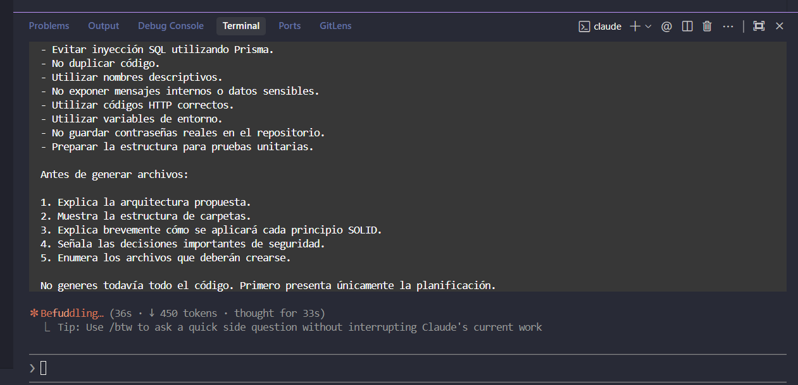
*Figura 1.1: Prompt enviado a Claude en la consola interactiva solicitando la planificación de arquitectura en capas, principios SOLID y restricciones de seguridad antes de escribir código.*

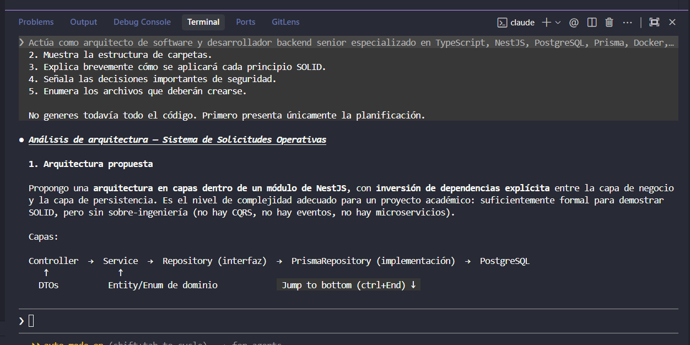
*Figura 1.2: Propuesta técnica de la IA dividida en Controller → Service → Repository (interfaz) → PrismaRepository → PostgreSQL, manteniendo la inversión de dependencias.*

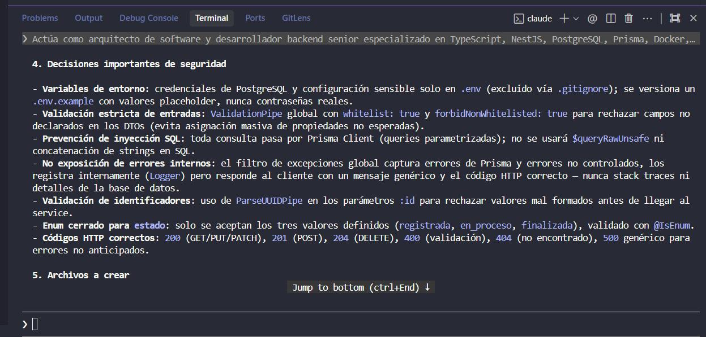
*Figura 1.3: Desglose de las decisiones de seguridad (ValidationPipe global, no exposición de errores internos, ParseUUIDPipe) y la lista de archivos creados para el módulo.*

### Resultado

La arquitectura en capas quedó funcionando y se sostuvo sin cambios durante el resto del proyecto. Su utilidad real (no solo teórica) se comprobó después, cuando las pruebas unitarias del Prompt 5 pudieron simular el repositorio sin tocar Prisma.

---

## Prompt 2: Docker y PostgreSQL

### Objetivo

Aislar por completo la base de datos usada por las pruebas automáticas de la base de datos de desarrollo, para que ningún error en la limpieza de datos de una prueba pudiera afectar información real.

### Prompt utilizado

> **Rol asignado:** *Actúa como desarrollador DevOps y backend senior especializado en Docker, PostgreSQL, NestJS y Prisma.*
>
> "Basándote en la arquitectura aprobada para el sistema de solicitudes operativas, configura el entorno inicial del proyecto.
>
> Necesito que generes:
> 1. Los comandos para crear un proyecto NestJS con TypeScript.
> 2. La instalación de Prisma, PostgreSQL, class-validator, class-transformer, Swagger y demás dependencias necesarias.
> 3. Un archivo docker-compose.yml que levante una imagen oficial de PostgreSQL.
> 4. Un archivo .env.example sin credenciales reales.
> 5. La variable DATABASE_URL compatible con Prisma.
> 6. La configuración inicial de Prisma.
> 7. Los comandos para levantar, detener y eliminar el contenedor.
> 8. Los comandos para crear y ejecutar migraciones.
> 9. Una comprobación de salud healthcheck para PostgreSQL.
> 10. Un volumen persistente para no perder los datos al reiniciar el contenedor.
>
> Utiliza una configuración local similar a esta:
> - Nombre del contenedor: solicitudes-postgres
> - Imagen: postgres con una versión estable específica, sin usar latest
> - Puerto externo: 5432
> - Base de datos: solicitudes_db
> - Usuario de desarrollo: solicitudes_user
> - Contraseña de desarrollo configurable mediante variables de entorno
> - Volumen: solicitudes_postgres_data
>
> Buenas prácticas obligatorias:
> - No colocar contraseñas directamente dentro del código fuente.
> - No subir el archivo .env al repositorio.
> - Incluir .env.example.
> - Incluir .gitignore.
> - Agregar restart: unless-stopped.
> - Utilizar un healthcheck real de PostgreSQL.
> - Explicar cada variable importante.
> - No crear configuraciones innecesariamente complejas.
> - Utilizar una red interna de Docker cuando sea útil.
> - Asegurar que Prisma pueda conectarse desde la aplicación ejecutada localmente.
>
> Entrega la respuesta en este orden:
> 1. Comandos de instalación.
> 2. Contenido completo de docker-compose.yml.
> 3. Contenido de .env.example.
> 4. Contenido o ajustes de .gitignore.
> 5. Comandos de Docker.
> 6. Comandos de Prisma.
> 7. Explicación breve de cómo verificar la conexión."

### Resumen de la respuesta obtenida

Se agregó un segundo servicio `postgres-test` en `docker-compose.yml`, con su propio contenedor, puerto (5433) y volumen — no solo un nombre de base distinto en el mismo servidor. Se creó `.env.test` (con sus propias credenciales) y `prisma.test.config.ts` para que las migraciones de prueba se apliquen contra esa base. Se agregó `test/setup-env.ts`, que carga `.env.test` y **aborta la ejecución** si `DATABASE_URL` no contiene la palabra `"test"`.

### Revisión crítica

- **Correcto:** usar un contenedor completamente separado es más seguro que confiar solo en que el nombre de la base de datos sea distinto, porque protege incluso ante un error de configuración.
- **Riesgo NO detectado en este momento, encontrado después en la auditoría del Prompt 6:** los puertos de PostgreSQL (tanto el de desarrollo como el de pruebas) se publicaban sin indicar una interfaz de red específica. Docker los enlazaba por defecto a `0.0.0.0`, es decir, cualquier otro equipo en la misma red local podía intentar conectarse a la base de datos.
- **Vulnerabilidad considerada:** exposición innecesaria de un servicio de base de datos en la red local durante el desarrollo.

### Ajustes aplicados

- Se cambió la publicación de puertos para que solo escuchen en la máquina local, en ambos servicios de `docker-compose.yml` (este ajuste se hizo en el Prompt 6, no en este prompt).

### Evidencia en el código

`docker-compose.yml`, antes y después de la corrección:

```yaml
# Antes
ports:
  - '${POSTGRES_PORT:-5432}:5432'

# Después
ports:
  - '127.0.0.1:${POSTGRES_PORT:-5432}:5432'
```

### Evidencia visual

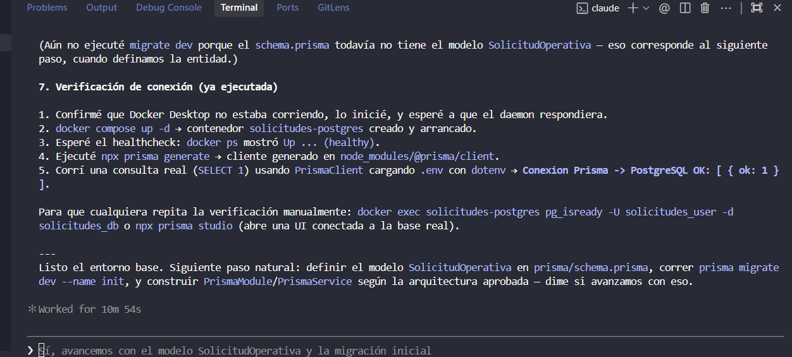
*Figura 2.1: Terminal ejecutando la comprobación del entorno Docker (`docker compose up -d`), generación del cliente Prisma y prueba de conexión exitosa contra PostgreSQL.*

### Resultado

Dos bases de datos PostgreSQL completamente independientes (desarrollo y pruebas), cada una accesible solo desde la máquina local.

---

## Prompt 3: Modelo de datos en Prisma

### Objetivo

Diseñar el modelo `SolicitudOperativa` en Prisma y PostgreSQL cumpliendo las reglas de negocio: prioridad entre 1 y 5, costo mayor o igual a cero con dos decimales, estado limitado a un enum, nombres de tabla y columnas en snake_case, y sin usar `Float` para dinero.

### Prompt utilizado

> **Rol asignado:** *Actúa como especialista en modelado de datos, PostgreSQL y Prisma ORM.*
>
> "Ahora implementa el modelo de datos del sistema de solicitudes operativas utilizando Prisma y PostgreSQL.
>
> Crea el modelo SolicitudOperativa con los siguientes campos:
> - id: UUID, clave primaria y generado automáticamente.
> - titulo: texto obligatorio, máximo 150 caracteres.
> - areaSolicitante: texto obligatorio, máximo 100 caracteres.
> - prioridad: entero obligatorio entre 1 y 5.
> - costoEstimado: decimal obligatorio, mayor o igual que cero y con dos decimales.
> - estado: enum con los valores REGISTRADA, EN_PROCESO y FINALIZADA.
> - createdAt: fecha generada automáticamente.
> - updatedAt: fecha actualizada automáticamente.
>
> Requisitos:
> - Utiliza nombres claros en TypeScript.
> - En PostgreSQL, utiliza nombres de tabla y columnas en snake_case mediante @map y @@map.
> - El nombre de la tabla debe ser solicitudes_operativas.
> - El costo debe utilizar un tipo Decimal de PostgreSQL, por ejemplo Decimal(12, 2).
> - Agrega índices únicamente cuando tengan sentido, por ejemplo para estado, prioridad o fecha de creación.
> - No utilices Float para almacenar dinero.
> - Explica cómo garantizar que prioridad esté entre 1 y 5.
> - Explica qué validaciones se realizarán en la aplicación y cuáles puede reforzar la base de datos.
> - Genera una migración segura.
> - No utilices SQL concatenado.
> - Incluye un seed opcional con tres solicitudes de ejemplo, sin duplicarlas cada vez que se ejecute.
>
> Datos de ejemplo:
> ```json
> {
>   "titulo": "Adquisición de nuevo servidor",
>   "areaSolicitante": "Infraestructura TI",
>   "prioridad": 3,
>   "costoEstimado": 2500.00,
>   "estado": "REGISTRADA"
> }
> ```
>
> Entrega:
> 1. schema.prisma completo.
> 2. Comandos para crear la migración.
> 3. Código del seed.
> 4. Configuración necesaria en package.json.
> 5. Comandos para ejecutar y verificar el seed.
> 6. Explicación de las decisiones tomadas."

### Resumen de la respuesta obtenida

Se generó `prisma/schema.prisma` con `id` de tipo `Uuid` generado por la base (`gen_random_uuid()`, nativo desde PostgreSQL 13), `costoEstimado` como `Decimal(12,2)`, un enum `EstadoSolicitud` mapeado a un tipo nativo de PostgreSQL, columnas mapeadas a snake_case (`@map`/`@@map`), e índices en `estado`, `prioridad` y `createdAt`. Como Prisma no permite declarar restricciones `CHECK` directamente en el archivo de esquema, la migración SQL se completó a mano agregando dos `ALTER TABLE ... CHECK` (rango de prioridad y costo no negativo). Se agregó un `seed.ts` que usa `upsert` con identificadores fijos, para que ejecutarlo varias veces no duplique datos.

### Revisión crítica

- **Correcto:** usar `Decimal(12,2)` en vez de `Float` evita los errores de redondeo típicos de la aritmética binaria en cantidades de dinero.
- **Correcto:** los `CHECK` de la base son una segunda capa de protección, independiente de la aplicación.
- **Riesgo reconocido en el momento:** la migración se escribió a mano porque Docker no estaba disponible en el entorno para ejecutar `prisma migrate dev` contra una base real. Esto se advirtió explícitamente y se dejaron los comandos exactos para que se verificara manualmente.
- **Ajuste relacionado, detectado más tarde (Prompt 6):** el modelo y la migración en sí no tuvieron errores, pero la capa de validación de la aplicación —creada recién en el Prompt 4— no reflejaba completamente el límite real de la columna `costoEstimado` (`DECIMAL(12,2)` admite como máximo `9999999999.99`). Un valor mayor pasaba la validación del DTO y terminaba provocando un error de PostgreSQL no controlado.

### Ajustes aplicados

- Ninguno sobre el `schema.prisma` en sí (quedó correcto desde el inicio).
- Como consecuencia indirecta, en el Prompt 6 se agregó el límite superior correspondiente en el DTO de la aplicación (ver Prompt 4).

### Evidencia en el código

`prisma/schema.prisma`:

```prisma
costoEstimado Decimal @map("costo_estimado") @db.Decimal(12, 2)
```

`prisma/migrations/20260730120000_create_solicitudes_operativas/migration.sql`:

```sql
ALTER TABLE "solicitudes_operativas"
    ADD CONSTRAINT "solicitudes_operativas_prioridad_check"
    CHECK ("prioridad" BETWEEN 1 AND 5);
```

### Evidencia visual

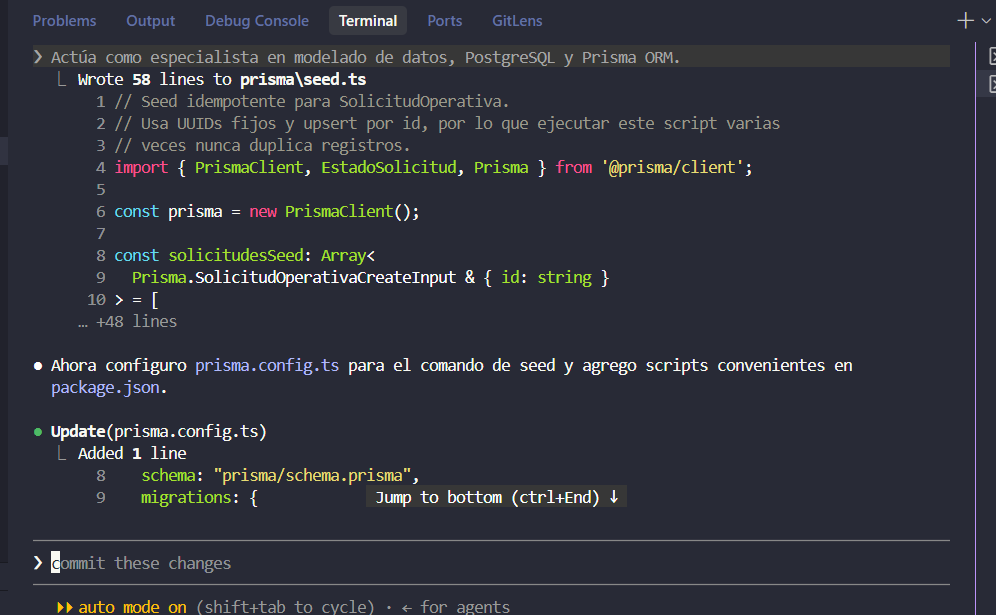
*Figura 3.1: Creación del archivo `prisma/seed.ts` utilizando UUIDs fijos e `upsert` para garantizar la idempotencia de los datos de prueba.*

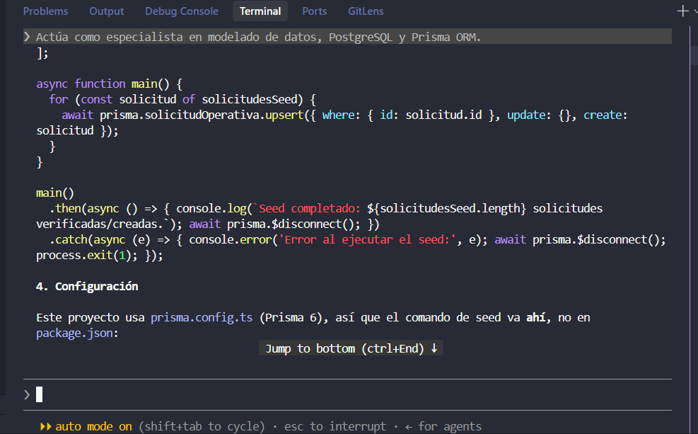
*Figura 3.2: Implementación de la función `main()` con control de ciclo de vida de la conexión en Prisma (`$disconnect`) y actualización de `prisma.config.ts`.*

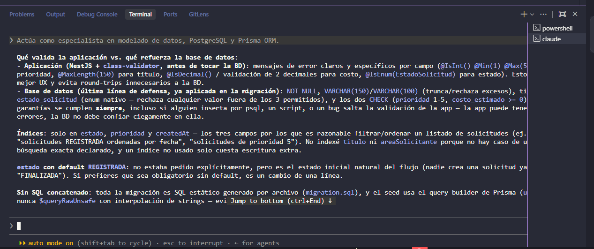
*Figura 3.3: Justificación técnica de la IA sobre la diferencia entre la capa de validación en NestJS (DTOs) y la protección final en PostgreSQL (restricciones CHECK y tipos nativos).*

### Resultado

Modelo de datos validado con `prisma validate` y `prisma generate`, pero pendiente de aplicarse contra una base real por quien ejecute el proyecto. Sirvió de base correcta para detectar, más adelante, que faltaba un límite equivalente en la capa de validación de la aplicación.

---

## Prompt 4: Implementación de los endpoints

### Objetivo

Implementar los cinco endpoints REST (`GET`, `POST`, `PUT`, `PATCH /estado`, `DELETE`) con validación estricta de entrada y códigos HTTP correctos.

### Prompt utilizado

> **Rol asignado:** *Actúa como desarrollador backend senior especializado en NestJS, TypeScript, Prisma, APIs REST, código limpio y principios SOLID.*
>
> "Implementa el módulo de solicitudes operativas utilizando la estructura previamente aprobada.
>
> Endpoints obligatorios:
> 1. GET /solicitudes: Devuelve todas las solicitudes ordenadas desde la más reciente. Responde 200.
> 2. POST /solicitudes: Registra una nueva solicitud. Responde 201. Estado por defecto REGISTRADA.
> 3. PUT /solicitudes/:id: Actualiza completamente una solicitud. Responde 200 (o 404 si no existe).
> 4. DELETE /solicitudes/:id: Elimina una solicitud. Responde 204 sin cuerpo (o 404 si no existe).
> 5. PATCH /solicitudes/:id/estado: Actualiza únicamente el estado. Rechaza campos adicionales. Responde 200 (o 404).
>
> DTO requeridos: CreateSolicitudDto, UpdateSolicitudDto, UpdateEstadoSolicitudDto.
>
> Validaciones obligatorias:
> - titulo: string, no vacío, máx 150 caracteres.
> - areaSolicitante: string, no vacío, máx 100 caracteres.
> - prioridad: número entero entre 1 y 5.
> - costoEstimado: número >= 0, máx 2 decimales.
> - estado: valor permitido por el enum.
> - id: UUID válido.
> - Rechazar propiedades no declaradas en los DTO.
>
> Configura ValidationPipe global con: whitelist: true, forbidNonWhitelisted: true, transform: true.
>
> Arquitectura: Controller (solo HTTP) -> Service (casos de uso) -> Repository (encapsula Prisma). Inyección de dependencias por token. Mapper separado para Decimal. Filtro global de excepciones. Strict mode.
>
> Seguridad y limpieza: Consultas parametrizadas. No devolver errores internos de Prisma. Limpiar espacios (trim). Documentación Swagger en cada endpoint con ejemplos."

### Resumen de la respuesta obtenida

Se generaron `CreateSolicitudDto`, `UpdateSolicitudDto` (reutilizando las reglas de `CreateSolicitudDto` mediante `OmitType`, pero con `estado` obligatorio) y `UpdateEstadoSolicitudDto` (que solo declara el campo `estado`). Se configuró el `ValidationPipe` global en `main.ts`. El endpoint `PATCH /solicitudes/:id/estado` quedó protegido únicamente por esa configuración global, sin código adicional por endpoint.

### Revisión crítica

- **Correcto:** al combinar `whitelist: true` y `forbidNonWhitelisted: true`, cualquier campo fuera de lo declarado en el DTO (por ejemplo, mandar `prioridad` en el `PATCH /estado`) se rechaza con `400`, sin necesidad de validarlo a mano en cada endpoint. Esto se confirmó después con pruebas e2e (Prompt 5).
- **Riesgo NO detectado en este momento, encontrado en la auditoría (Prompt 6):** la documentación Swagger del `POST /solicitudes` anunciaba un posible `422 Unprocessable Entity`, pero el `ValidationPipe` de Nest siempre responde `400 Bad Request`. La documentación no coincidía con el comportamiento real.
- **Otro riesgo detectado en el Prompt 6:** `costoEstimado` no tenía un límite superior (`@Max`), tal como se explicó en el Prompt 3.

### Ajustes aplicados

- Se reemplazó `@ApiUnprocessableEntityResponse` por `@ApiBadRequestResponse` en `POST /solicitudes`, para que la documentación coincidiera con el código real que devuelve el `ValidationPipe`.
- Se agregó `@Max(COSTO_ESTIMADO_MAXIMO)` en `CreateSolicitudDto`, con una constante calculada a partir del `DECIMAL(12,2)` real de la base de datos.

### Evidencia en el código

`src/solicitudes/dto/create-solicitud.dto.ts`:

```ts
/** costo_estimado es DECIMAL(12,2) en la base: 10 dígitos enteros + 2 decimales como máximo. */
export const COSTO_ESTIMADO_MAXIMO = 9_999_999_999.99;
...
@IsNumber({ maxDecimalPlaces: 2 })
@Min(0)
@Max(COSTO_ESTIMADO_MAXIMO)
costoEstimado!: number;
```

`src/solicitudes/solicitudes.controller.ts`:

```ts
@ApiBadRequestResponse({ description: 'Datos de entrada inválidos' })
create(@Body() dto: CreateSolicitudDto): Promise<SolicitudResponseDto> {
  return this.solicitudesService.create(dto);
}
```

### Evidencia visual

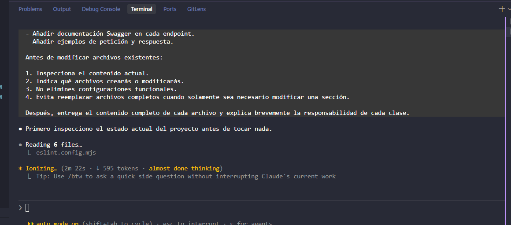
*Figura 4.1: Instrucciones enviadas a la IA para agregar la documentación de Swagger, ejemplos de request/response y reglas de modificación sin alterar código funcional.*

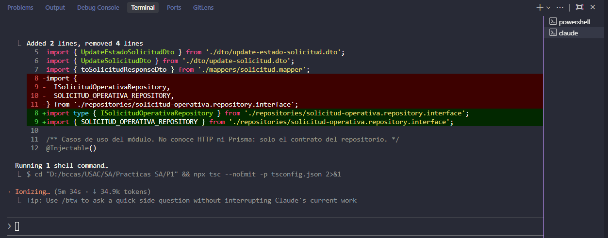
*Figura 4.2: Refactorización en `SolicitudesService` con la inyección por token y la comprobación estricta de tipos mediante `npx tsc --noEmit`.*

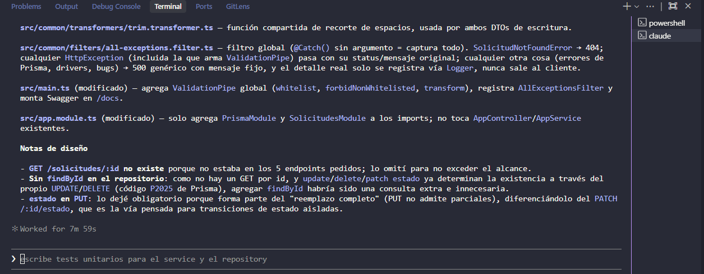
*Figura 4.3: Resumen de archivos generados para la gestión de excepciones (`all-exceptions.filter.ts`) y transformadores (`trim.transformer.ts`), junto a las notas de diseño REST.*

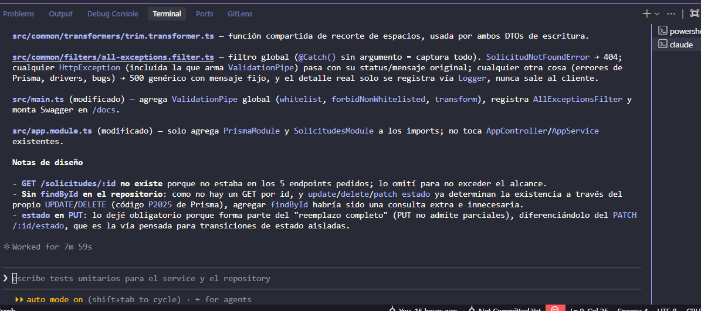
*Figura 4.4: Detalle de las decisiones de diseño para los endpoints HTTP, justificando la distinción entre reemplazo completo (`PUT`) y transición de estado (`PATCH`).*

### Resultado

Los cinco endpoints quedaron funcionando según lo pedido, con la documentación Swagger y los límites de validación alineados con el comportamiento real del `ValidationPipe` y con la capacidad real de la columna en PostgreSQL.

---

## Prompt 5: Pruebas

### Objetivo

Cubrir con pruebas automáticas los 16 escenarios pedidos (registro válido, límites de prioridad y costo, campos no permitidos, actualización completa vs. parcial, registros inexistentes, UUID inválido, no exposición de errores internos), sin depender del orden de ejecución ni de tiempos de espera arbitrarios.

### Prompt utilizado

> **Rol asignado:** *Actúa como ingeniero de calidad especializado en NestJS, Jest, Prisma y pruebas de APIs REST.*
>
> "Analiza el módulo de solicitudes operativas que ya fue implementado y crea una estrategia de pruebas.
>
> Necesito pruebas para:
> 1. Registrar una solicitud válida.
> 2. Rechazar prioridad menor que 1.
> 3. Rechazar prioridad mayor que 5.
> 4. Rechazar costo negativo.
> 5. Rechazar estados no permitidos.
> 6. Rechazar campos adicionales no declarados.
> 7. Obtener todas las solicitudes.
> 8. Actualizar completamente una solicitud.
> 9. Rechazar un PUT incompleto.
> 10. Actualizar únicamente el estado.
> 11. Comprobar que PATCH /estado no modifica otros campos.
> 12. Rechazar campos adicionales en PATCH /estado.
> 13. Eliminar una solicitud.
> 14. Responder 404 al actualizar o eliminar un registro inexistente.
> 15. Responder correctamente ante un UUID inválido.
> 16. Comprobar que no se exponen errores internos de Prisma.
>
> Crea:
> - Pruebas unitarias del servicio con un repositorio simulado.
> - Pruebas unitarias del controlador cuando aporten valor.
> - Pruebas end-to-end de los endpoints principales.
> - Una base de datos de pruebas separada o una estrategia segura para no afectar desarrollo.
> - Limpieza de datos después de cada prueba.
> - Scripts npm para unit, e2e y coverage.
>
> Buenas prácticas:
> - No conectarse accidentalmente a la base de datos de producción.
> - No depender del orden en que se ejecutan las pruebas.
> - No usar tiempos de espera arbitrarios.
> - Evitar mocks innecesarios.
> - Utilizar datos descriptivos.
> - Aplicar Arrange, Act, Assert.
> - Comprobar códigos HTTP y cuerpo de respuesta.
> - Mantener pruebas pequeñas y comprensibles.
>
> Primero revisa el código existente y señala posibles dificultades para probarlo. Después genera los archivos de prueba y explica cómo ejecutarlos."

### Resumen de la respuesta obtenida

Se crearon pruebas unitarias del `SolicitudesService` y del `SolicitudesController` con un repositorio simulado (mock), y pruebas end-to-end con Supertest contra la base de datos de pruebas, usando un helper (`createTestApp`) que reproduce la configuración de `main.ts` (pipes y filtro). La limpieza de datos se hace con `deleteMany()` después de cada prueba.

### Revisión crítica

- **Correcto:** para la prueba de "más reciente primero", en vez de esperar tiempo real entre dos creaciones (lo que hubiera sido inestable si ambas caían en el mismo milisegundo), se fuerza el `createdAt` del registro más antiguo hacia el pasado directamente con Prisma. Este riesgo se identificó y se resolvió en el momento, no después.
- **Riesgo NO detectado en este momento, encontrado en la auditoría (Prompt 6):** faltaban pruebas para reglas que sí estaban implementadas en el DTO pero nunca se verificaban: longitud máxima de `titulo` (150) y `areaSolicitante` (100), un título compuesto solo de espacios, y que el recorte de espacios (`trim`) realmente ocurriera antes de guardar.
- **Mock justificado y explicado:** para probar que el filtro global nunca expone errores internos, no existe una forma natural de provocar un error real de Prisma a través de la API pública (no hay una clave de negocio única expuesta). Se decidió, de forma explícita, sustituir el repositorio por un doble que falla de manera controlada solo en esa prueba puntual, dejando por escrito por qué era necesario.

### Ajustes aplicados

- Se agregaron, en el Prompt 6, cinco pruebas e2e nuevas: título y área que exceden la longitud máxima, título compuesto solo de espacios, recorte de espacios verificado, y el nuevo límite superior de `costoEstimado`.
- Se agregó una prueba unitaria nueva y dedicada para el repositorio, verificando que solo el código `P2025` de Prisma se traduce a `SolicitudNotFoundError` y que cualquier otro código se propaga sin modificar.

### Evidencia en el código

`test/solicitudes-read.e2e-spec.ts`:

```ts
await prismaTestClient.solicitudOperativa.update({
  where: { id: antigua.id },
  data: { createdAt: new Date(Date.now() - 60_000) },
});
```

`src/solicitudes/repositories/solicitud-operativa.repository.spec.ts`:

```ts
it('no traduce otros códigos de error de Prisma: los propaga sin modificar', async () => {
  const { prisma, update } = buildPrismaServiceMock();
  const otroError = buildPrismaError('P2000');
  update.mockRejectedValue(otroError);
  const repository = new SolicitudOperativaRepository(prisma);

  await expect(
    repository.update('algun-id', datosDeActualizacion),
  ).rejects.toBe(otroError);
});
```

### Evidencia visual

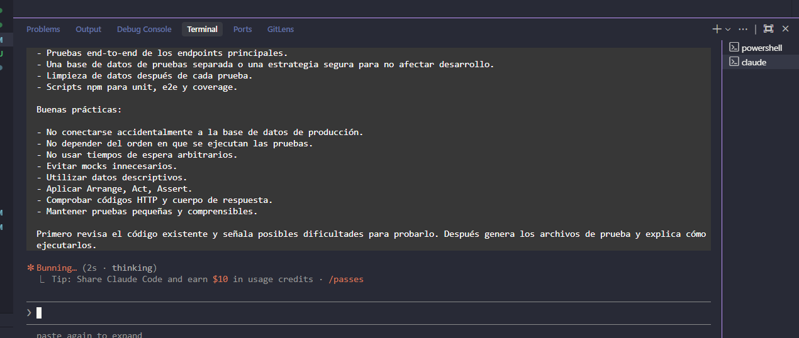
*Figura 5.1: Solicitud inicial enviada a la IA pidiendo la estrategia de pruebas unitarias y e2e, base de datos aislada y buenas prácticas de testing.*

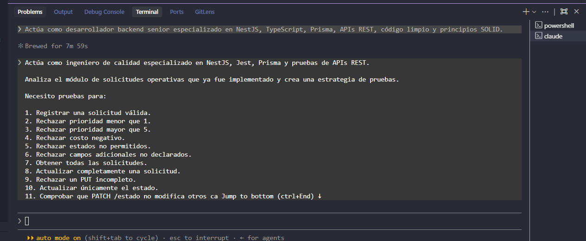
*Figura 5.2: Desglose de los 16 casos de prueba obligatorios requeridos por el enunciado para cubrir validaciones, errores HTTP y comportamiento de endpoints.*

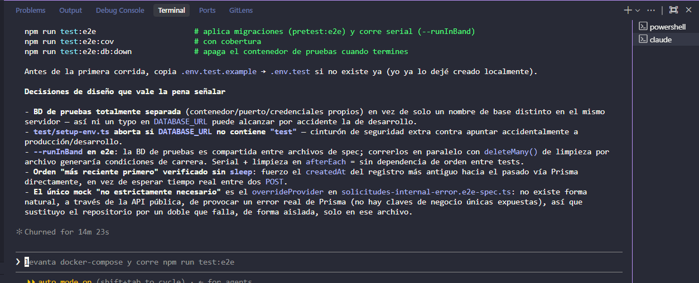
*Figura 5.3: Justificación de las decisiones de diseño de la suite de pruebas: BD separada, validación de entorno en `setup-env.ts`, ejecución en serie (`--runInBand`) y uso de mocks aislados.*

### Resultado

20 pruebas unitarias pasando (verificado en este entorno) y un conjunto de pruebas e2e completo, escrito y revisado, pero que no se pudo ejecutar en este entorno concreto porque Docker Desktop no estaba disponible; queda documentado como limitación, no como algo ya verificado.

---

## Prompt 6: Revisión de seguridad y principios SOLID

### Objetivo

Auditar de forma crítica todo lo generado en los prompts anteriores, sin asumir que el código era correcto solo porque compilaba o pasaba las pruebas existentes.

### Prompt utilizado

> **Rol asignado:** *Actúa como revisor de código senior y auditor de seguridad especializado en NestJS, TypeScript, Prisma, PostgreSQL, REST, SOLID y código limpio.*
>
> "Realiza una revisión crítica del proyecto de solicitudes operativas. No asumas que el código es correcto únicamente porque compila.
>
> Analiza específicamente:
> 1. Validación de entradas.
> 2. Manejo de propiedades no permitidas.
> 3. Prevención de inyección SQL.
> 4. Manejo de errores de Prisma.
> 5. Exposición de datos sensibles.
> 6. Uso correcto de códigos HTTP.
> 7. Diferencia correcta entre PUT y PATCH.
> 8. Restricción de prioridad entre 1 y 5.
> 9. Validación de costo mayor o igual que cero.
> 10. Precisión del campo monetario.
> 11. Validación del enum de estado.
> 12. Manejo de UUID inválidos.
> 13. Manejo de registros inexistentes.
> 14. Separación entre controlador, servicio y repositorio.
> 15. Aplicación real de los principios SOLID.
> 16. Código duplicado.
> 17. Uso de any o tipos débiles.
> 18. Nombres poco descriptivos.
> 19. Funciones o clases con demasiadas responsabilidades.
> 20. Posibles errores de concurrencia o consistencia.
> 21. Configuración insegura de Docker o variables de entorno.
> 22. Falta de pruebas importantes.
>
> Para cada problema encontrado, entrega:
> - Archivo y ubicación aproximada.
> - Descripción del problema.
> - Nivel de riesgo: bajo, medio o alto.
> - Principio o buena práctica afectada.
> - Corrección recomendada.
> - Fragmento corregido.
> - Justificación de por qué el cambio es necesario.
>
> También genera una tabla final con: | Hallazgo | Riesgo | Corrección aplicada | Resultado |
>
> No realices cambios innecesarios ni agregues patrones complejos solamente para aparentar arquitectura. Mantén el proyecto apropiado para una práctica académica.
>
> Al finalizar, entrega una conclusión indicando:
> - Qué partes cumplen correctamente.
> - Qué partes fueron corregidas.
> - Qué riesgos permanecen.
> - Qué ajustes se hicieron específicamente sobre el código generado por IA."

### Resumen de la respuesta obtenida

Se revisaron uno por uno los 22 puntos pedidos. Se encontraron y corrigieron 8 problemas reales (ya descritos en los prompts anteriores: falta de tope en `costoEstimado`, documentación Swagger incorrecta, orden no determinista en `GET /solicitudes`, mensaje de validación duplicado, puertos de Docker expuestos, Swagger sin restricción por entorno, y dos huecos de cobertura de pruebas). El resto de los puntos (inyección SQL, `any`, separación de capas, PUT vs. PATCH, manejo de UUID inválido, entre otros) se evaluaron y se dejaron sin cambios porque ya cumplían correctamente.

### Revisión crítica

- Esta revisión demostró que el código generado en los prompts 1 a 5 era, en general, sólido, pero **no estaba libre de errores**: 8 de 22 puntos analizados sí tenían algo que corregir.
- Se evaluó explícitamente si el patrón repositorio con interfaz era una abstracción innecesaria (posible violación de "no agregar complejidad para aparentar arquitectura"): se concluyó que no, porque permite probar el `SolicitudesService` sin base de datos real (Prompt 5), lo cual es un beneficio concreto, no solo teórico.
- Se dejaron documentados, a propósito, dos riesgos que no se corrigieron: la conversión de `Prisma.Decimal` a `number` en la respuesta JSON (segura para los montos que permite la base, pero no la opción más robusta para un sistema financiero real) y la falta de control de concurrencia optimista (dos actualizaciones simultáneas al mismo registro aplican "la última gana"). No corregirlos fue una decisión, no un descuido: agregarlos habría sido una complejidad fuera del alcance de una práctica académica.

### Ajustes aplicados

- Se agregó `@Max(COSTO_ESTIMADO_MAXIMO)` en el DTO de creación.
- Se corrigió la documentación Swagger de `POST /solicitudes` (400 en vez de 422).
- Se agregó un segundo criterio de orden (`id`) para que `GET /solicitudes` sea determinista.
- Se centralizó el mensaje de validación del enum `estado` en una sola constante compartida.
- Se restringieron los puertos de PostgreSQL a `127.0.0.1` en `docker-compose.yml`.
- Se condicionó el montaje de Swagger a que `NODE_ENV` no sea `production`.
- Se agregaron pruebas unitarias para la traducción de errores de Prisma en el repositorio.
- Se agregaron pruebas e2e para longitud máxima de campos y recorte de espacios.

### Evidencia en el código

`src/solicitudes/repositories/solicitud-operativa.repository.ts`:

```ts
findAllOrderedByRecent(): Promise<SolicitudOperativa[]> {
  // Desempate por id: dos registros con el mismo createdAt (mismo
  // milisegundo) no tienen, si no, un orden determinista en Postgres.
  return this.prisma.solicitudOperativa.findMany({
    orderBy: [{ createdAt: 'desc' }, { id: 'desc' }],
  });
}
```

### Evidencia visual

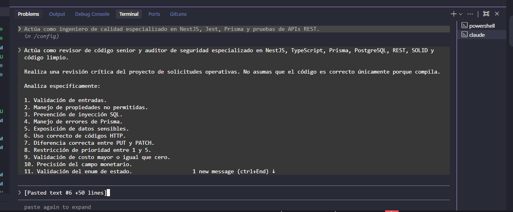
*Figura 6.1: Prompt exigiendo una revisión crítica del proyecto sobre 22 puntos específicos de seguridad, validación y principios SOLID.*

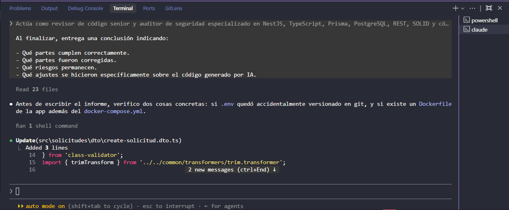
*Figura 6.2: Proceso de auditoría en la consola de Claude revisando los 23 archivos del proyecto y aplicando ajustes en la cota superior del DTO de creación.*

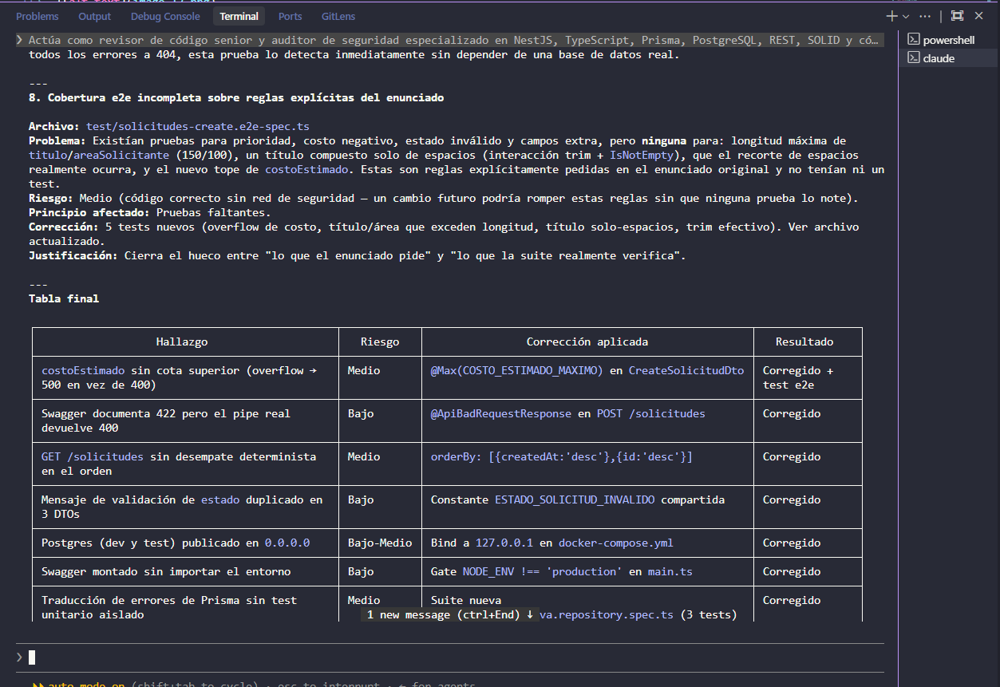
*Figura 6.3: Tabla resumen de la auditoría detallando los 8 hallazgos detectados, nivel de riesgo, corrección aplicada en el código y resultado obtenido.*

### Resultado

El proyecto quedó con menos deuda técnica y, tan importante como eso, con los riesgos que sí se dejaron pendientes **documentados explícitamente** en vez de ocultos, para que quien continúe el proyecto sepa exactamente qué falta revisar.

---

## Prompt 7: Documentación final

### Objetivo

Redactar un `README.md` real y verificable, sin inventar rutas de archivos, comandos o fragmentos de código que no existieran en el proyecto.

### Prompt utilizado

Extracto del mensaje de documentación:

> "Antes de escribir el página, inspecciona los archivos reales del proyecto y utiliza únicamente clases, interfaces y métodos que existan. [...] No inventes fragmentos de código."

*(Nota: este mismo requisito de "no inventar" se aplicó también a este documento, PROMPTS.md.)*

### Resumen de la respuesta obtenida

Se generó un `README.md` con 18 secciones: descripción del problema, tecnologías, instalación, configuración de entorno, Docker, migraciones, seed, ejecución de la app y de las pruebas, documentación de endpoints con ejemplos JSON reales, códigos HTTP, estructura de carpetas, decisiones de seguridad y una explicación de los cinco principios SOLID con fragmentos de código reales del proyecto.

### Revisión crítica

- Antes de escribir cada sección, se releyeron directamente los archivos fuente (`solicitudes.controller.ts`, `solicitudes.service.ts`, la interfaz y la implementación del repositorio, `solicitudes.module.ts`, `docker-compose.yml`, `package.json`) para confirmar que cada fragmento citado existiera literalmente en ese momento.
- Esto importaba en particular porque el proyecto ya había sido modificado en el Prompt 6: por ejemplo, se verificó el contenido actualizado de `update-solicitud.dto.ts` para no citar por error una versión anterior a la que dejó de usar el mensaje de validación duplicado.
- Se descartó por completo el `README.md` anterior (la plantilla genérica que genera `@nestjs/cli` al crear el proyecto), porque no describía nada específico del sistema de solicitudes operativas.

### Ajustes aplicados

Ninguno sobre el código de la aplicación: este prompt solo generó documentación. El único "ajuste" fue de contenido: se revisaron y corrigieron manualmente las citas de código antes de incluirlas, para que coincidieran con el estado real de cada archivo.

### Evidencia en el código

`README.md`, sección de principios SOLID, citando textualmente `src/solicitudes/solicitudes.service.ts`:

```ts
constructor(
  @Inject(SOLICITUD_OPERATIVA_REPOSITORY)
  private readonly repository: ISolicitudOperativaRepository,
) {}
```

### Evidencia visual

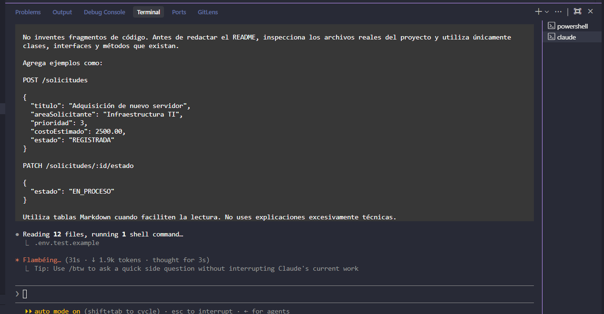
*Figura 7.1: Instrucción impartida a la IA para redactar `README.md` basándose estrictamente en la inspección de archivos reales del proyecto.*

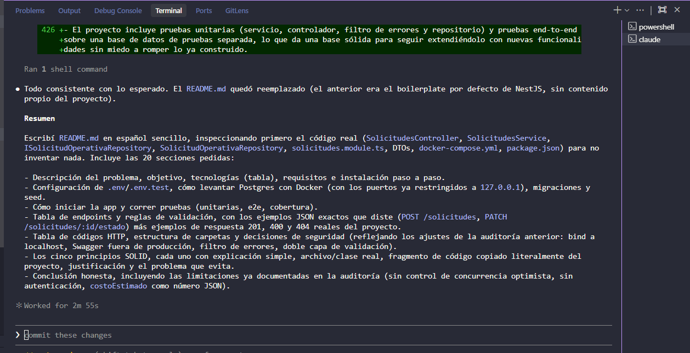
*Figura 7.2: Confirmación de la generación del nuevo `README.md` estructurado en 20 secciones que cubren instalación, Docker, arquitectura y principios SOLID.*


### Resultado

Documentación alineada con el estado final y real del código, no con una versión intermedia del proyecto.


En ningún momento se aceptó una respuesta de la IA sin ejecutar al menos una verificación objetiva (`tsc --noEmit`, `eslint`, `nest build`, o la ejecución real de las pruebas unitarias). Cuando esas verificaciones automáticas no alcanzaban —como detectar que una regla de validación no cubría el límite real de una columna, o que un puerto de Docker quedaba expuesto de más— se dependió de una revisión manual dedicada (Prompt 6), que sí encontró errores reales. Ese es, en definitiva, el propósito de este documento: dejar constancia de que la IA propuso y escribió código, pero que cada parte fue leída, cuestionada y, cuando hizo falta, corregida antes de darla por buena.
