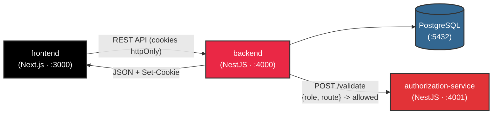
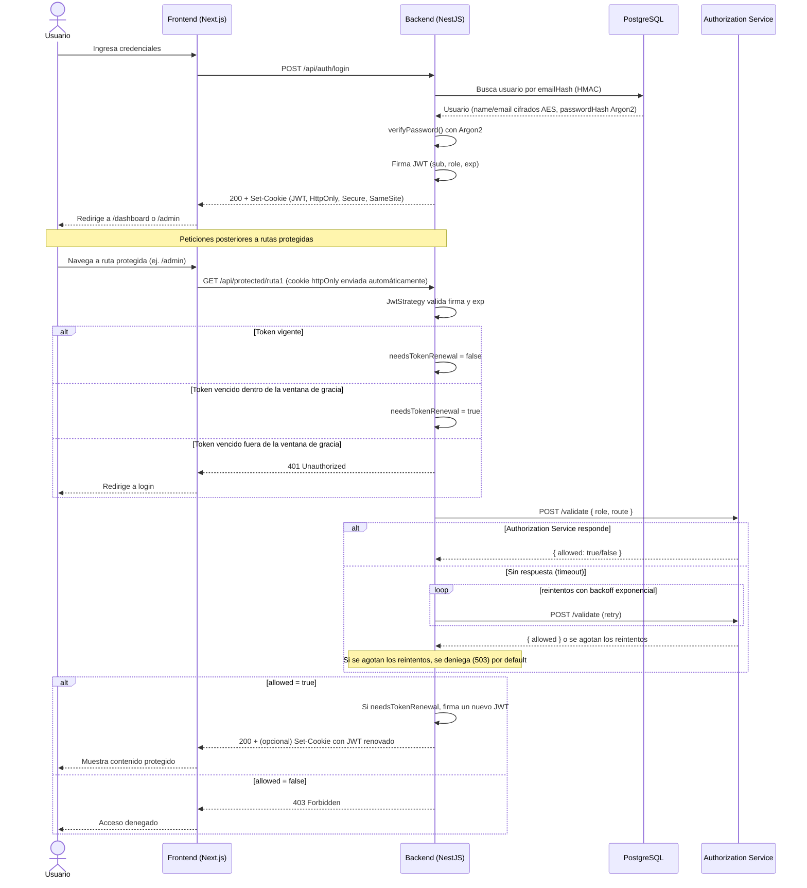

# Práctica SA — Módulo de Registro y Login con Autorización por Microservicio

Implementación de un módulo de registro/login con dos roles (`ADMIN` y `CLIENT`), JWT en cookies `HttpOnly` con renovación automática, cifrado AES-256 de datos sensibles, y un **microservicio de autorización independiente** consultado mediante un ciclo de reintentos con backoff. Todo corre en Docker sobre PostgreSQL.

## Inicio rápido

Requiere Docker Desktop corriendo. En 5 comandos queda todo el stack arriba:

```bash
git clone <url-del-repositorio> && cd P2

cp backend/.env.example backend/.env
# Edita backend/.env y coloca JWT_SECRET y AES_KEY reales (ver comandos abajo)

docker compose build
docker compose up -d
docker compose exec backend npx prisma db seed   # crea el usuario Admin
```

Genera valores reales para `JWT_SECRET` y `AES_KEY` antes de levantar el stack (déjalos vacíos en `.env` y el backend no arrancará):

```bash
node -e "console.log(require('crypto').randomBytes(32).toString('hex'))"    # -> JWT_SECRET
node -e "console.log(require('crypto').randomBytes(32).toString('base64'))" # -> AES_KEY
```

| Servicio | URL |
|---|---|
| Frontend | http://localhost:3000 |
| Backend (API) | http://localhost:4000/api |
| Authorization service | http://localhost:4001/api |
| pgAdmin | http://localhost:5050 |

Inicia sesión con las [credenciales de prueba](#credenciales-de-prueba) que ya vienen creadas, o regístrate desde `/register` (siempre crea un usuario `CLIENT`). Para bajar todo: `docker compose down` (agrega `-v` para además borrar los datos de Postgres). Si prefieres correr el código sin contenedores, o quieres el detalle variable por variable, sigue en [Puesta en marcha](#puesta-en-marcha).

## Tecnologías

| Categoría | Tecnología | Uso en el proyecto |
|---|---|---|
| Frontend | [Next.js 16](https://nextjs.org/) (App Router) + React 19 + TypeScript | Páginas de login, registro, dashboard y panel admin |
| Estilos | Tailwind CSS 4 | UI del frontend |
| Backend | [NestJS 11](https://nestjs.com/) + TypeScript | API principal (`backend/`) y microservicio de autorización (`authorization-service/`) |
| Base de datos | PostgreSQL 16 + [Prisma ORM 7](https://www.prisma.io/) | Persistencia de usuarios (solo desde `backend/`) |
| Autenticación | JWT (`@nestjs/jwt`, `passport-jwt`) | Firma y verificación de sesión, con renovación automática por ventana de gracia |
| Transporte de sesión | Cookies `HttpOnly` (`cookie-parser`) | El JWT nunca es accesible desde JavaScript en el navegador |
| Cifrado | AES-256-CBC (Node `crypto`) | Cifrado de `name`/`email` en reposo, más HMAC-SHA256 para el índice de búsqueda por email |
| Hash de contraseñas | [Argon2](https://github.com/ranisalt/node-argon2) | Hash irreversible de contraseñas (no usa AES, ya que nunca deben desencriptarse) |
| Comunicación interna | Axios + `@nestjs/axios` con retry/backoff | `backend` → `authorization-service` vía HTTP |
| Contenedores | Docker + Docker Compose | Orquesta los 5 servicios (`postgres`, `pgadmin`, `authorization-service`, `backend`, `frontend`) |
| Documentación de API | Swagger (`@nestjs/swagger`) | Especificación de los endpoints del backend |

## Arquitectura

Tres procesos Node/TypeScript independientes, cada uno con una única responsabilidad:



- **`frontend/`** — Next.js (App Router). No conoce reglas de permisos ni toca el token: solo hace `fetch`/`axios` con `withCredentials: true` y reacciona a 401/403.
- **`backend/`** — NestJS. Dueño de la autenticación (usuarios, contraseñas, JWT, cifrado) y del enrutamiento HTTP. **No decide** si un rol puede entrar a una ruta — eso lo delega al microservicio.
- **`authorization-service/`** — NestJS, proceso separado, sin base de datos ni acceso a contraseñas. Solo conoce la regla `{ role, route } → allowed: boolean`.
- **`postgres`** — única fuente de datos persistente, contiene exclusivamente al `backend`.

### Diagrama de secuencia — Login, renovación de JWT y autorización por rol



## Cumplimiento de requisitos

| # | Requisito | Cómo se cumple |
|---|---|---|
| 1 | Comunicación frontend↔backend por API REST | `frontend/lib/axios.ts` contra `backend` con prefijo `/api` |
| 2 | Autenticación con JWT | `@nestjs/jwt`, firmado en `AuthService.login()` |
| 3 | Token no visible para el usuario | Cookie `HttpOnly` (`AuthService.getCookieOptions()`) |
| 4 | Vida del JWT configurable por env var | `JWT_EXPIRES_IN_SECONDS` (`auth.module.ts`) |
| 5 | Renovación automática dentro de una ventana de gracia configurable | `JWT_RENEWAL_GRACE_SECONDS` (`jwt.strategy.ts` + `jwt-renewal.interceptor.ts`) |
| 6 | Datos sensibles cifrados (AES) | `CryptoService` (AES-256-CBC) sobre `name`/`email` |
| 7 | Página de confirmación tras login exitoso | `/dashboard` y `/admin` en el frontend |
| 8 | Dos endpoints protegidos por rol (Admin ambos, Cliente uno) | `/protected/ruta1` (solo Admin), `/protected/ruta2` (Admin y Cliente) |
| 9 | Autorización como microservicio independiente, con retry/backoff configurable | `authorization-service/` + `AuthorizationClientService` |

## Puesta en marcha

### Opción A — Docker (recomendada)

Requiere Docker Desktop corriendo.

```bash
# 1. Variables de entorno del backend
cp backend/.env.example backend/.env

# 2. Genera secretos reales (no dejes JWT_SECRET/AES_KEY vacíos)
node -e "console.log(require('crypto').randomBytes(32).toString('hex'))"    # -> JWT_SECRET
node -e "console.log(require('crypto').randomBytes(32).toString('base64'))" # -> AES_KEY (32 bytes para AES-256)
# Pega ambos valores en backend/.env

# 3. Construye y levanta los 5 servicios (postgres, pgadmin, authorization-service, backend, frontend)
docker compose build
docker compose up -d

# 4. Crea el primer usuario Admin (el registro público solo crea CLIENT)
docker compose exec backend npx prisma db seed
```

La app queda en `http://localhost:3000`, la API en `http://localhost:4000/api`, el microservicio de autorización en `http://localhost:4001/api`, y pgAdmin en `http://localhost:5050`.

Para bajar todo: `docker compose down` (agrega `-v` si además quieres borrar el volumen de Postgres).

### Opción B — Desarrollo local sin contenedores para el código Node

```bash
# Solo la base de datos vive en Docker
docker compose up -d postgres

# Backend
cd backend
cp .env.example .env   # y llena JWT_SECRET / AES_KEY / ADMIN_* como arriba
npm install
npx prisma migrate deploy
npm run seed            # crea el Admin
npm run start:dev       # http://localhost:4000

# Microservicio de autorización (otra terminal)
cd authorization-service
npm install
npm run start:dev       # http://localhost:4001

# Frontend (otra terminal)
cd frontend
npm install
npm run dev              # http://localhost:3000
```

## Variables de entorno (`backend/.env`)

| Variable | Descripción |
|---|---|
| `PORT` | Puerto HTTP del backend (`4000`) |
| `FRONTEND_URL` | Origen permitido por CORS |
| `DATABASE_URL` | Cadena de conexión a PostgreSQL |
| `JWT_SECRET` | Clave de firma del JWT |
| `JWT_EXPIRES_IN_SECONDS` | Tiempo de vida del token |
| `JWT_RENEWAL_GRACE_SECONDS` | Ventana de gracia tras expirar en la que aún se renueva automáticamente |
| `JWT_COOKIE_NAME` | Nombre de la cookie que guarda el JWT |
| `COOKIE_SECURE` / `COOKIE_SAME_SITE` | Atributos de seguridad de la cookie |
| `AES_KEY` | Clave base64 (32 bytes) usada para cifrar `name`/`email` y para el `emailHash` (HMAC) |
| `AUTHORIZATION_SERVICE_URL` | URL base del microservicio de autorización |
| `AUTHORIZATION_TIMEOUT_MS` | Timeout por intento de request al microservicio |
| `AUTHORIZATION_MAX_RETRIES` | Máximo de reintentos antes de denegar por error de comunicación |
| `AUTHORIZATION_BACKOFF_MS` | Base del backoff exponencial entre reintentos |
| `ADMIN_EMAIL` / `ADMIN_PASSWORD` / `ADMIN_NAME` | Usados solo por `npm run seed` para crear el primer Admin |

## Endpoints de la API

| Método | Ruta | Rol requerido | Descripción |
|---|---|---|---|
| `POST` | `/api/auth/register` | público | Crea un usuario. Siempre con rol `CLIENT` — el campo `role` no existe en el DTO público |
| `POST` | `/api/auth/login` | público | Valida credenciales, firma el JWT y lo entrega en cookie `HttpOnly` |
| `POST` | `/api/auth/logout` | sesión | Limpia la cookie |
| `GET` | `/api/protected/ruta1` | `ADMIN` | Ruta 1 — exclusiva de administrador |
| `GET` | `/api/protected/ruta2` | `ADMIN`, `CLIENT` | Ruta 2 — compartida |
| `POST` | `/api/validate` *(authorization-service)* | interno | `{ role, route } → { allowed: boolean }`, consultado únicamente por el backend |

## Seguridad: cómo se implementó cada requisito

### JWT en cookie `HttpOnly`

`AuthService` firma el token y el controlador lo entrega solo como cookie, nunca en el cuerpo de la respuesta:

```typescript
getCookieOptions() {
  return {
    httpOnly: true,
    secure: this.configService.get('COOKIE_SECURE') === 'true',
    sameSite: this.configService.get('COOKIE_SAME_SITE') as 'lax' | 'strict' | 'none',
  };
}
```

```typescript
response.cookie(cookieName, access_token, this.authService.getCookieOptions());
return { message: 'Login successful', user: { id: user.id, role: user.role } };
```

### Renovación automática dentro de la ventana de gracia

`JwtStrategy` desactiva la expiración automática de Passport (`ignoreExpiration: true`) para poder decidir manualmente si el token está "vencido pero renovable":

```typescript
if (currentTimestamp > exp) {
  if (currentTimestamp <= exp + gracePeriod) {
    request.needsTokenRenewal = true;
  } else {
    throw new UnauthorizedException('Token expired beyond grace period');
  }
}
```

`JwtRenewalInterceptor` observa esa bandera después de resolver la petición y reemite la cookie con un token nuevo, de forma transparente para el usuario:

```typescript
tap(async () => {
  if (request.needsTokenRenewal && request.user) {
    const { access_token } = await this.authService.login(request.user);
    response.cookie(cookieName, access_token, this.authService.getCookieOptions());
  }
});
```

### Cifrado AES-256 de datos sensibles

```typescript
encrypt(text: string): string {
  const iv = crypto.randomBytes(16);
  const cipher = crypto.createCipheriv('aes-256-cbc', this.key, iv);
  let encrypted = cipher.update(text, 'utf8', 'hex');
  encrypted += cipher.final('hex');
  return `${iv.toString('hex')}:${encrypted}`;
}

hashForIndex(text: string): string {
  return crypto.createHmac('sha256', this.key).update(text).digest('hex');
}
```

`UsersService.create()` cifra `name` y `email` antes de guardarlos, calcula `emailHash` para el login, y hashea la contraseña con **Argon2** (irreversible por diseño, no usa AES porque una contraseña nunca debe poder desencriptarse):

```typescript
const emailHash = this.cryptoService.hashForIndex(createUserDto.email.toLowerCase());
const nameEncrypted = this.cryptoService.encrypt(createUserDto.name);
const emailEncrypted = this.cryptoService.encrypt(createUserDto.email.toLowerCase());
const passwordHash = await this.cryptoService.hashPassword(createUserDto.password);
```

### Autorización como microservicio independiente, con retry/backoff

`RolesGuard` no contiene ninguna regla de negocio: solo extrae el rol del usuario autenticado y le pregunta al microservicio.

```typescript
const hasAccess = await this.authClientService.validateAccess(user.role, requiredRoute);
if (!hasAccess) {
  throw new ForbiddenException(`Acceso denegado a la ruta ${requiredRoute} para el rol ${user.role}`);
}
```

```typescript
for (let attempt = 1; attempt <= maxRetries; attempt++) {
  try {
    const response = await firstValueFrom(this.httpService.post(url, { role, route }, { timeout }));
    return response.data.allowed === true;
  } catch (error) {
    if (attempt === maxRetries) {
      throw new ServiceUnavailableException('El servicio de autorización no está disponible');
    }
    const delay = backoffMs * 2 ** (attempt - 1);
    await new Promise((resolve) => setTimeout(resolve, delay));
  }
}
```

Si el microservicio no responde tras agotar los reintentos, el acceso se **deniega** (503) — nunca se concede por default ante un fallo de comunicación. Las reglas en sí viven completamente aisladas, sin tocar la base de datos de usuarios:

```typescript
validateAccess({ role, route }: ValidateDto): { allowed: boolean } {
  if (role === Role.ADMIN) return { allowed: true };
  if (role === Role.CLIENT) return { allowed: route === 'ruta2' };
  return { allowed: false };
}
```

## Principios SOLID aplicados

Para mantener el código mantenible y escalable, estructuramos el proyecto siguiendo las bases de SOLID. Así es como se ven en la práctica dentro del código:

### 1. Single Responsibility Principle (SRP)

Separamos las responsabilidades en clases muy específicas. Por ejemplo, en `backend/src/crypto/crypto.service.ts`, el `CryptoService` se dedica únicamente a cifrar, descifrar y procesar hashes. No toca la base de datos ni gestiona la sesión de los usuarios. Su única razón para existir y cambiar es la criptografía.

```typescript
@Injectable()
export class CryptoService {
  encrypt(text: string): string { /* ... */ }
  decrypt(encryptedData: string): string { /* ... */ }
  hashForIndex(text: string): string { /* ... */ }
  async hashPassword(password: string): Promise<string> { return argon2.hash(password); }
  async verifyPassword(hash: string, plain: string): Promise<boolean> { return argon2.verify(hash, plain); }
}
```

### 2. Open/Closed Principle (OCP)

El sistema está diseñado para crecer sin tener que reescribir lo que ya funciona. Un buen ejemplo es cómo manejamos la protección de rutas en `backend/src/protected/roles.guard.ts`. En lugar de tener un montón de `if` o `switch` con nombres de rutas estáticos metidos dentro del guard, leemos los requisitos de forma dinámica mediante metadatos. Si agregamos una tercera ruta protegida mañana, el guard no se toca para nada; simplemente decoramos el controlador nuevo.

```typescript
export const ROUTE_KEY = 'route_name';
export const RouteName = (name: string) => SetMetadata(ROUTE_KEY, name);
```

```typescript
const requiredRoute = this.reflector.getAllAndOverride<string>(ROUTE_KEY, [
  context.getHandler(),
  context.getClass(),
]);
if (!requiredRoute) return true;
```

### 3. Liskov Substitution Principle (LSP)

Respetamos los contratos de las interfaces del framework para que nuestras piezas sean 100% intercambiables. Por ejemplo, nuestro `RolesGuard` implementa la interfaz `CanActivate` que requiere NestJS. Al respetar su firma (retornando siempre un booleano), NestJS puede inyectar y ejecutar nuestro guard en cualquier parte del ciclo de vida sin que explote por diferencias de tipos.

```typescript
@Injectable()
export class RolesGuard implements CanActivate {
  async canActivate(context: ExecutionContext): Promise<boolean> {
    // ...
    return true;
  }
}
```

### 4. Interface Segregation Principle (ISP)

Evitamos enviar o depender de datos que no necesitamos. En `backend/src/auth/auth.service.ts`, cuando registramos un nuevo usuario, el ORM nos devuelve el modelo de base de datos que incluye cosas delicadas como el hash de la contraseña. En lugar de pasar todo ese objeto hacia arriba al controlador, usamos la utilidad `Omit` de TypeScript para segregar y entregar estrictamente lo que es seguro mostrar.

```typescript
async register(createUserDto: CreateUserDto): Promise<Omit<User, 'passwordHash'>> {
  const user = await this.usersService.create(createUserDto);
  const { passwordHash, ...result } = user;
  return result;
}
```

### 5. Dependency Inversion Principle (DIP)

No hacemos instanciaciones quemadas con `new` dentro de nuestros servicios. En `AuthService`, las piezas que necesitamos para funcionar (`UsersService`, `CryptoService`, etc.) nos las inyecta el framework por el constructor. Dependemos de las abstracciones y el contenedor de inyección, lo que hace al servicio súper fácil de mockear en testing y totalmente desacoplado.

```typescript
@Injectable()
export class AuthService {
  constructor(
    private usersService: UsersService,
    private cryptoService: CryptoService,
    private jwtService: JwtService,
    private configService: ConfigService,
  ) {}
}
```

## Estructura del proyecto

```
P2/
├── compose.yaml                  # postgres, pgadmin, authorization-service, backend, frontend
├── backend/                      # API principal (NestJS) — auth, usuarios, cifrado
│   ├── prisma/schema.prisma      # modelo User + enum Role
│   ├── prisma/seed.ts            # crea el primer Admin
│   └── src/
│       ├── auth/                 # login, registro, JWT, cookie, renovación
│       ├── authorization-client/ # cliente HTTP con retry/backoff hacia authorization-service
│       ├── crypto/               # AES-256 + Argon2
│       ├── protected/            # rutas protegidas + guard por rol
│       ├── users/                # persistencia de usuarios
│       └── prisma/               # PrismaService (driver adapter de Postgres)
├── authorization-service/        # Microservicio de autorización (NestJS), sin DB propia
│   └── src/app.service.ts        # única fuente de verdad de las reglas por rol
└── frontend/                     # Next.js — login, registro, dashboard, panel admin
    └── app/
        ├── page.tsx               # login
        ├── register/               # registro (siempre crea CLIENT)
        ├── dashboard/               # confirmación post-login (Ruta 2)
        └── admin/                   # confirmación post-login (Ruta 1, solo Admin)
```

## Credenciales de prueba

Usuarios ya creados en la base de datos para probar el control de acceso por rol (`http://localhost:3000`):

| Rol | Correo | Contraseña |
|---|---|---|
| Admin | `admin@practica.local` | `Admin123456` |
| Cliente | `cliente@test.com` | `clave123` |

El usuario Admin accede a ambas rutas protegidas (`/admin` y `/dashboard`); el Cliente solo accede a `/dashboard`. El registro público (`/register`) siempre crea usuarios con rol `CLIENT` — no es posible autoasignarse `ADMIN` desde el formulario ni desde la API. Para crear un nuevo Admin, define `ADMIN_EMAIL`, `ADMIN_PASSWORD` y `ADMIN_NAME` en `backend/.env` y corre `npm run seed` (o `docker compose exec backend npx prisma db seed`).
