## 202203069
## Bruce Carbonell Castillo Cifuentes 

# 1. Arquitectura propuesta

Para este sistema propondría **4 microservicios principales**, reutilizando además el servicio de autenticación de la Práctica 2:

| Componente                            | Responsabilidad                                           |
| ------------------------------------- | --------------------------------------------------------- |
| Servicio de Autenticación             | Login, OAuth/JWT, usuarios, roles y permisos              |
| Microservicio de Transacciones        | Carga CSV, lotes, transacciones, validaciones e historial |
| Microservicio de Aprobaciones         | Flujo Maker → Checker → Authorizer                        |
| Microservicio de Integración Bancaria | Comunicación con el Core Bancario externo                 |
| Microservicio de Notificaciones       | Envío de correos a clientes/beneficiarios                 |
| API Gateway                           | Punto de entrada, validación JWT, rutas, autorización     |
| FTP / Object Storage                  | Almacenamiento de CSV                                     |
| Logging centralizado                  | Auditoría y registro de todos los servicios               |

El flujo general quedaría:

```text
Usuario
   ↓
OAuth / Auth
   ↓ JWT
API Gateway
   ↓
Transacciones
   ↓
Validación CSV
   ↓
Aprobaciones
   ↓
Maker → Checker → Authorizer
   ↓
Integración Bancaria
   ↓
Core Bancario
   ↓
Notificaciones
```

---

# 2. Integración del servicio de autenticación de la Práctica 2

No recomiendo crear nuevamente la autenticación.

Se reutiliza el servicio existente:

```text
Usuario
   ↓ usuario/password
Servicio Auth Práctica 2
   ↓
OAuth
   ↓
JWT - duración 12 horas
   ↓
Usuario
   ↓ JWT
API Gateway
```

El JWT puede contener, conceptualmente:

```json
{
  "userId": 152,
  "username": "usuario1",
  "roles": [
    "MAKER"
  ],
  "exp": "..."
}
```

El API Gateway valida:

* que exista token;
* que no esté vencido;
* identidad del usuario;
* rol;
* permisos para acceder a determinada ruta.

Por ejemplo:

```text
POST /transactions/batches
→ MAKER

POST /approvals/{batchId}/check
→ CHECKER

POST /approvals/{batchId}/authorize
→ AUTHORIZER
```

---

# 3. Microservicio 1: Transacciones

## Responsabilidad

Se encarga de:

* crear lotes;
* recibir archivos CSV;
* guardar información del archivo;
* validar transacciones;
* consultar lotes;
* consultar transacciones;
* guardar estados;
* mantener historial.

No debe decidir quién puede aprobar una transacción. Eso corresponde al **Microservicio de Aprobaciones**.

---

# 4. Diagrama ER — Microservicio de Transacciones

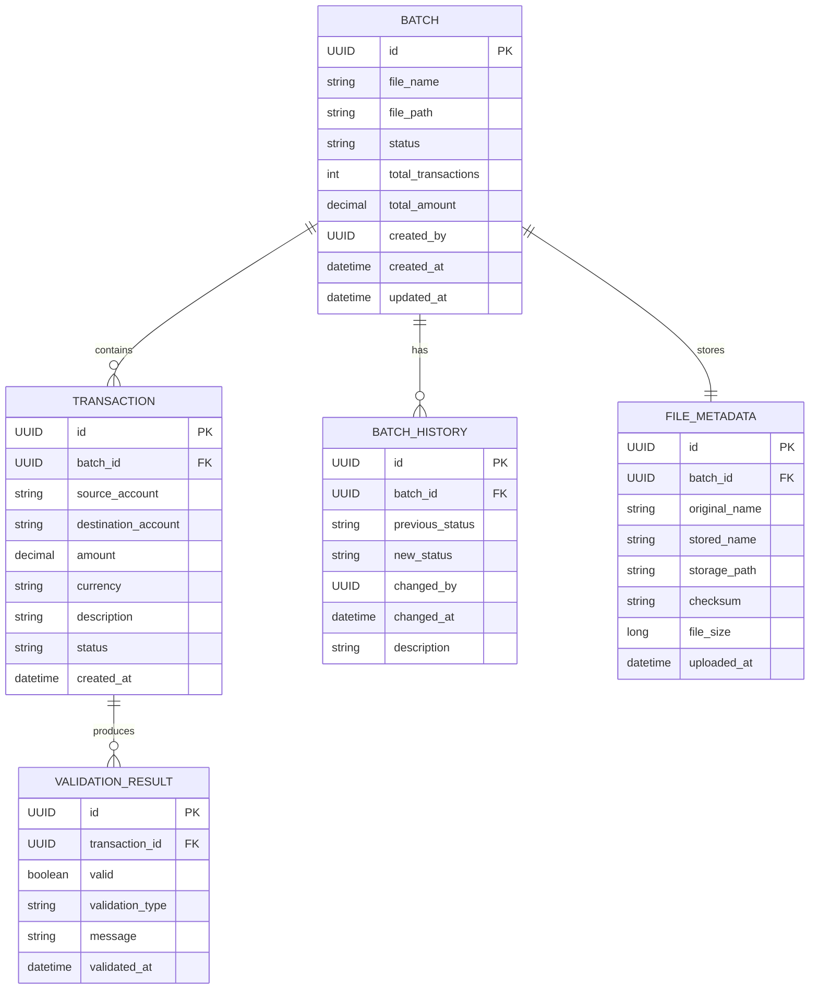
```mermaid
erDiagram

    BATCH {
        UUID id PK
        string file_name
        string file_path
        string status
        int total_transactions
        decimal total_amount
        UUID created_by
        datetime created_at
        datetime updated_at
    }

    TRANSACTION {
        UUID id PK
        UUID batch_id FK
        string source_account
        string destination_account
        decimal amount
        string currency
        string description
        string status
        datetime created_at
    }

    VALIDATION_RESULT {
        UUID id PK
        UUID transaction_id FK
        boolean valid
        string validation_type
        string message
        datetime validated_at
    }

    BATCH_HISTORY {
        UUID id PK
        UUID batch_id FK
        string previous_status
        string new_status
        UUID changed_by
        datetime changed_at
        string description
    }

    FILE_METADATA {
        UUID id PK
        UUID batch_id FK
        string original_name
        string stored_name
        string storage_path
        string checksum
        long file_size
        datetime uploaded_at
    }

    BATCH ||--o{ TRANSACTION : contains
    BATCH ||--o{ BATCH_HISTORY : has
    BATCH ||--|| FILE_METADATA : stores
    TRANSACTION ||--o{ VALIDATION_RESULT : produces
```

## Idea importante

El archivo CSV físico **no se guarda directamente en la base de datos**.

La BD guarda algo como:

```text
batch_id: 10025
file_name: pagos_agosto.csv
file_path: /transactions/2026/08/10025.csv
```

Mientras el archivo está realmente en FTP/Object Storage.

---

# 5. Diagrama de clases — Microservicio de Transacciones

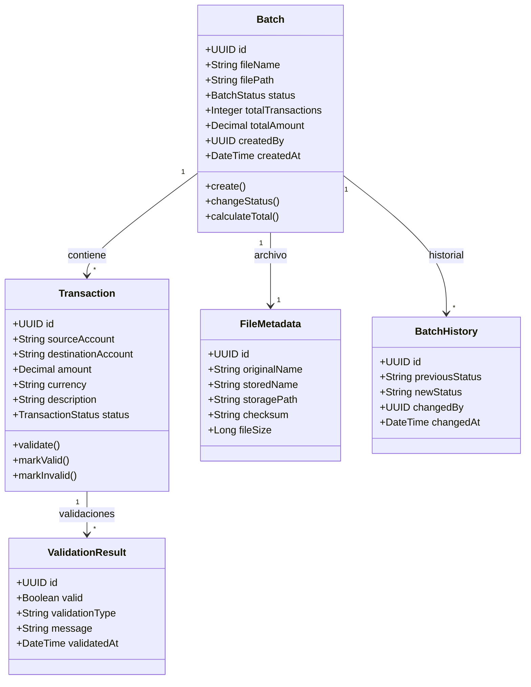
```mermaid
classDiagram

    class Batch {
        +UUID id
        +String fileName
        +String filePath
        +BatchStatus status
        +Integer totalTransactions
        +Decimal totalAmount
        +UUID createdBy
        +DateTime createdAt

        +create()
        +changeStatus()
        +calculateTotal()
    }

    class Transaction {
        +UUID id
        +String sourceAccount
        +String destinationAccount
        +Decimal amount
        +String currency
        +String description
        +TransactionStatus status

        +validate()
        +markValid()
        +markInvalid()
    }

    class ValidationResult {
        +UUID id
        +Boolean valid
        +String validationType
        +String message
        +DateTime validatedAt
    }

    class FileMetadata {
        +UUID id
        +String originalName
        +String storedName
        +String storagePath
        +String checksum
        +Long fileSize
    }

    class BatchHistory {
        +UUID id
        +String previousStatus
        +String newStatus
        +UUID changedBy
        +DateTime changedAt
    }

    Batch "1" --> "*" Transaction : contiene
    Batch "1" --> "1" FileMetadata : archivo
    Batch "1" --> "*" BatchHistory : historial
    Transaction "1" --> "*" ValidationResult : validaciones
```

---

# 6. Microservicio 2: Aprobaciones

Este es uno de los servicios más importantes.

Tiene una única responsabilidad:

> Controlar que un lote pase correctamente por Maker → Checker → Authorizer.

No debería encargarse de leer archivos CSV ni comunicarse directamente con el Core.

Estados posibles:

```text
PENDING_CHECKER
CHECKER_APPROVED
PENDING_AUTHORIZER
AUTHORIZED
REJECTED
```

---

# 7. Diagrama ER — Microservicio de Aprobaciones

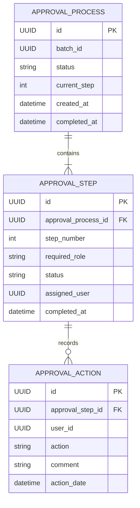
```mermaid
erDiagram

    APPROVAL_PROCESS {
        UUID id PK
        UUID batch_id
        string status
        int current_step
        datetime created_at
        datetime completed_at
    }

    APPROVAL_STEP {
        UUID id PK
        UUID approval_process_id FK
        int step_number
        string required_role
        string status
        UUID assigned_user
        datetime completed_at
    }

    APPROVAL_ACTION {
        UUID id PK
        UUID approval_step_id FK
        UUID user_id
        string action
        string comment
        datetime action_date
    }

    APPROVAL_PROCESS ||--|{ APPROVAL_STEP : contains
    APPROVAL_STEP ||--o{ APPROVAL_ACTION : records
```

---

# 8. Diagrama de clases — Microservicio de Aprobaciones

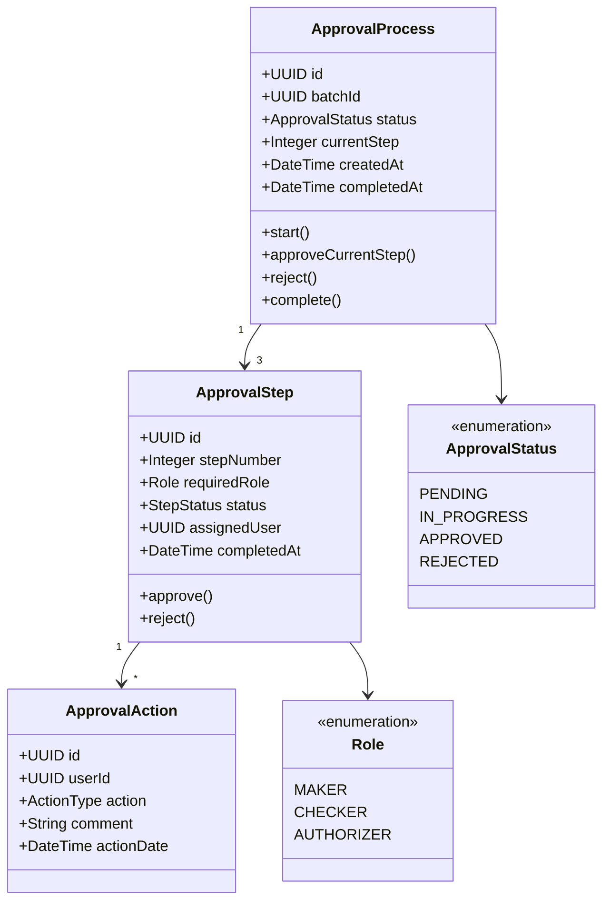
```mermaid
classDiagram

    class ApprovalProcess {
        +UUID id
        +UUID batchId
        +ApprovalStatus status
        +Integer currentStep
        +DateTime createdAt
        +DateTime completedAt

        +start()
        +approveCurrentStep()
        +reject()
        +complete()
    }

    class ApprovalStep {
        +UUID id
        +Integer stepNumber
        +Role requiredRole
        +StepStatus status
        +UUID assignedUser
        +DateTime completedAt

        +approve()
        +reject()
    }

    class ApprovalAction {
        +UUID id
        +UUID userId
        +ActionType action
        +String comment
        +DateTime actionDate
    }

    class Role {
        <<enumeration>>
        MAKER
        CHECKER
        AUTHORIZER
    }

    class ApprovalStatus {
        <<enumeration>>
        PENDING
        IN_PROGRESS
        APPROVED
        REJECTED
    }

    ApprovalProcess "1" --> "3" ApprovalStep
    ApprovalStep "1" --> "*" ApprovalAction
    ApprovalStep --> Role
    ApprovalProcess --> ApprovalStatus
```

---

# 9. Microservicio 3: Integración Bancaria

Este servicio sirve como intermediario entre nuestra aplicación y el Core Bancario.

Eso evita que:

```text
Servicio Transacciones
```

tenga código específico del banco.

La responsabilidad queda mucho más clara:

```text
Aprobaciones
     ↓
Integración Bancaria
     ↓
Core Bancario externo
```

Se encarga de:

* preparar solicitud;
* enviar transacciones;
* recibir respuesta;
* manejar errores;
* registrar intento;
* almacenar identificador externo;
* reintentar cuando corresponda.

---

# 10. Diagrama ER — Integración Bancaria

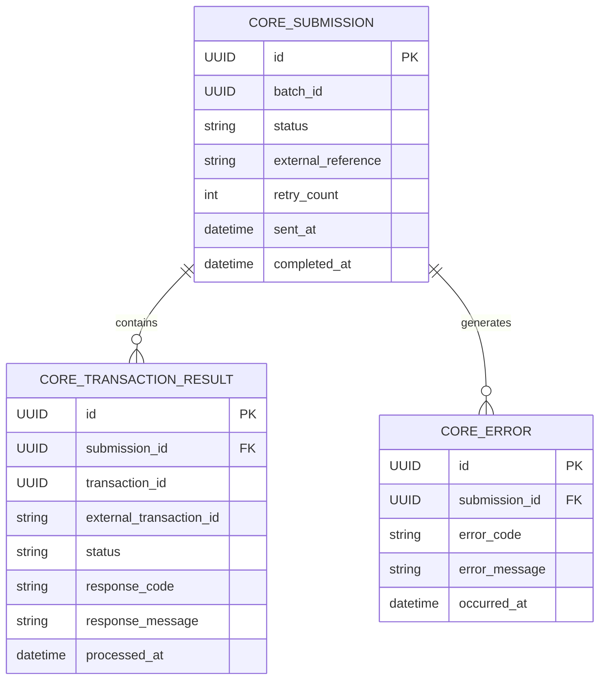
```mermaid
erDiagram

    CORE_SUBMISSION {
        UUID id PK
        UUID batch_id
        string status
        string external_reference
        int retry_count
        datetime sent_at
        datetime completed_at
    }

    CORE_TRANSACTION_RESULT {
        UUID id PK
        UUID submission_id FK
        UUID transaction_id
        string external_transaction_id
        string status
        string response_code
        string response_message
        datetime processed_at
    }

    CORE_ERROR {
        UUID id PK
        UUID submission_id FK
        string error_code
        string error_message
        datetime occurred_at
    }

    CORE_SUBMISSION ||--o{ CORE_TRANSACTION_RESULT : contains
    CORE_SUBMISSION ||--o{ CORE_ERROR : generates
```

---

# 11. Diagrama de clases — Integración Bancaria

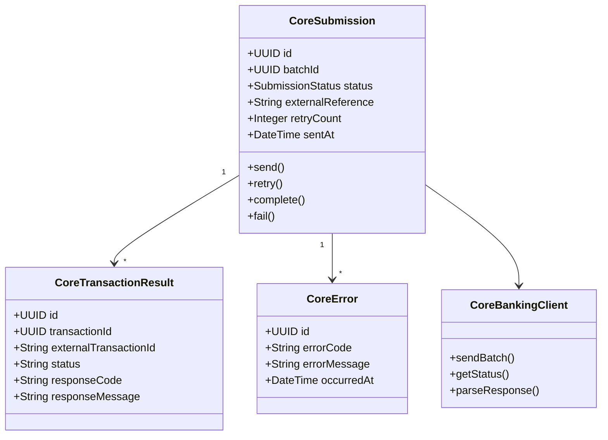
```mermaid
classDiagram

    class CoreSubmission {
        +UUID id
        +UUID batchId
        +SubmissionStatus status
        +String externalReference
        +Integer retryCount
        +DateTime sentAt

        +send()
        +retry()
        +complete()
        +fail()
    }

    class CoreTransactionResult {
        +UUID id
        +UUID transactionId
        +String externalTransactionId
        +String status
        +String responseCode
        +String responseMessage
    }

    class CoreError {
        +UUID id
        +String errorCode
        +String errorMessage
        +DateTime occurredAt
    }

    class CoreBankingClient {
        +sendBatch()
        +getStatus()
        +parseResponse()
    }

    CoreSubmission "1" --> "*" CoreTransactionResult
    CoreSubmission "1" --> "*" CoreError
    CoreSubmission --> CoreBankingClient
```

---

# 12. Microservicio 4: Notificaciones

Su responsabilidad es sencilla:

> Recibir eventos que requieran comunicación y enviar las notificaciones correspondientes.

Por ejemplo:

```text
Lote autorizado
       ↓
Transacciones enviadas al Core
       ↓
Evento
       ↓
Notification Service
       ↓
Correos
```

---

# 13. Diagrama ER — Notificaciones

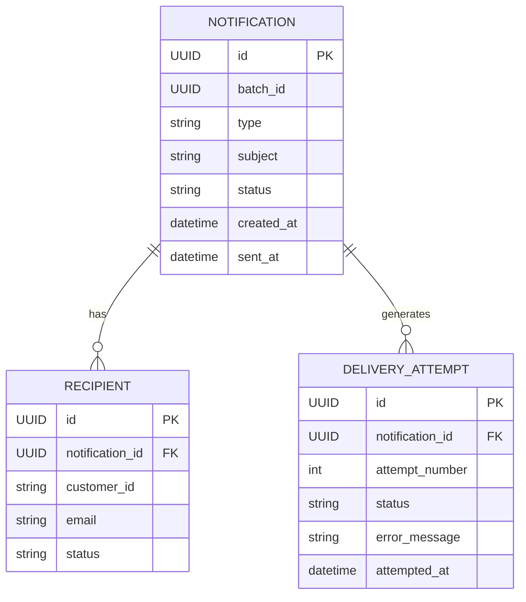
```mermaid
erDiagram

    NOTIFICATION {
        UUID id PK
        UUID batch_id
        string type
        string subject
        string status
        datetime created_at
        datetime sent_at
    }

    RECIPIENT {
        UUID id PK
        UUID notification_id FK
        string customer_id
        string email
        string status
    }

    DELIVERY_ATTEMPT {
        UUID id PK
        UUID notification_id FK
        int attempt_number
        string status
        string error_message
        datetime attempted_at
    }

    NOTIFICATION ||--o{ RECIPIENT : has
    NOTIFICATION ||--o{ DELIVERY_ATTEMPT : generates
```

---

# 14. Diagrama de clases — Notificaciones

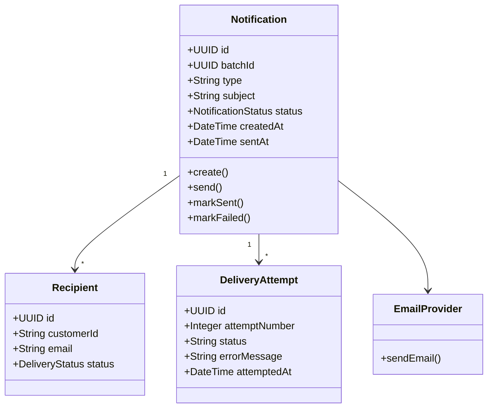
```mermaid
classDiagram

    class Notification {
        +UUID id
        +UUID batchId
        +String type
        +String subject
        +NotificationStatus status
        +DateTime createdAt
        +DateTime sentAt

        +create()
        +send()
        +markSent()
        +markFailed()
    }

    class Recipient {
        +UUID id
        +String customerId
        +String email
        +DeliveryStatus status
    }

    class DeliveryAttempt {
        +UUID id
        +Integer attemptNumber
        +String status
        +String errorMessage
        +DateTime attemptedAt
    }

    class EmailProvider {
        +sendEmail()
    }

    Notification "1" --> "*" Recipient
    Notification "1" --> "*" DeliveryAttempt
    Notification --> EmailProvider
```

---

# 15. Flujo de aprobación Maker → Checker → Authorizer

Aquí hay algo importante.

**Maker realmente inicia el proceso creando/cargando el lote.**

Luego:

```text
MAKER
  ↓
Carga CSV
  ↓
Validación
  ↓
CHECKER
  ↓
Revisa
  ↓
AUTHORIZER
  ↓
Autoriza
  ↓
Core Bancario
```

Las reglas serían:

### Paso 1 — Maker

Carga el archivo CSV y genera el lote.

```text
CREATED
   ↓
VALIDATING
   ↓
PENDING_CHECKER
```

### Paso 2 — Checker

Revisa el lote.

Puede:

```text
APPROVE
REJECT
```

Si aprueba:

```text
PENDING_CHECKER
       ↓
CHECKER_APPROVED
       ↓
PENDING_AUTHORIZER
```

### Paso 3 — Authorizer

Realiza la autorización final.

```text
PENDING_AUTHORIZER
        ↓
AUTHORIZED
```

En ese momento el lote ya puede enviarse al Core Bancario.

---

# 16. UML de estados de aprobación

Mermaid permite representarlo de manera muy clara:

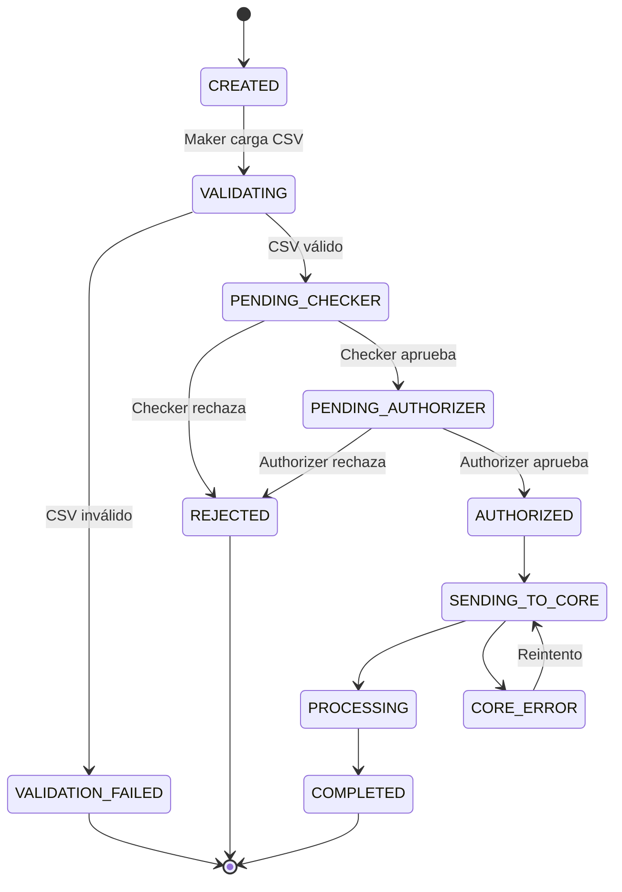
```mermaid
stateDiagram-v2

    [*] --> CREATED

    CREATED --> VALIDATING : Maker carga CSV

    VALIDATING --> VALIDATION_FAILED : CSV inválido
    VALIDATING --> PENDING_CHECKER : CSV válido

    VALIDATION_FAILED --> [*]

    PENDING_CHECKER --> REJECTED : Checker rechaza
    PENDING_CHECKER --> PENDING_AUTHORIZER : Checker aprueba

    PENDING_AUTHORIZER --> REJECTED : Authorizer rechaza
    PENDING_AUTHORIZER --> AUTHORIZED : Authorizer aprueba

    AUTHORIZED --> SENDING_TO_CORE
    SENDING_TO_CORE --> PROCESSING
    PROCESSING --> COMPLETED

    SENDING_TO_CORE --> CORE_ERROR

    CORE_ERROR --> SENDING_TO_CORE : Reintento

    REJECTED --> [*]
    COMPLETED --> [*]
```

Este diagrama te recomiendo mucho incluirlo porque explica perfectamente el flujo de los estados.

---

# 17. Secuencia UML — Aprobación de 3 pasos

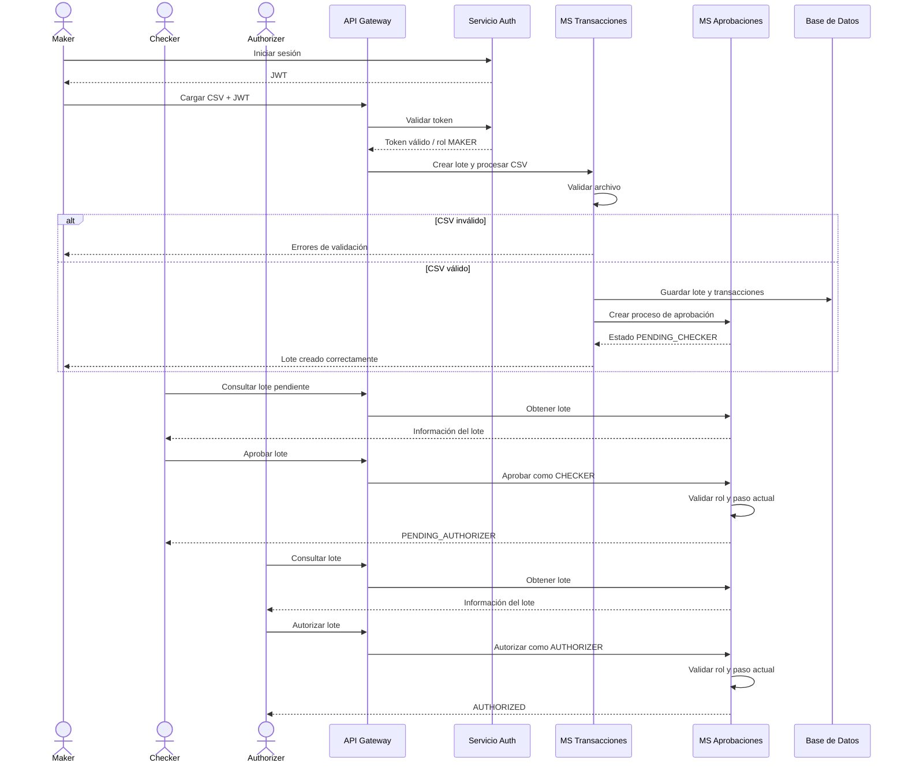
```mermaid
sequenceDiagram

    actor Maker
    actor Checker
    actor Authorizer

    participant Gateway as API Gateway
    participant Auth as Servicio Auth
    participant Tx as MS Transacciones
    participant Approval as MS Aprobaciones
    participant DB as Base de Datos

    Maker->>Auth: Iniciar sesión
    Auth-->>Maker: JWT

    Maker->>Gateway: Cargar CSV + JWT
    Gateway->>Auth: Validar token
    Auth-->>Gateway: Token válido / rol MAKER

    Gateway->>Tx: Crear lote y procesar CSV
    Tx->>Tx: Validar archivo

    alt CSV inválido
        Tx-->>Maker: Errores de validación
    else CSV válido
        Tx->>DB: Guardar lote y transacciones
        Tx->>Approval: Crear proceso de aprobación
        Approval-->>Tx: Estado PENDING_CHECKER
        Tx-->>Maker: Lote creado correctamente
    end

    Checker->>Gateway: Consultar lote pendiente
    Gateway->>Approval: Obtener lote
    Approval-->>Checker: Información del lote

    Checker->>Gateway: Aprobar lote
    Gateway->>Approval: Aprobar como CHECKER
    Approval->>Approval: Validar rol y paso actual
    Approval-->>Checker: PENDING_AUTHORIZER

    Authorizer->>Gateway: Consultar lote
    Gateway->>Approval: Obtener lote
    Approval-->>Authorizer: Información del lote

    Authorizer->>Gateway: Autorizar lote
    Gateway->>Approval: Autorizar como AUTHORIZER
    Approval->>Approval: Validar rol y paso actual
    Approval-->>Authorizer: AUTHORIZED
```

---

# 18. Secuencia UML — Envío al Core Bancario

Aquí recomiendo utilizar comunicación asíncrona.

En lugar de:

```text
Approval → HTTP → CoreIntegration
```

utilizamos:

```text
Approval
   ↓ evento
Message Broker
   ↓
Core Integration
```

Así, si el Core está temporalmente caído, no perdemos el lote.

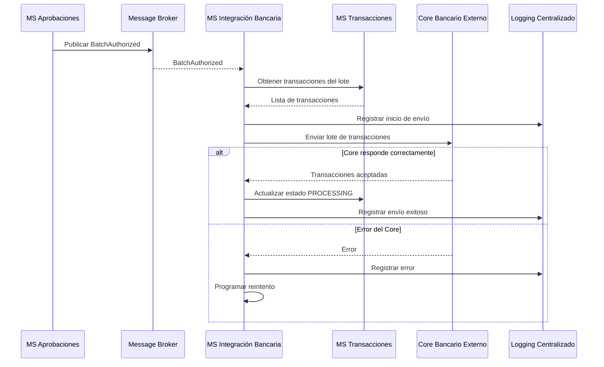
```mermaid
sequenceDiagram

    participant Approval as MS Aprobaciones
    participant Broker as Message Broker
    participant CoreIntegration as MS Integración Bancaria
    participant Tx as MS Transacciones
    participant Core as Core Bancario Externo
    participant Logs as Logging Centralizado

    Approval->>Broker: Publicar BatchAuthorized

    Broker-->>CoreIntegration: BatchAuthorized

    CoreIntegration->>Tx: Obtener transacciones del lote
    Tx-->>CoreIntegration: Lista de transacciones

    CoreIntegration->>Logs: Registrar inicio de envío

    CoreIntegration->>Core: Enviar lote de transacciones

    alt Core responde correctamente
        Core-->>CoreIntegration: Transacciones aceptadas
        CoreIntegration->>Tx: Actualizar estado PROCESSING
        CoreIntegration->>Logs: Registrar envío exitoso
    else Error del Core
        Core-->>CoreIntegration: Error
        CoreIntegration->>Logs: Registrar error
        CoreIntegration->>CoreIntegration: Programar reintento
    end
```

---

# 19. Secuencia UML — Notificación a clientes

Según el enunciado, después de la aprobación final se debe avisar a los clientes/beneficiarios que su transacción está en proceso.

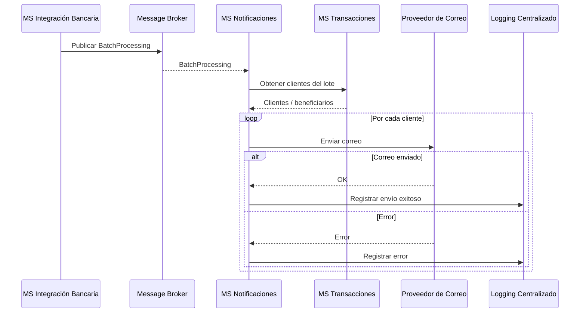
```mermaid
sequenceDiagram

    participant CoreIntegration as MS Integración Bancaria
    participant Broker as Message Broker
    participant Notification as MS Notificaciones
    participant Tx as MS Transacciones
    participant Email as Proveedor de Correo
    participant Logs as Logging Centralizado

    CoreIntegration->>Broker: Publicar BatchProcessing

    Broker-->>Notification: BatchProcessing

    Notification->>Tx: Obtener clientes del lote
    Tx-->>Notification: Clientes / beneficiarios

    loop Por cada cliente
        Notification->>Email: Enviar correo

        alt Correo enviado
            Email-->>Notification: OK
            Notification->>Logs: Registrar envío exitoso
        else Error
            Email-->>Notification: Error
            Notification->>Logs: Registrar error
        end
    end
```

---

# 20. Diagrama UML de componentes

Mermaid actualmente no tiene una sintaxis `componentDiagram` UML nativa como PlantUML, por lo que lo más estable es representarlo mediante `flowchart`, usando estereotipos `<<component>>`.

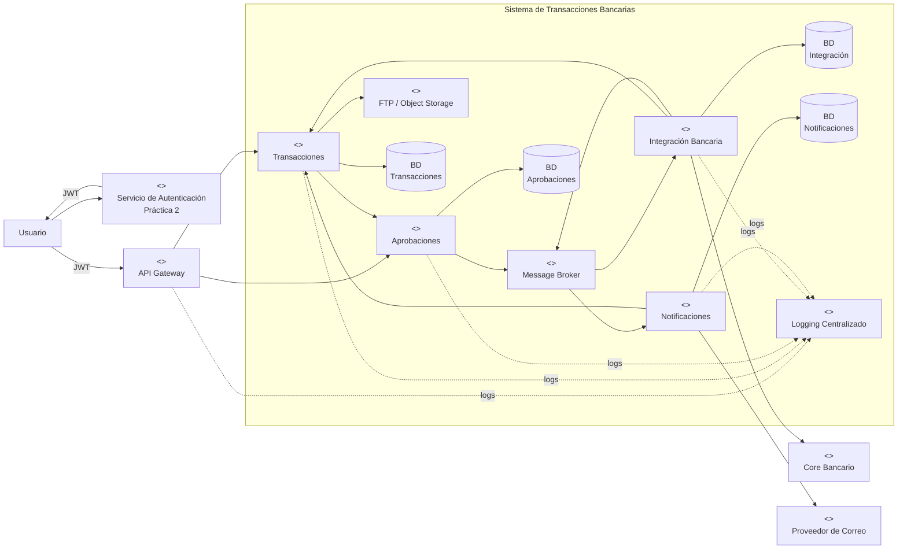
```mermaid
flowchart LR

    User["Usuario"]

    Auth["<<component>><br/>Servicio de Autenticación<br/>Práctica 2"]

    Gateway["<<component>><br/>API Gateway"]

    subgraph BankingSystem["Sistema de Transacciones Bancarias"]

        Tx["<<microservice>><br/>Transacciones"]

        Approval["<<microservice>><br/>Aprobaciones"]

        CoreIntegration["<<microservice>><br/>Integración Bancaria"]

        Notification["<<microservice>><br/>Notificaciones"]

        Broker["<<infrastructure>><br/>Message Broker"]

        Storage["<<storage>><br/>FTP / Object Storage"]

        TxDB[("BD<br/>Transacciones")]

        ApprovalDB[("BD<br/>Aprobaciones")]

        CoreDB[("BD<br/>Integración")]

        NotificationDB[("BD<br/>Notificaciones")]

        Logs["<<infrastructure>><br/>Logging Centralizado"]
    end

    Core["<<external system>><br/>Core Bancario"]

    Email["<<external system>><br/>Proveedor de Correo"]

    User --> Auth
    Auth -->|JWT| User

    User -->|JWT| Gateway

    Gateway --> Tx
    Gateway --> Approval

    Tx --> TxDB
    Tx --> Storage

    Tx --> Approval

    Approval --> ApprovalDB
    Approval --> Broker

    Broker --> CoreIntegration
    CoreIntegration --> CoreDB
    CoreIntegration --> Tx
    CoreIntegration --> Core

    CoreIntegration --> Broker
    Broker --> Notification

    Notification --> NotificationDB
    Notification --> Tx
    Notification --> Email

    Gateway -. logs .-> Logs
    Tx -. logs .-> Logs
    Approval -. logs .-> Logs
    CoreIntegration -. logs .-> Logs
    Notification -. logs .-> Logs
```

Este sería uno de los diagramas principales que yo colocaría en tu documentación.

---

# 21. Estrategia para almacenar los CSV

No almacenaría los CSV dentro de PostgreSQL.

Tendría:

```text
                 MS Transacciones
                    /        \
                   /          \
                  ↓            ↓
           PostgreSQL     Object Storage
                          FTP / S3 / MinIO
```

La base de datos almacena:

```text
ID del lote
Nombre
Ruta
Checksum
Tamaño
Fecha
Usuario
Estado
```

El almacenamiento conserva:

```text
archivo.csv
```

Una estructura podría ser:

```text
/transactions
    /2026
        /08
            /batch-UUID
                original.csv
                validated.csv
```

Por ejemplo:

```text
/transactions/2026/08/8f81-abc/original.csv
```

### ¿Por qué?

Porque una base de datos está mejor preparada para consultar información estructurada.

Mientras FTP/Object Storage está preparado para almacenar archivos.

---

# 22. Base de datos por microservicio

Un principio muy importante sería:

> Cada microservicio es propietario de su propia información.

No:

```text
                Una única DB
                 ↑ ↑ ↑ ↑
                 │ │ │ │
            todos los servicios
```

Preferiblemente:

```text
Transacciones ─────── PostgreSQL Transactions

Aprobaciones ─────── PostgreSQL Approvals

Integración ───────── PostgreSQL Integration

Notificaciones ────── PostgreSQL Notifications
```

No significa obligatoriamente cuatro servidores PostgreSQL.

En desarrollo podrían existir dentro de una misma instancia de PostgreSQL utilizando bases o esquemas separados.

Conceptualmente siguen siendo independientes.

---

# 23. Comunicación entre microservicios

Aquí usaría **dos tipos de comunicación**.

## REST

Para operaciones donde necesitamos respuesta inmediata.

Por ejemplo:

```text
API Gateway
     ↓ REST
Transacciones
```

También:

```text
CoreIntegration
     ↓ REST
Transactions
     ↓
GET /batches/{id}/transactions
```

Ejemplos:

```http
POST /api/v1/batches
GET  /api/v1/batches/{id}
GET  /api/v1/batches/{id}/transactions

GET  /api/v1/approvals/pending
POST /api/v1/approvals/{batchId}/check
POST /api/v1/approvals/{batchId}/authorize
POST /api/v1/approvals/{batchId}/reject
```

---

## Mensajería

Para acciones que pueden ejecutarse posteriormente.

Por ejemplo:

```text
Approval Service
       ↓
BatchAuthorized
       ↓
Message Broker
       ↓
Core Integration
```

Luego:

```text
Core Integration
       ↓
BatchProcessing
       ↓
Message Broker
       ↓
Notification Service
```

Podríamos manejar eventos como:

```text
BatchCreated
BatchValidated
BatchRejected
BatchAuthorized
BatchSentToCore
BatchProcessing
BatchCompleted
BatchFailed
```

Esto hace el sistema más desacoplado.

---

# 24. Flujo completo REST + eventos

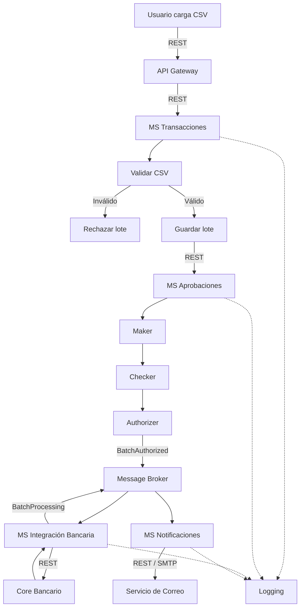
```mermaid
flowchart TD

    A[Usuario carga CSV]

    A -->|REST| B[API Gateway]

    B -->|REST| C[MS Transacciones]

    C --> D[Validar CSV]

    D -->|Inválido| X[Rechazar lote]

    D -->|Válido| E[Guardar lote]

    E -->|REST| F[MS Aprobaciones]

    F --> G[Maker]

    G --> H[Checker]

    H --> I[Authorizer]

    I -->|BatchAuthorized| J[Message Broker]

    J --> K[MS Integración Bancaria]

    K -->|REST| L[Core Bancario]

    L --> K

    K -->|BatchProcessing| J

    J --> M[MS Notificaciones]

    M -->|REST / SMTP| N[Servicio de Correo]

    C -.-> LOG[Logging]
    F -.-> LOG
    K -.-> LOG
    M -.-> LOG
```

---

# 25. Estrategia de logging centralizado

El requisito específicamente pide:

> sistema de logging centralizado y auditable.

No debemos tener:

```text
transactions.log
approvals.log
notifications.log
```

perdidos en diferentes servidores.

Todos los servicios mandan sus registros al mismo sistema:

```text
API Gateway ───────────┐
Auth ──────────────────┤
Transactions ──────────┤
Approvals ─────────────┤
Core Integration ──────┤──► Logging Centralizado
Notifications ─────────┘
```

Cada log debería tener al menos:

```json
{
  "timestamp": "2026-08-11T20:30:00",
  "service": "approval-service",
  "level": "INFO",
  "userId": "123",
  "batchId": "ABC-123",
  "action": "BATCH_AUTHORIZED",
  "message": "Lote autorizado correctamente"
}
```

Muy importante para este sistema sería usar un:

```text
correlationId
```

Por ejemplo:

```text
correlationId = TX-893728
```

Ese mismo ID acompaña:

```text
API Gateway
↓
Transactions
↓
Approval
↓
Core Integration
↓
Notification
```

Así puedes buscar:

```text
TX-893728
```

en los logs y ver **todo lo que ocurrió con esa operación**.

---

# 26. Propuesta de tecnologías para logging

Arquitectónicamente:

```text
Microservicios
      ↓
Collector
      ↓
Sistema central
```

Una opción clásica:

```text
Microservicios
      ↓
Fluent Bit / Logstash
      ↓
Elasticsearch
      ↓
Kibana
```

También podrías utilizar:

```text
Grafana + Loki
```

Para la práctica no necesitas necesariamente implementarlo completo si únicamente te solicitan diseño; puedes proponerlo.

---

# 27. Propuesta de API Gateway

El API Gateway será el único punto público hacia los microservicios.

```text
Internet
   ↓
API Gateway
   ↓
┌───────────────┐
│ Microservicios│
└───────────────┘
```

No expondría:

```text
transactions-service:3001
approval-service:3002
notification-service:3003
```

directamente.

El usuario solamente debería conocer:

```text
https://api.banco.com
```

---

# 28. Rutas propuestas

Por ejemplo:

```text
/api/v1/auth/*
       ↓
Authentication Service

/api/v1/batches/*
       ↓
Transaction Service

/api/v1/transactions/*
       ↓
Transaction Service

/api/v1/approvals/*
       ↓
Approval Service
```

Integración bancaria y notificaciones **no necesitan necesariamente estar expuestos al usuario**.

```text
CoreIntegration
Notification
```

pueden ser únicamente internos.

---

# 29. Funciones del API Gateway

Tu API Gateway tendría:

```text
Validación JWT
      ↓
Autorización
      ↓
Rate Limiting
      ↓
Routing
      ↓
Logging
      ↓
Microservicio
```

Por ejemplo:

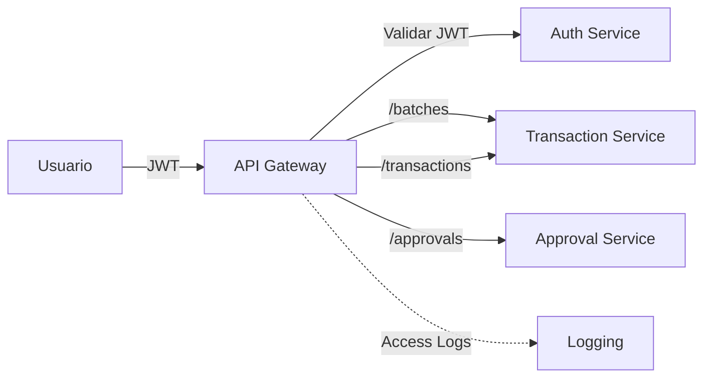
```mermaid
flowchart LR

    User[Usuario]

    Gateway[API Gateway]

    Auth[Auth Service]

    Transactions[Transaction Service]

    Approvals[Approval Service]

    Logs[Logging]

    User -->|JWT| Gateway

    Gateway -->|Validar JWT| Auth

    Gateway -->|/batches| Transactions

    Gateway -->|/transactions| Transactions

    Gateway -->|/approvals| Approvals

    Gateway -.->|Access Logs| Logs
```

---

# 30. Arquitectura final recomendada

Juntando todo, la solución que yo defendería para tu práctica sería:

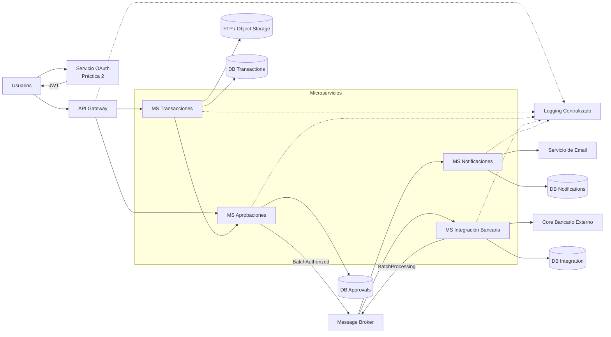
```mermaid
flowchart LR

    User[Usuarios]

    Auth[Servicio OAuth<br/>Práctica 2]

    Gateway[API Gateway]

    subgraph Microservices["Microservicios"]

        Transactions[MS Transacciones]

        Approvals[MS Aprobaciones]

        Integration[MS Integración Bancaria]

        Notifications[MS Notificaciones]

    end

    Broker[Message Broker]

    FileStorage[(FTP / Object Storage)]

    DB1[(DB Transactions)]
    DB2[(DB Approvals)]
    DB3[(DB Integration)]
    DB4[(DB Notifications)]

    Core[Core Bancario Externo]

    Email[Servicio de Email]

    Logging[Logging Centralizado]

    User --> Auth
    Auth -->|JWT| User

    User --> Gateway

    Gateway --> Transactions
    Gateway --> Approvals

    Transactions --> DB1
    Transactions --> FileStorage

    Transactions --> Approvals

    Approvals --> DB2

    Approvals -->|BatchAuthorized| Broker

    Broker --> Integration

    Integration --> DB3

    Integration --> Core

    Integration -->|BatchProcessing| Broker

    Broker --> Notifications

    Notifications --> DB4

    Notifications --> Email

    Gateway -.-> Logging
    Transactions -.-> Logging
    Approvals -.-> Logging
    Integration -.-> Logging
    Notifications -.-> Logging
```

