## 202203069
## Bruce Carbonell Castillo Cifuentes 

## 1. Arquitectura propuesta

La arquitectura se divide en **4 microservicios principales** y reutiliza el servicio de autenticación desarrollado en la Práctica 2. Esta división obedece a los principios de alta cohesión y bajo acoplamiento, permitiendo escalar de forma independiente las partes del sistema que más lo requieran (por ejemplo, el procesamiento de transacciones masivas). 

| Componente                            | Responsabilidad principal y alcance                       |
| ------------------------------------- | --------------------------------------------------------- |
| Servicio de Autenticación             | Gestión de la identidad de los usuarios, login, generación y validación de tokens OAuth/JWT, así como administración de roles y permisos del sistema. |
| Microservicio de Transacciones        | Orquestación de la carga de archivos CSV, creación de lotes (batches), desglose de transacciones individuales, validaciones de formato/negocio e historial de estados. |
| Microservicio de Aprobaciones         | Gestión del flujo de autorización de pagos (Maker → Checker → Authorizer). Controla de forma estricta qué roles pueden aprobar o rechazar cada lote en su etapa correspondiente. |
| Microservicio de Integración Bancaria | Actúa como capa anticorrupción (Anti-Corruption Layer) para la comunicación con el Core Bancario externo, aislando las fallas y gestionando reintentos. |
| Microservicio de Notificaciones       | Encargado del envío de correos electrónicos a clientes o beneficiarios, y cualquier otra comunicación saliente de la plataforma. |
| API Gateway                           | Único punto de entrada público de la aplicación. Centraliza el enrutamiento, validación inicial del JWT, políticas de seguridad (CORS, Rate Limiting) y autorización de rutas. |
| FTP / Object Storage                  | Medio de almacenamiento persistente para los archivos CSV originales, evitando sobrecargar la base de datos relacional. |
| Logging centralizado                  | Plataforma unificada de auditoría y registro de eventos transaccionales y técnicos de todos los microservicios, clave para la trazabilidad y monitoreo. |

El flujo general del sistema inicia cuando el usuario se autentica y posteriormente interactúa con el API Gateway, el cual dirige el tráfico al microservicio adecuado según el proceso. El flujo de interacciones es el siguiente:el siguiente:

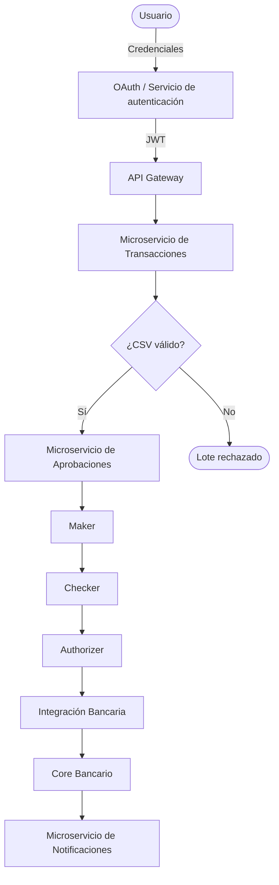

---

# 2. Integración del servicio de autenticación de la Práctica 2

Para este proyecto, la autenticación no se vuelve a implementar desde cero, sino que se integra y reutiliza el servicio desarrollado en la Práctica 2. Esta estrategia asegura la compatibilidad con los sistemas heredados de la empresa y reduce significativamente el tiempo de desarrollo.

El flujo de autenticación garantiza que ningún usuario interactúe directamente con los microservicios de negocio sin antes haber sido validado y autenticado correctamente:

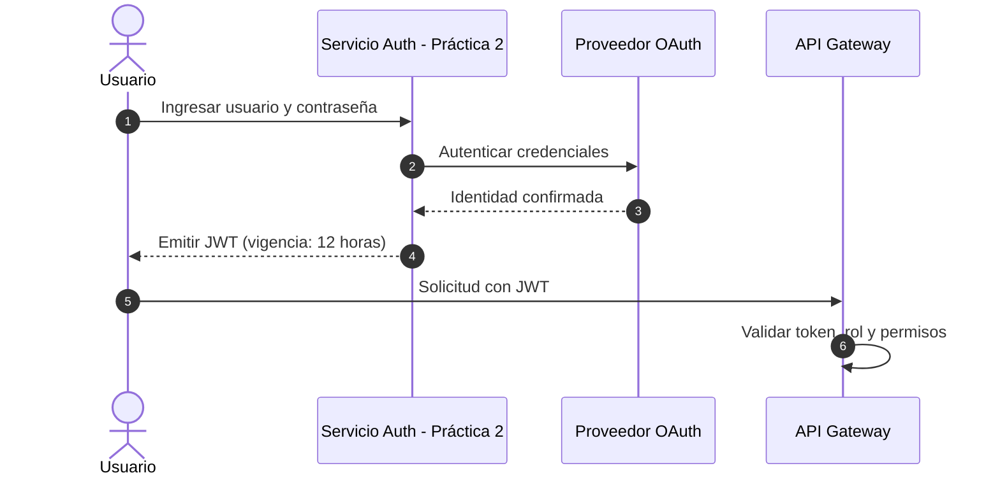

El JWT resultante es firmado digitalmente (por ejemplo, utilizando algoritmos como HS256 o RS256) y contiene los "claims" o afirmaciones necesarias para que el API Gateway tome decisiones de autorización de forma autónoma, sin necesidad de consultar repetidamente a la base de datos en cada petición. El contenido (payload) típico es el siguiente:

```json
{
  "userId": 152,
  "username": "usuario1",
  "roles": [
    "MAKER"
  ],
  "exp": "..."
}
```

Para garantizar la seguridad perimetral y el control de acceso, el API Gateway inspecciona cada petición entrante y valida de forma estricta los siguientes aspectos del token:

* **Existencia y formato:** Verifica que el token esté presente en el header `Authorization` (como un `Bearer token`) y que esté bien formado estructuralmente.
* **Vigencia:** Confirma que el token no haya expirado (mediante la validación del claim `exp`).
* **Autenticidad e Integridad:** Comprueba mediante la clave secreta o pública que el token fue firmado por el Servicio de Autenticación y no ha sido alterado.
* **Identidad:** Determina qué usuario específico está realizando la petición.
* **Rol y Permisos:** Analiza los roles del usuario para conceder o denegar el acceso a la ruta solicitada, aplicando el principio de menor privilegio.

La autorización de las rutas y operaciones se distribuye de manera granular y estricta según el rol del usuario:

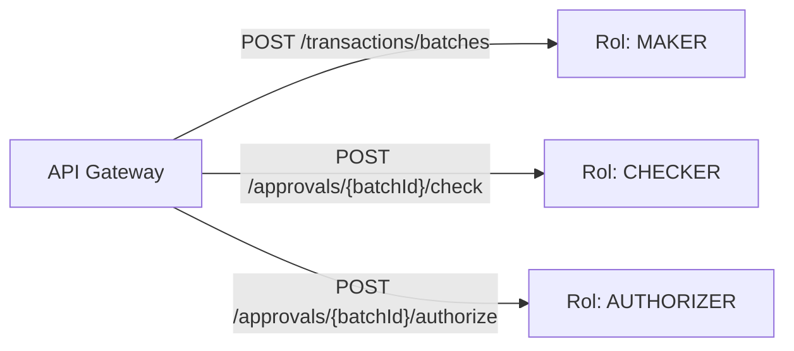

---

# 3. Microservicio 1: Transacciones

## Responsabilidad Principal

Este es el microservicio central para la captura de datos. Su propósito principal es aislar la lógica de procesamiento de archivos masivos y las validaciones de negocio iniciales.

Sus responsabilidades específicas incluyen:

* **Gestión de Lotes (Batches):** Permite crear, listar y consultar lotes de pagos. Cada lote agrupa múltiples transacciones que deben procesarse en conjunto.
* **Procesamiento de Archivos CSV:** Recibe el archivo, lo parsea de forma asíncrona para no bloquear el API, y extrae los registros individuales.
* **Validaciones Estructurales y de Negocio:** Verifica que cada transacción cumpla con las reglas (por ejemplo, cuenta de origen válida, monto mayor a cero, moneda soportada). Las transacciones inválidas se marcan con su respectivo error.
* **Almacenamiento de Metadatos:** Guarda referencias al archivo físico (ubicación, nombre, checksum) pero no el archivo en sí.
* **Trazabilidad (Historial):** Mantiene un registro inmutable de todos los cambios de estado por los que pasa un lote (ej. CREATED, VALIDATING, PENDING_CHECKER, etc.).

**Límites del contexto (Bounded Context):**
Es muy importante destacar que este servicio **no toma decisiones de autorización de flujo**. No sabe ni le interesa qué usuario específico debe aprobar el lote, ni qué roles existen. Toda la lógica de "Maker → Checker → Authorizer" corresponde única y exclusivamente al **Microservicio de Aprobaciones**.

---

# 4. Diagrama ER — Microservicio de Transacciones

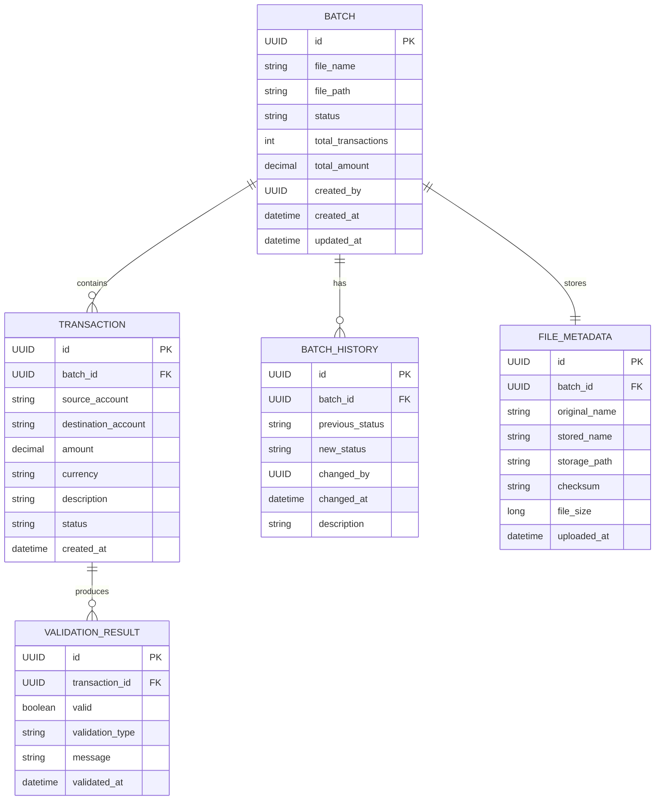

## Almacenamiento del archivo

El archivo CSV físico **no se guarda directamente en la base de datos**. La base de datos conserva únicamente sus metadatos:

```text
batch_id: 10025
file_name: pagos_agosto.csv
file_path: /transactions/2026/08/10025.csv
```

El archivo se almacena en FTP u Object Storage.

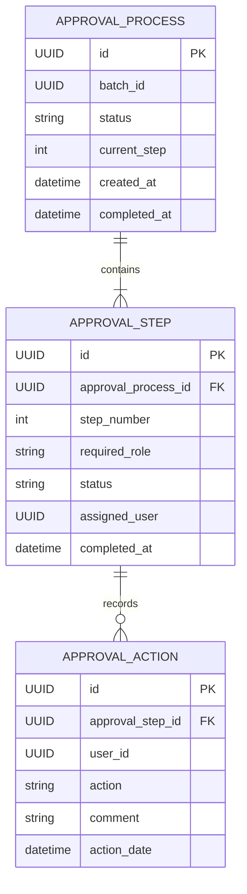

---

# 8. Diagrama de clases — Microservicio de Aprobaciones

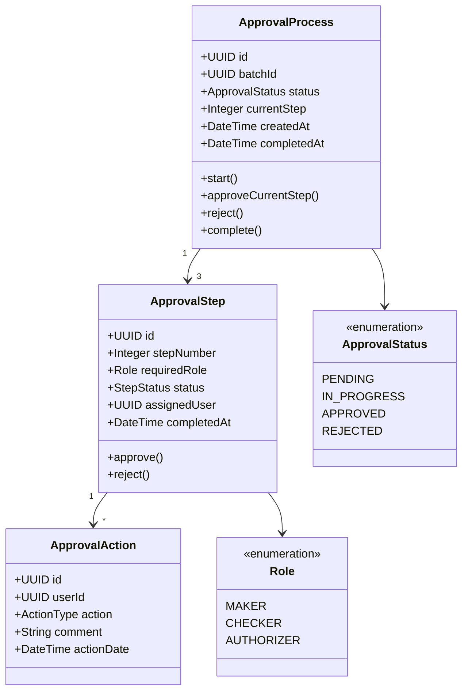

---

# 9. Microservicio 3: Integración Bancaria

Este servicio funciona como intermediario entre la aplicación y el Core Bancario. De esta forma, el servicio de transacciones no contiene código específico del banco.

La comunicación se distribuye así:

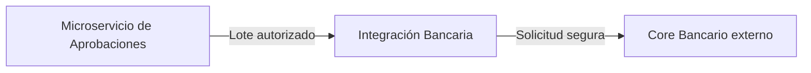

Se encarga de:

* preparar solicitud;
* enviar transacciones;
* recibir respuesta;
* manejar errores;
* registrar intento;
* almacenar identificador externo;
* reintentar cuando corresponda.

---

# 10. Diagrama ER — Integración Bancaria

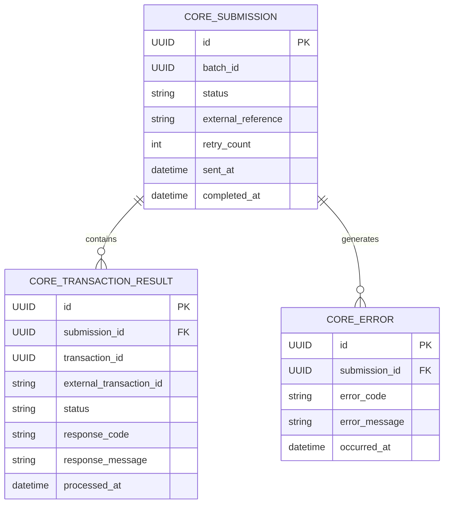

---

# 11. Diagrama de clases — Integración Bancaria

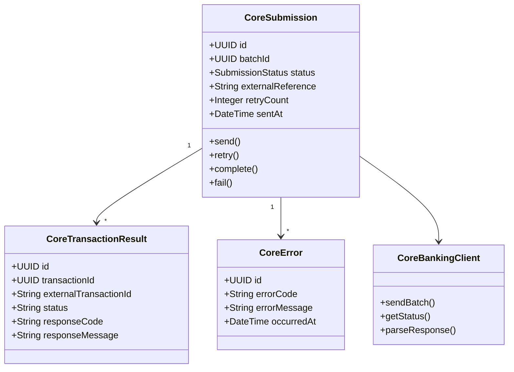

---

# 12. Microservicio 4: Notificaciones

Este servicio recibe los eventos que requieren comunicación con los clientes:

El flujo de notificación es el siguiente:

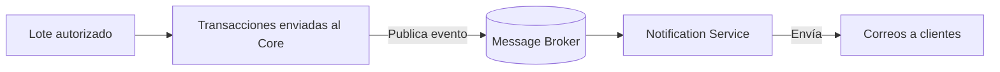

---

# 13. Diagrama ER — Notificaciones

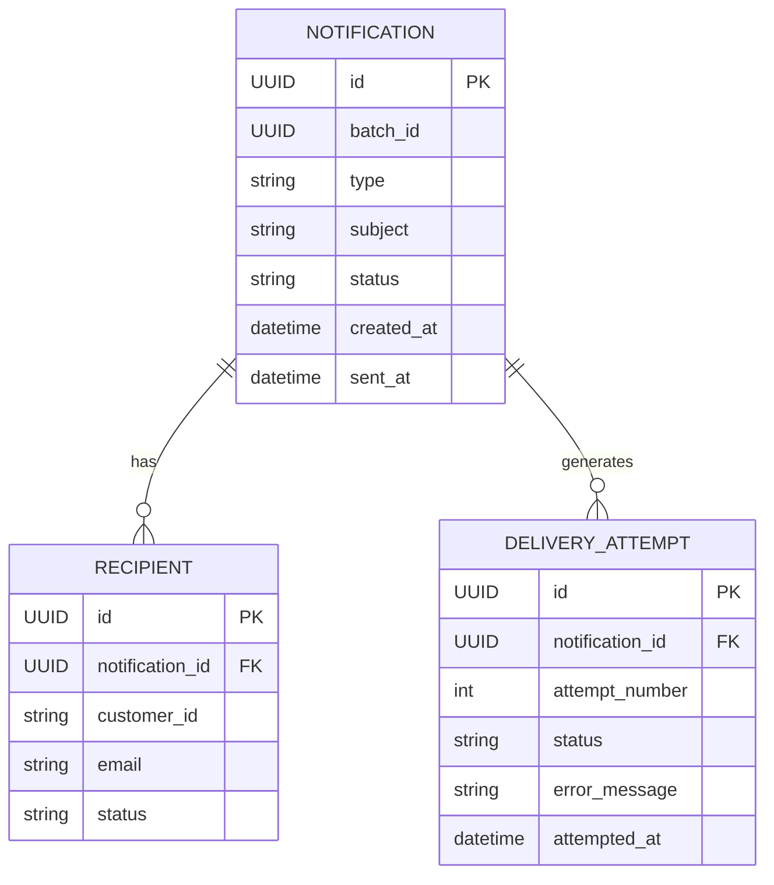

---

# 14. Diagrama de clases — Notificaciones

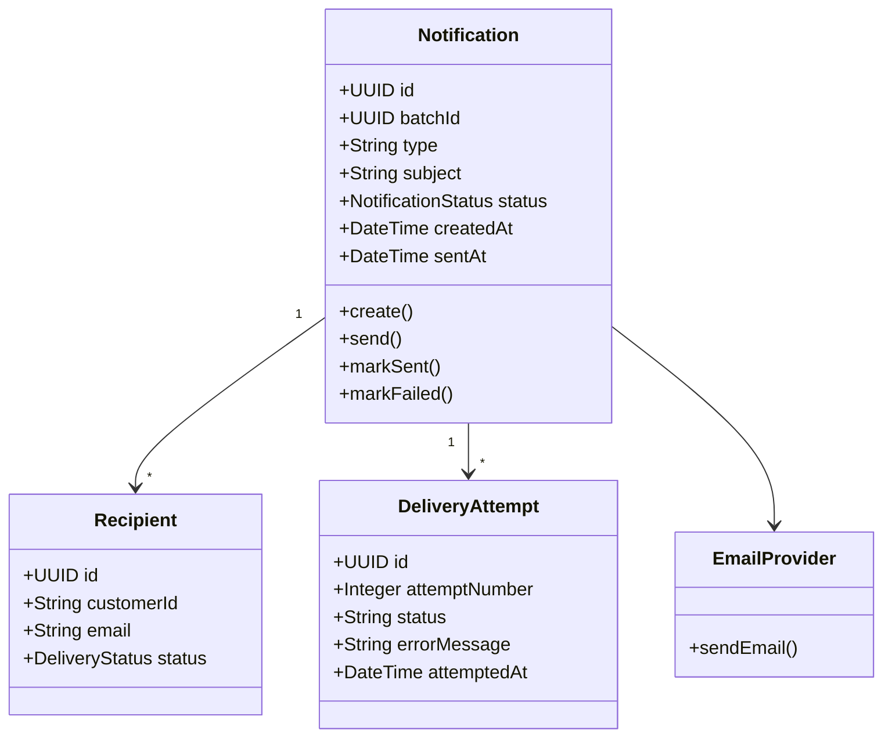

---

# 15. Flujo de aprobación Maker → Checker → Authorizer

El proceso inicia cuando el **Maker** crea el lote y carga el archivo CSV:

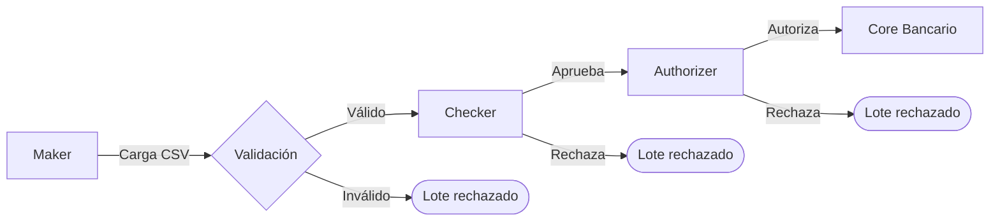

El flujo se divide en tres pasos:

### Paso 1 — Maker

Carga el archivo CSV y genera el lote.

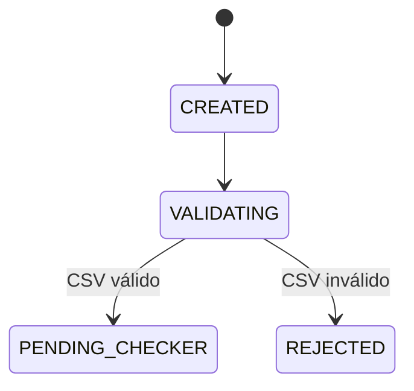

### Paso 2 — Checker

Revisa el lote.

Puede:

```text
APPROVE
REJECT
```

Si aprueba:

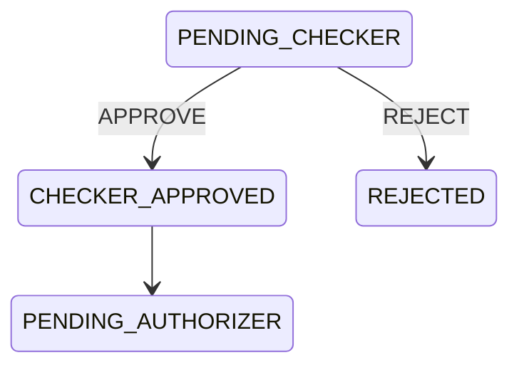

### Paso 3 — Authorizer

Realiza la autorización final.

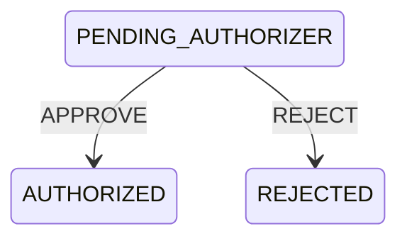

Después de la autorización, el lote queda listo para enviarse al Core Bancario.

---

# 16. UML de estados de aprobación

El ciclo completo de estados se muestra a continuación:

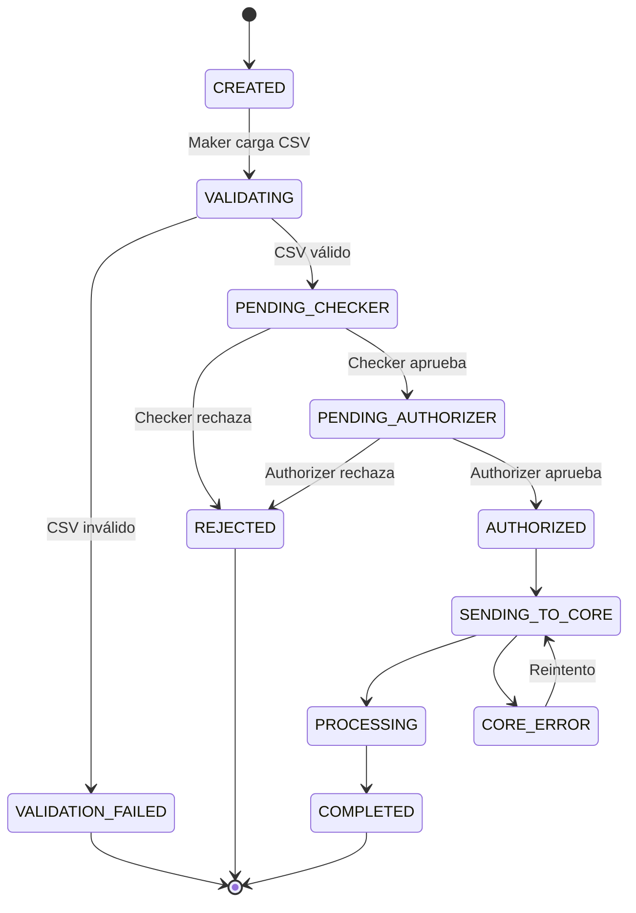

---

# 17. Secuencia UML — Aprobación de 3 pasos

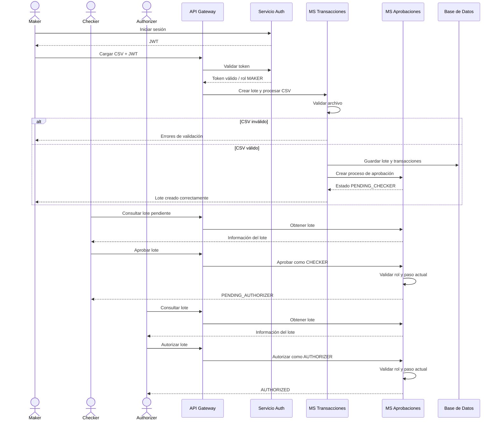

---

# 18. Secuencia UML — Envío al Core Bancario

Para este envío se utiliza comunicación asíncrona.

En lugar de:

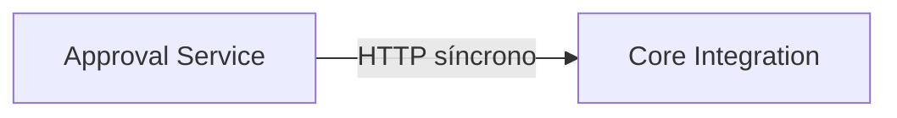

El flujo implementado es:

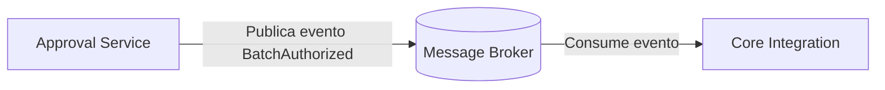

Si el Core no está disponible temporalmente, el mensaje permanece en el broker y puede procesarse después.

```mermaid
sequenceDiagram

    participant Approval as MS Aprobaciones
    participant Broker as Message Broker
    participant CoreIntegration as MS Integración Bancaria
    participant Tx as MS Transacciones
    participant Core as Core Bancario Externo
    participant Logs as Logging Centralizado

    Approval->>Broker: Publicar BatchAuthorized

    Broker-->>CoreIntegration: BatchAuthorized

    CoreIntegration->>Tx: Obtener transacciones del lote
    Tx-->>CoreIntegration: Lista de transacciones

    CoreIntegration->>Logs: Registrar inicio de envío

    CoreIntegration->>Core: Enviar lote de transacciones

    alt Core responde correctamente
        Core-->>CoreIntegration: Transacciones aceptadas
        CoreIntegration->>Tx: Actualizar estado PROCESSING
        CoreIntegration->>Logs: Registrar envío exitoso
    else Error del Core
        Core-->>CoreIntegration: Error
        CoreIntegration->>Logs: Registrar error
        CoreIntegration->>CoreIntegration: Programar reintento
    end
```

---

# 19. Secuencia UML — Notificación a clientes

Según el enunciado, después de la aprobación final se debe avisar a los clientes/beneficiarios que su transacción está en proceso.

```mermaid
sequenceDiagram

    participant CoreIntegration as MS Integración Bancaria
    participant Broker as Message Broker
    participant Notification as MS Notificaciones
    participant Tx as MS Transacciones
    participant Email as Proveedor de Correo
    participant Logs as Logging Centralizado

    CoreIntegration->>Broker: Publicar BatchProcessing

    Broker-->>Notification: BatchProcessing

    Notification->>Tx: Obtener clientes del lote
    Tx-->>Notification: Clientes / beneficiarios

    loop Por cada cliente
        Notification->>Email: Enviar correo

        alt Correo enviado
            Email-->>Notification: OK
            Notification->>Logs: Registrar envío exitoso
        else Error
            Email-->>Notification: Error
            Notification->>Logs: Registrar error
        end
    end
```

---

# 20. Diagrama UML de componentes

El diagrama utiliza `flowchart` y estereotipos `<<component>>` para representar los componentes de la arquitectura.

```mermaid
flowchart LR

    User["Usuario"]

    Auth["<<component>><br/>Servicio de Autenticación<br/>Práctica 2"]

    Gateway["<<component>><br/>API Gateway"]

    subgraph BankingSystem["Sistema de Transacciones Bancarias"]

        Tx["<<microservice>><br/>Transacciones"]

        Approval["<<microservice>><br/>Aprobaciones"]

        CoreIntegration["<<microservice>><br/>Integración Bancaria"]

        Notification["<<microservice>><br/>Notificaciones"]

        Broker["<<infrastructure>><br/>Message Broker"]

        Storage["<<storage>><br/>FTP / Object Storage"]

        TxDB[("BD<br/>Transacciones")]

        ApprovalDB[("BD<br/>Aprobaciones")]

        CoreDB[("BD<br/>Integración")]

        NotificationDB[("BD<br/>Notificaciones")]

        Logs["<<infrastructure>><br/>Logging Centralizado"]
    end

    Core["<<external system>><br/>Core Bancario"]

    Email["<<external system>><br/>Proveedor de Correo"]

    User --> Auth
    Auth -->|JWT| User

    User -->|JWT| Gateway

    Gateway --> Tx
    Gateway --> Approval

    Tx --> TxDB
    Tx --> Storage

    Tx --> Approval

    Approval --> ApprovalDB
    Approval --> Broker

    Broker --> CoreIntegration
    CoreIntegration --> CoreDB
    CoreIntegration --> Tx
    CoreIntegration --> Core

    CoreIntegration --> Broker
    Broker --> Notification

    Notification --> NotificationDB
    Notification --> Tx
    Notification --> Email

    Gateway -. logs .-> Logs
    Tx -. logs .-> Logs
    Approval -. logs .-> Logs
    CoreIntegration -. logs .-> Logs
    Notification -. logs .-> Logs
```

---

# 21. Estrategia para almacenar los CSV

Los archivos CSV se almacenan fuera de PostgreSQL:

```mermaid
flowchart TD
    TX[Microservicio de Transacciones]
    TX -->|Metadatos y estados| DB[(PostgreSQL)]
    TX -->|Archivos CSV| OBJ[(Object Storage<br/>FTP / S3 / MinIO)]
```

La base de datos almacena:

```text
ID del lote
Nombre
Ruta
Checksum
Tamaño
Fecha
Usuario
Estado
```

El almacenamiento conserva:

```text
archivo.csv
```

La estructura de almacenamiento es:

```text
/transactions
    /2026
        /08
            /batch-UUID
                original.csv
                validated.csv
```

Una ruta completa queda de esta forma:

```text
/transactions/2026/08/8f81-abc/original.csv
```

PostgreSQL se usa para consultar información estructurada, mientras que FTP u Object Storage conserva los archivos.

---

# 22. Base de datos por microservicio

Cada microservicio es propietario de su información.

Se evita que todos los servicios utilicen una misma base de datos:

```mermaid
flowchart BT
    TX[Transacciones] --> DB[(Base de datos compartida)]
    AP[Aprobaciones] --> DB
    INT[Integración] --> DB
    NOT[Notificaciones] --> DB
```

Cada servicio mantiene su propia base de datos:

```mermaid
flowchart LR
    TX[Transacciones] --> TXDB[(PostgreSQL<br/>Transactions)]
    AP[Aprobaciones] --> APDB[(PostgreSQL<br/>Approvals)]
    INT[Integración] --> INTDB[(PostgreSQL<br/>Integration)]
    NOT[Notificaciones] --> NOTDB[(PostgreSQL<br/>Notifications)]
```

Esto no requiere cuatro servidores PostgreSQL. En desarrollo se puede usar una sola instancia con bases de datos o esquemas separados, manteniendo la independencia lógica entre servicios.

---

# 23. Comunicación entre microservicios

La comunicación entre microservicios se divide en **REST** y **mensajería**.

## REST

REST se utiliza cuando la operación necesita una respuesta inmediata:

```mermaid
flowchart LR
    GW[API Gateway] -->|REST síncrono| TX[Microservicio de Transacciones]
```

El servicio de integración también consulta las transacciones de un lote mediante REST:

```mermaid
sequenceDiagram
    participant CORE as Core Integration
    participant TX as Transactions
    CORE->>TX: GET /batches/{id}/transactions
    TX-->>CORE: Transacciones del lote
```

Ejemplos:

```http
POST /api/v1/batches
GET  /api/v1/batches/{id}
GET  /api/v1/batches/{id}/transactions

GET  /api/v1/approvals/pending
POST /api/v1/approvals/{batchId}/check
POST /api/v1/approvals/{batchId}/authorize
POST /api/v1/approvals/{batchId}/reject
```

---

## Mensajería

La mensajería se utiliza para las acciones que pueden procesarse de forma asíncrona:

```mermaid
flowchart LR
    AP[Approval Service] -->|BatchAuthorized| MQ[(Message Broker)]
    MQ --> CORE[Core Integration]
```

Cuando el Core comienza a procesar el lote, se publica otro evento:

```mermaid
flowchart LR
    CORE[Core Integration] -->|BatchProcessing| MQ[(Message Broker)]
    MQ --> NOT[Notification Service]
```

Los eventos definidos son:

```text
BatchCreated
BatchValidated
BatchRejected
BatchAuthorized
BatchSentToCore
BatchProcessing
BatchCompleted
BatchFailed
```

Con estos eventos, los servicios no dependen de una respuesta inmediata entre sí.

---

# 24. Flujo completo REST + eventos

```mermaid
flowchart TD

    A[Usuario carga CSV]

    A -->|REST| B[API Gateway]

    B -->|REST| C[MS Transacciones]

    C --> D[Validar CSV]

    D -->|Inválido| X[Rechazar lote]

    D -->|Válido| E[Guardar lote]

    E -->|REST| F[MS Aprobaciones]

    F --> G[Maker]

    G --> H[Checker]

    H --> I[Authorizer]

    I -->|BatchAuthorized| J[Message Broker]

    J --> K[MS Integración Bancaria]

    K -->|REST| L[Core Bancario]

    L --> K

    K -->|BatchProcessing| J

    J --> M[MS Notificaciones]

    M -->|REST / SMTP| N[Servicio de Correo]

    C -.-> LOG[Logging]
    F -.-> LOG
    K -.-> LOG
    M -.-> LOG
```

---

# 25. Estrategia de logging centralizado

El sistema requiere un registro centralizado y auditable.

Los archivos de log no deben quedar separados en cada servidor:

```text
transactions.log
approvals.log
notifications.log
```

Todos los servicios envían sus registros al mismo sistema:

```mermaid
flowchart LR
    GW[API Gateway] -.->|Logs| LOG[(Logging centralizado)]
    AUTH[Auth] -.->|Logs| LOG
    TX[Transactions] -.->|Logs| LOG
    AP[Approvals] -.->|Logs| LOG
    CORE[Core Integration] -.->|Logs| LOG
    NOT[Notifications] -.->|Logs| LOG
```

Cada registro contiene, como mínimo, los siguientes datos:

```json
{
  "timestamp": "2026-08-11T20:30:00",
  "service": "approval-service",
  "level": "INFO",
  "userId": "123",
  "batchId": "ABC-123",
  "action": "BATCH_AUTHORIZED",
  "message": "Lote autorizado correctamente"
}
```

Para relacionar los registros de una misma operación se utiliza un identificador de correlación:

```text
correlationId
```

Ejemplo:

```text
correlationId = TX-893728
```

El mismo identificador se propaga entre los servicios:

```mermaid
flowchart LR
    GW[API Gateway] -->|correlationId| TX[Transactions]
    TX -->|correlationId| AP[Approval]
    AP -->|correlationId| CORE[Core Integration]
    CORE -->|correlationId| NOT[Notification]
```

Al buscar:

```text
TX-893728
```

se obtiene el historial completo de la operación en los logs.

---

# 26. Propuesta de tecnologías para logging

La arquitectura de logging se divide en tres partes:

```mermaid
flowchart LR
    MS[Microservicios] -->|Envían logs| COL[Collector]
    COL -->|Agrega y procesa| CENTRAL[(Sistema central)]
```

La implementación seleccionada puede utilizar Fluent Bit o Logstash como collector, Elasticsearch para almacenar los registros y Kibana para consultarlos:

```mermaid
flowchart LR
    MS[Microservicios] --> COL[Fluent Bit / Logstash]
    COL --> ES[(Elasticsearch)]
    ES --> KB[Kibana]
```

Otra alternativa es:

```text
Grafana + Loki
```

Para el alcance de esta práctica se documenta la arquitectura, aunque sus componentes pueden implementarse posteriormente.

---

# 27. Propuesta de API Gateway

El API Gateway será el único punto público hacia los microservicios.

```mermaid
flowchart TD
    NET((Internet)) -->|HTTPS| GW[API Gateway]
    GW --> AUTH[Authentication Service]
    GW --> TX[Transaction Service]
    GW --> AP[Approval Service]
    GW --> NOT[Notification Service]
```

Las direcciones internas de los servicios no se exponen:

```text
transactions-service:3001
approval-service:3002
notification-service:3003
```

El usuario accede únicamente a la dirección pública:

```text
https://api.banco.com
```

---

# 28. Rutas propuestas

Las rutas se distribuyen de la siguiente manera:

```mermaid
flowchart LR
    GW[API Gateway]
    GW -->|/api/v1/auth/*| AUTH[Authentication Service]
    GW -->|/api/v1/batches/*| TX[Transaction Service]
    GW -->|/api/v1/transactions/*| TX
    GW -->|/api/v1/approvals/*| AP[Approval Service]
```

Los servicios de integración bancaria y notificaciones no se exponen al usuario.

```text
CoreIntegration
Notification
```

Ambos se mantienen dentro de la red interna.

---

# 29. Funciones del API Gateway

El API Gateway ejecuta las siguientes validaciones antes de dirigir la solicitud al microservicio correspondiente:

```mermaid
flowchart LR
    REQ([Solicitud]) --> JWT{¿JWT válido?}
    JWT -->|No| E401([401 Unauthorized])
    JWT -->|Sí| AUTHZ{¿Tiene permisos?}
    AUTHZ -->|No| E403([403 Forbidden])
    AUTHZ -->|Sí| RATE{¿Dentro del límite?}
    RATE -->|No| E429([429 Too Many Requests])
    RATE -->|Sí| ROUTE[Routing]
    ROUTE --> LOG[Registrar solicitud]
    LOG --> MS[Microservicio destino]
```

La distribución de solicitudes queda así:

```mermaid
flowchart LR

    User[Usuario]

    Gateway[API Gateway]

    Auth[Auth Service]

    Transactions[Transaction Service]

    Approvals[Approval Service]

    Logs[Logging]

    User -->|JWT| Gateway

    Gateway -->|Validar JWT| Auth

    Gateway -->|/batches| Transactions

    Gateway -->|/transactions| Transactions

    Gateway -->|/approvals| Approvals

    Gateway -.->|Access Logs| Logs
```

---

# 30. Arquitectura final

La arquitectura completa integra los componentes descritos en las secciones anteriores:

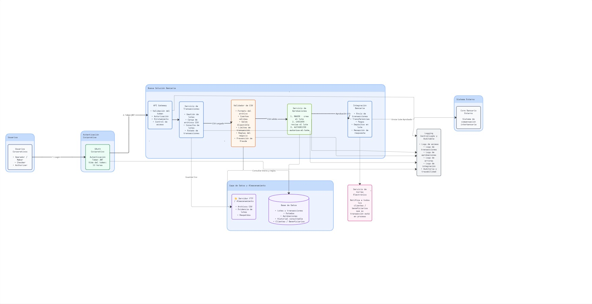