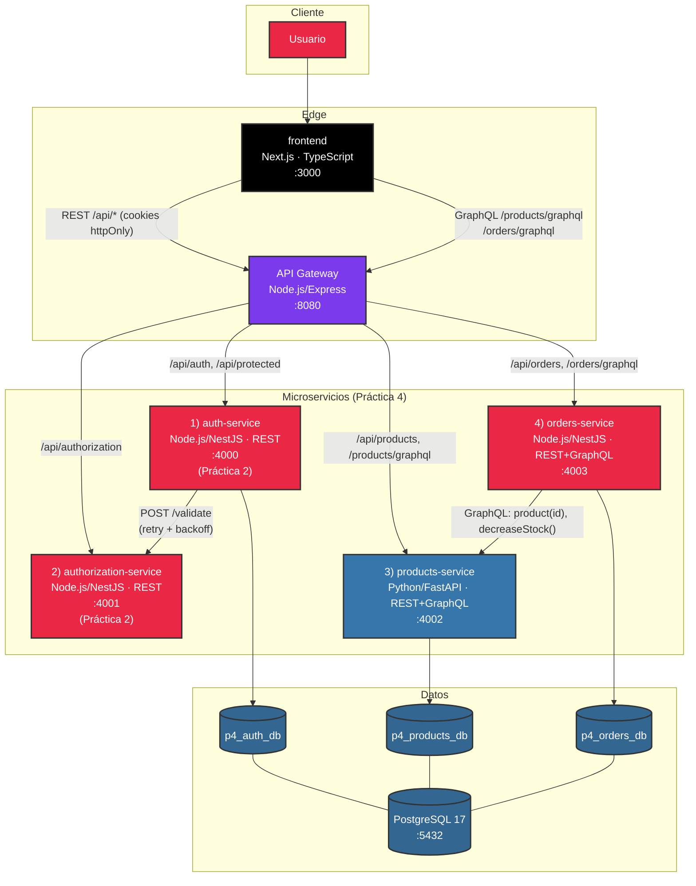
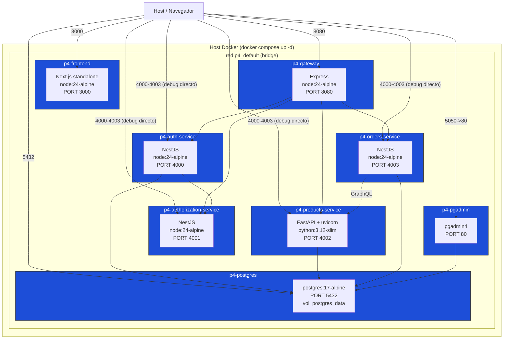
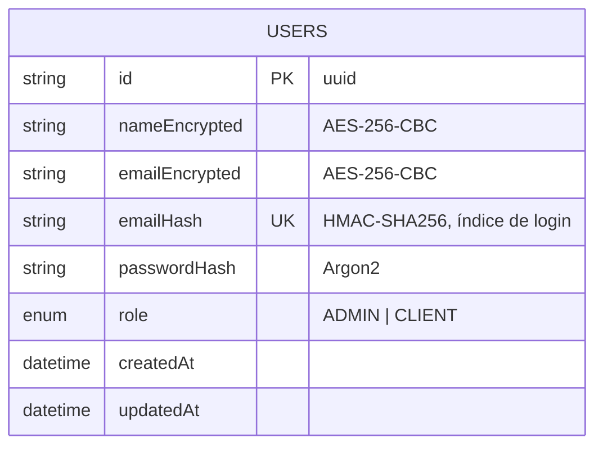
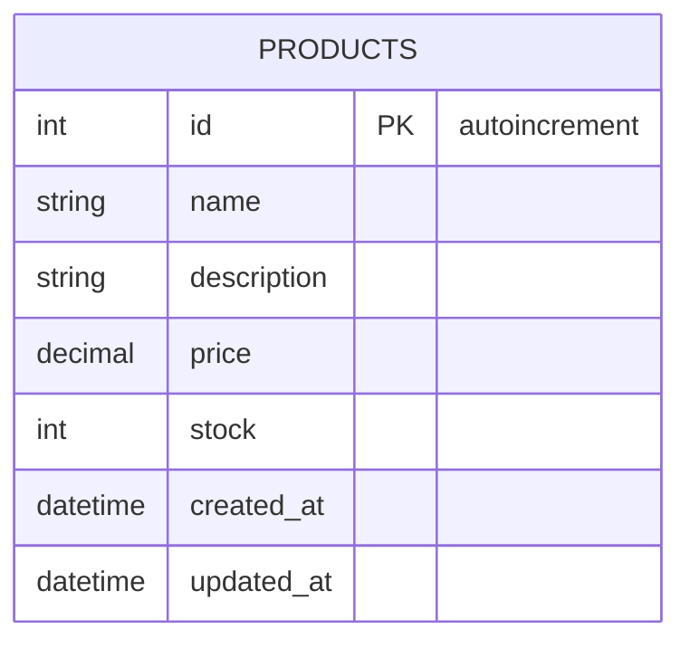
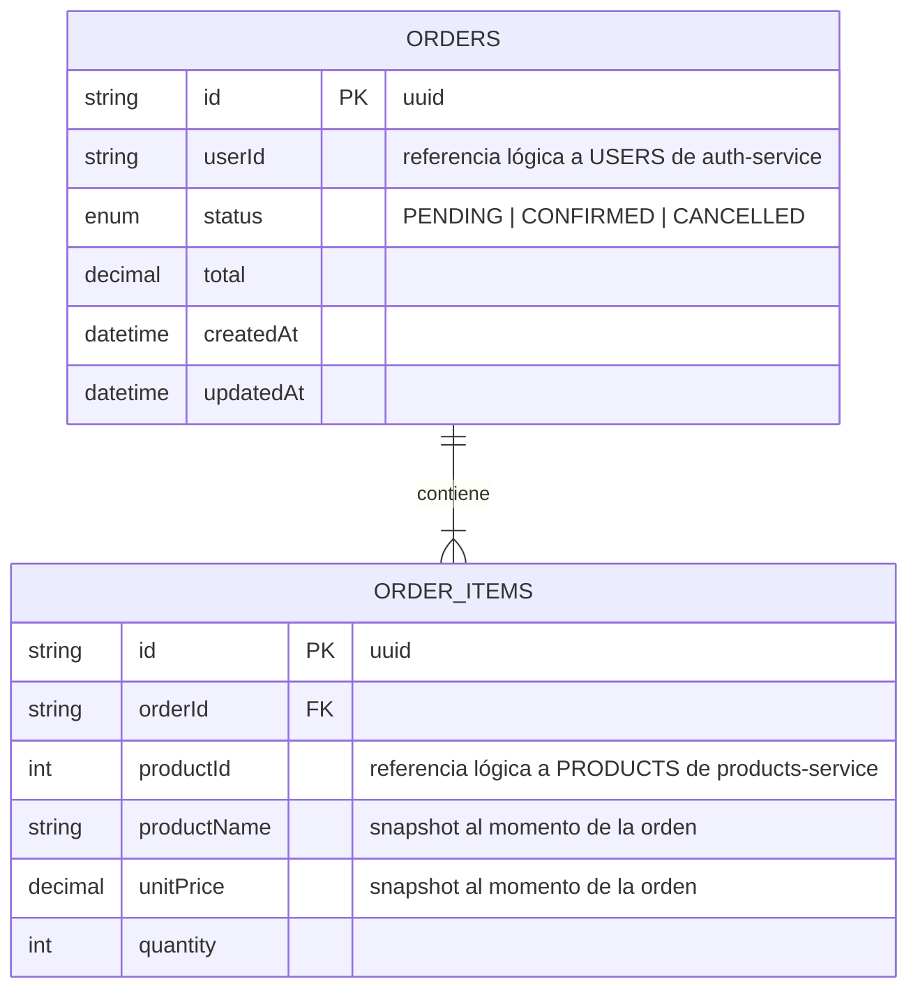
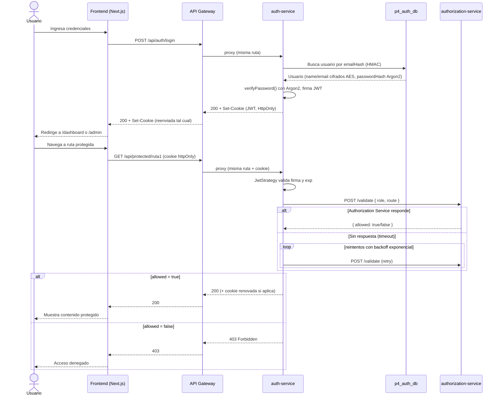
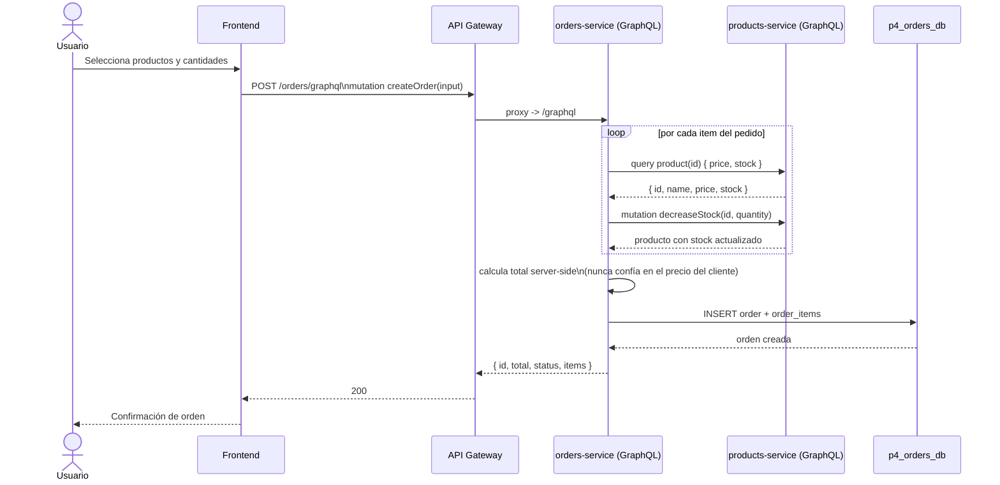

## 202203069
## Bruce Carbonell Castillo Cifuentes
# Práctica 4 — Sistema de Microservicios

Sistema distribuido de temática libre (catálogo de productos + órdenes) compuesto por **4 microservicios funcionales** en **2 lenguajes distintos** (Node.js/TypeScript y Python), un **API Gateway** que enruta hacia todos ellos, **GraphQL** en dos de los servicios, y **REST + Swagger** en los otros dos. El servicio de autenticación desarrollado en la Práctica 2 (`backend/` + `authorization-service/`) se reutiliza tal cual, sin modificar su lógica de negocio. Todo el sistema se levanta con **un solo comando** (`docker compose up`).

## Índice

- [Inicio rápido](#inicio-rápido)
- [Arquitectura de microservicios](#arquitectura-de-microservicios)
- [Diagrama de despliegue](#diagrama-de-despliegue)
- [Diagramas ER de las bases de datos](#diagramas-er-de-las-bases-de-datos)
- [Diagramas de secuencia](#diagramas-de-secuencia)
- [Cumplimiento de requisitos de la Práctica 4](#cumplimiento-de-requisitos-de-la-práctica-4)
- [Los 4 microservicios](#los-4-microservicios)
- [API Gateway](#api-gateway)
- [Contrato de API (Swagger / Postman / GraphQL)](#contrato-de-api-swagger--postman--graphql)
- [Cómo probar el sistema](#cómo-probar-el-sistema)
- [Variables de entorno](#variables-de-entorno)
- [Estructura del repositorio](#estructura-del-repositorio)
- [Principios de desacoplamiento aplicados](#principios-de-desacoplamiento-aplicados)
- [Principios SOLID aplicados](#principios-solid-aplicados)
- [Credenciales de pgAdmin (ver las bases de datos)](#credenciales-de-pgadmin-ver-las-bases-de-datos)
- [Credenciales de prueba](#credenciales-de-prueba)

## Inicio rápido

Requiere Docker Desktop corriendo. En 5 comandos queda todo el stack arriba:

```bash
git clone <url-del-repositorio> && cd P4

cp backend/.env.example backend/.env
# Edita backend/.env y coloca JWT_SECRET y AES_KEY reales (ver comandos abajo)

docker compose build
docker compose up -d
docker compose exec auth-service npx prisma db seed   # crea el usuario Admin
```

Genera valores reales para `JWT_SECRET` y `AES_KEY` antes de levantar el stack (déjalos vacíos en `.env` y el servicio no arrancará):

```bash
node -e "console.log(require('crypto').randomBytes(32).toString('hex'))"    # Genera JWT_SECRET
node -e "console.log(require('crypto').randomBytes(32).toString('base64'))" # Genera AES_KEY
```

| Servicio | URL | Descripción |
|---|---|---|
| **Frontend** | http://localhost:3000 | Next.js — login, registro, dashboard, catálogo, órdenes |
| **API Gateway** | http://localhost:8080 | Punto de entrada único · `/health` agrega el estado de los 4 microservicios · `/docs` contrato OpenAPI |
| auth-service | http://localhost:4000/api | Swagger: `/api/docs` |
| authorization-service | http://localhost:4001/api | Swagger: `/api/docs` |
| products-service | http://localhost:4002 | Swagger/OpenAPI (FastAPI): `/docs` · GraphQL: `/graphql` |
| orders-service | http://localhost:4003/api | Swagger: `/api/docs` · GraphQL: `/graphql` |
| pgAdmin | http://localhost:5050 | Ver [credenciales de pgAdmin](#credenciales-de-pgadmin-ver-las-bases-de-datos) |

Inicia sesión con las [credenciales de prueba](#credenciales-de-prueba), o regístrate desde `/register`. Para bajar todo: `docker compose down` (agrega `-v` para además borrar los datos de Postgres).

## Arquitectura de microservicios



**Detalles de la arquitectura:**

- El **frontend nunca habla directo con un microservicio**: todo pasa por el API Gateway (`http://localhost:8080`), que es el único punto de entrada externo además de los puertos publicados para depuración directa (Swagger/GraphiQL de cada servicio).
- **orders-service** no tiene acceso a la base de datos de productos ni la toca directamente: la única forma en que conoce precio/stock de un producto es preguntándole a **products-service por GraphQL** (`product(id)`, `decreaseStock(id, quantity)`). Esto es desacoplamiento real entre microservicios, no solo separación de carpetas.
- **auth-service** delega toda decisión de autorización por rol a **authorization-service** (patrón heredado de la Práctica 2), con reintentos y backoff exponencial si no responde.
- Cada microservicio tiene su **propia base de datos lógica** (`p4_auth_db`, `p4_products_db`, `p4_orders_db`) dentro de la misma instancia de Postgres — aislamiento por base de datos, ningún servicio hace joins cross-servicio a nivel de SQL.
- **2 lenguajes**: Node.js/TypeScript (auth-service, authorization-service, orders-service, gateway, frontend) y **Python** (products-service).
- **GraphQL en 2 servicios**: products-service (Strawberry) y orders-service (NestJS + Apollo).

## Diagrama de despliegue



Cada microservicio tiene su **propio `Dockerfile`** (build multi-stage para los servicios Node/NestJS, imagen `python:3.12-slim` para products-service, imagen liviana `node:24-alpine` para el gateway). `docker-compose.yml` en la raíz orquesta las 8 piezas con un solo comando, incluyendo dependencias de arranque (`depends_on` + `healthcheck` de Postgres) y la red interna compartida.

## Diagramas ER de las bases de datos

Cada microservicio con persistencia es dueño exclusivo de su base de datos — nadie más la lee ni la escribe directamente.

### `p4_auth_db` (propiedad de auth-service)



### `p4_products_db` (propiedad de products-service)



### `p4_orders_db` (propiedad de orders-service)



> `userId` y `productId` son **referencias lógicas**, no claves foráneas de SQL: `orders-service` no tiene ni debe tener acceso a `p4_auth_db` ni a `p4_products_db`. La integridad se resuelve a nivel de aplicación (orders-service valida el producto contra products-service en el momento de crear la orden y guarda una copia — `productName`/`unitPrice` — de los datos relevantes).

## Diagramas de secuencia

### Login, renovación de JWT y autorización por rol (vía Gateway)



### Crear una orden (comunicación real entre 2 microservicios vía GraphQL)



## Cumplimiento de requisitos de la Práctica 4

| # | Requisito | Cómo se cumple |
|---|---|---|
| 1 | Mínimo 4 microservicios funcionales | `auth-service`, `authorization-service`, `products-service`, `orders-service` |
| 2 | Integrar el servicio de autenticación de la Práctica 2 | `backend/` (auth-service) + `authorization-service/` reutilizados sin cambiar su lógica |
| 3 | Cada microservicio con ≥1 endpoint funcional | Ver tabla en [Los 4 microservicios](#los-4-microservicios) |
| 4 | Dockerfile individual por servicio | `backend/Dockerfile`, `authorization-service/Dockerfile`, `products-service/Dockerfile`, `orders-service/Dockerfile`, `gateway/Dockerfile`, `frontend/Dockerfile` |
| 5 | API Gateway funcional que consuma todos los microservicios | `gateway/` — proxy HTTP hacia los 4 + healthcheck agregado que los consulta a los 4 |
| 6 | ≥2 lenguajes de programación distintos | Node.js/TypeScript + **Python** (`products-service`) |
| 7 | Docker Compose que levante todo con un comando | `docker-compose.yml` en la raíz — `docker compose up -d` |
| 8 | GraphQL en ≥2 servicios | `products-service` (Strawberry) y `orders-service` (NestJS + Apollo) |
| 9 | Diagrama de arquitectura | [Arquitectura de microservicios](#arquitectura-de-microservicios) |
| 10 | Diagrama de despliegue | [Diagrama de despliegue](#diagrama-de-despliegue) |
| 11 | Diagrama ER completo de las bases de datos | [Diagramas ER](#diagramas-er-de-las-bases-de-datos) |
| 12 | Documentación técnica completa | Este README + Swagger por servicio + Postman |
| 13 | Repositorio en la nube con la estructura solicitada | Repositorio Git de este proyecto (ver [Estructura del repositorio](#estructura-del-repositorio)) |
| 14 | Contrato de microservicios en Swagger o Postman | Swagger en `auth-service`, `authorization-service`, `orders-service`, `products-service` (OpenAPI de FastAPI) + `docs/postman_collection.json` + `gateway/docs/openapi.yaml` |
| 15 | Principios de desacoplamiento entre microservicios | Ver [Principios de desacoplamiento aplicados](#principios-de-desacoplamiento-aplicados) |

## Los 4 microservicios

### 1. `auth-service` (Node.js / NestJS / REST) — Práctica 2

Autenticación: registro, login, JWT en cookie `HttpOnly`, cifrado AES-256 de datos sensibles, hash Argon2 de contraseñas, rutas protegidas por rol.

| Método | Ruta | Rol | Descripción |
|---|---|---|---|
| GET | `/api/health` | público | Healthcheck |
| POST | `/api/auth/register` | público | Crea usuario (siempre `CLIENT`) |
| POST | `/api/auth/login` | público | Login, entrega JWT en cookie |
| POST | `/api/auth/logout` | sesión | Limpia la cookie |
| GET | `/api/protected/ruta1` | `ADMIN` | Ruta protegida exclusiva de admin |
| GET | `/api/protected/ruta2` | `ADMIN`, `CLIENT` | Ruta protegida compartida |

Base de datos propia: `p4_auth_db` (Prisma + PostgreSQL). Swagger: `/api/docs`.

### 2. `authorization-service` (Node.js / NestJS / REST) — Práctica 2

Microservicio encargado de las reglas de autorización por rol, sin acceso directo a bases de datos ni contraseñas. Valida los permisos de acceso en base al rol y la ruta de destino.

| Método | Ruta | Descripción |
|---|---|---|
| GET | `/api/health` | Healthcheck |
| POST | `/api/validate` | Valida accesos según el rol y la ruta |

Swagger: `/api/docs`.

### 3. `products-service` (Python / FastAPI / REST + GraphQL) — nuevo

Catálogo de productos. Persistencia propia (`p4_products_db`, SQLAlchemy + PostgreSQL), seed automático de 4 productos al arrancar.

**REST:**

| Método | Ruta | Descripción |
|---|---|---|
| GET | `/health` | Healthcheck |
| GET | `/products` | Lista el catálogo |
| GET | `/products/{id}` | Obtiene un producto |
| POST | `/products` | Crea un producto |

**GraphQL** (`/graphql`, con GraphiQL habilitado):

```graphql
query { products { id name description price stock } }
query { product(id: 1) { id name price stock } }
mutation { createProduct(name: "X", description: "", price: 9.99, stock: 5) { id } }
mutation { decreaseStock(id: 1, quantity: 2) { id stock } }   # usado por orders-service
```

OpenAPI autogenerado por FastAPI: `/docs`.

### 4. `orders-service` (Node.js / NestJS / REST + GraphQL) — nuevo

Servicio para gestionar las órdenes de compra. Antes de crear una orden, valida el precio y stock de cada producto consultando a `products-service` a través de GraphQL. Tras esto, actualiza el inventario remotamente y guarda la orden en su base de datos (`p4_orders_db`, Prisma + PostgreSQL).

**REST:**

| Método | Ruta | Descripción |
|---|---|---|
| GET | `/api/health` | Healthcheck |
| GET | `/api/orders` | Lista órdenes |
| GET | `/api/orders/:id` | Obtiene una orden |
| POST | `/api/orders` | Crea una orden |

**GraphQL** (`/graphql`):

```graphql
query { orders { id userId status total items { productName quantity unitPrice } } }
mutation {
  createOrder(input: { userId: "u1", items: [{ productId: 1, quantity: 2 }] }) {
    id total status items { productName quantity unitPrice }
  }
}
```

Swagger (parte REST): `/api/docs`.

## API Gateway

El directorio `gateway/` aloja un servicio Node.js con Express que funciona como punto de entrada público. Se encarga de redirigir el tráfico hacia los distintos microservicios dependiendo del prefijo de la URL. También ofrece un endpoint de estado (healthcheck) que verifica la disponibilidad de todos los servicios:

| Ruta en el Gateway | Microservicio destino | Tipo |
|---|---|---|
| `GET /health` | Todos los microservicios | — |
| `GET /docs` | — | Swagger UI del propio gateway (`gateway/docs/openapi.yaml`) |
| `/api/auth/*` | auth-service | REST |
| `/api/protected/*` | auth-service | REST |
| `/api/authorization/*` (hacia `/api/*`) | authorization-service | REST |
| `/api/products/*` (hacia `/products/*`) | products-service | REST |
| `/products/graphql` (hacia `/graphql`) | products-service | GraphQL |
| `/api/orders/*` | orders-service | REST |
| `/orders/graphql` (hacia `/graphql`) | orders-service | GraphQL |

Implementado con `http-proxy-middleware`. El filtro de cada proxy usa comparación **por segmento de path** (no un simple `startsWith`), para que `/api/authorization/*` no sea capturado por accidente por el proxy de `/api/auth/*`.

## Contrato de API (Swagger / Postman / GraphQL)

La API cuenta con documentación en diferentes formatos: Swagger/OpenAPI para los endpoints REST, GraphiQL para explorar las consultas de GraphQL, y una colección de Postman que integra ambos accesos apuntando al gateway (ver [Cómo probar el sistema](#cómo-probar-el-sistema)).

| Capa | Dónde vive | Formato | Generado cómo |
|---|---|---|---|
| Swagger — auth-service | `http://localhost:4000/api/docs` | OpenAPI 3 | `@nestjs/swagger`, decoradores en DTOs/controllers |
| Swagger — authorization-service | `http://localhost:4001/api/docs` | OpenAPI 3 | `@nestjs/swagger` |
| Swagger — orders-service (parte REST) | `http://localhost:4003/api/docs` | OpenAPI 3 | `@nestjs/swagger` |
| OpenAPI — products-service | `http://localhost:4002/docs` (Swagger UI) y `/redoc` | OpenAPI 3 | Autogenerado por FastAPI a partir de los `pydantic.BaseModel` de `app/rest.py`, sin decoradores manuales |
| Contrato agregado del Gateway | `http://localhost:8080/docs` | OpenAPI 3 (YAML estático) | `gateway/docs/openapi.yaml`, escrito a mano, describe las rutas *tal como las ve el cliente* (ya reescritas) |
| GraphQL — products-service | `http://localhost:4002/graphql` (GraphiQL) | Esquema GraphQL (SDL) | Code-first con `strawberry.type`/`strawberry.field` en `app/schema.py` |
| GraphQL — orders-service | `http://localhost:4003/graphql` (GraphiQL) | Esquema GraphQL (SDL) | Code-first con `@ObjectType()`/`@Resolver()` de `@nestjs/graphql` en `src/orders/` |
| Postman | [`docs/postman_collection.json`](docs/postman_collection.json) | Postman Collection v2.1 | Escrita a mano, agrupa los 4 microservicios + el healthcheck del gateway |

### Swagger/OpenAPI (auth-service, authorization-service, orders-service, products-service)

En los proyectos con NestJS se configura Swagger mediante `DocumentBuilder` en el archivo de inicio. La documentación está disponible en `/api/docs`. Ejemplo en el servicio de autenticación:

```ts
const config = new DocumentBuilder()
  .setTitle('Auth Service API')
  .setDescription('Contrato REST del microservicio de autenticación (Práctica 4): registro, login, rutas protegidas por rol.')
  .setVersion('1.0')
  .build();
const document = SwaggerModule.createDocument(app, config);
SwaggerModule.setup('api/docs', app, document);
```

La documentación se genera de forma dinámica analizando los controladores y los DTOs en el código. Cualquier cambio en los esquemas se reflejará automáticamente en la especificación, garantizando que el contrato de la API y el código no queden desincronizados.

Por su parte, en `products-service` se autogenera la especificación OpenAPI de FastAPI basándose en las sugerencias de tipos de Python y los modelos de Pydantic definidos en `products-service/app/rest.py`:

```python
class ProductCreate(BaseModel):
    name: str = Field(min_length=1, max_length=150)
    description: str = Field(default="", max_length=500)
    price: float = Field(gt=0)
    stock: int = Field(ge=0, default=0)

@router.post("/products", response_model=ProductOut, status_code=201)
def create_product(payload: ProductCreate, db: Session = Depends(get_db_session)):
    ...
```

Los modelos de validación se aprovechan tanto para sanitizar las peticiones entrantes como para documentar la estructura de datos que se espera en los endpoints, unificando la lógica en un solo lugar.

### GraphQL (products-service y orders-service)

Se utiliza un enfoque *code-first* para ambos servicios. El esquema de GraphQL se construye en tiempo de ejecución al interpretar las clases y anotaciones escritas en el código.

**products-service** (`app/schema.py`, Strawberry):

```python
@strawberry.type
class ProductType:
    id: int
    name: str
    description: str
    price: float
    stock: int

@strawberry.type
class Query:
    @strawberry.field(description="Lista todos los productos del catálogo.")
    def products(self) -> List[ProductType]: ...

    @strawberry.field(description="Obtiene un producto por id.")
    def product(self, id: int) -> Optional[ProductType]: ...

@strawberry.type
class Mutation:
    @strawberry.mutation(description="Crea un nuevo producto en el catálogo.")
    def create_product(self, name: str, description: str, price: float, stock: int) -> ProductType: ...

    @strawberry.mutation(description="Descuenta stock de un producto (usado por orders-service al confirmar una orden).")
    def decrease_stock(self, id: int, quantity: int) -> ProductType: ...
```

Esquema equivalente en SDL (lo que ves en el panel **Docs** de GraphiQL):

```graphql
type Query {
  products: [ProductType!]!
  product(id: Int!): ProductType
}

type Mutation {
  createProduct(name: String!, description: String!, price: Float!, stock: Int!): ProductType!
  decreaseStock(id: Int!, quantity: Int!): ProductType!
}
```

**orders-service** (`src/orders/orders.resolver.ts` + `src/orders/models/order.model.ts`, NestJS/Apollo):

```ts
@Resolver(() => OrderModel)
export class OrdersResolver {
  @Query(() => [OrderModel], { description: 'Lista todas las órdenes.' })
  orders() { return this.ordersService.findAll(); }

  @Mutation(() => OrderModel, { description: 'Crea una orden validando stock/precio contra products-service.' })
  createOrder(@Args('input') input: CreateOrderInput) { return this.ordersService.create(input); }
}
```

SDL equivalente:

```graphql
type Mutation {
  createOrder(input: CreateOrderInput!): OrderModel!
}

input CreateOrderInput {
  userId: ID!
  items: [OrderItemInput!]!
}
```

> **Solución a errores de introspección en GraphQL:** Por defecto, Apollo Server deshabilita la introspección en entornos de producción, lo que impide que GraphiQL muestre el esquema. Para resolverlo, se activó forzando `introspection: true` en la configuración del módulo de `orders-service`. Esta restricción no está presente en Strawberry (`products-service`).

### Postman

El archivo [`docs/postman_collection.json`](docs/postman_collection.json) incluye peticiones de ejemplo para todos los servicios, configuradas mediante la variable `gateway_url`. Para agilizar las pruebas en endpoints autenticados, se recomienda ejecutar el request de Login; Postman guardará de manera automática la cookie de sesión y la utilizará en las subsecuentes solicitudes.

## Cómo probar el sistema

Se proveen diferentes maneras de interactuar y comprobar los servicios una vez que la aplicación se encuentra en ejecución:

### 1. Ver los datos crudos en pgAdmin (SQL)

1. Entra a http://localhost:5050 y registra el servidor como se explica en [Credenciales de pgAdmin](#credenciales-de-pgadmin-ver-las-bases-de-datos).
2. En el árbol de la izquierda: **Servers → p4-postgres → Databases → `p4_products_db` → Schemas → public → Tables → `products`** → clic derecho → **View/Edit Data → All Rows**. Así ves la tabla en una grilla editable, sin escribir SQL.
3. Para correr consultas propias: clic derecho sobre la base de datos (por ejemplo `p4_orders_db`) → **Query Tool**, y ahí escribe SQL directo, por ejemplo:

   ```sql
   -- en p4_products_db
   SELECT id, name, price, stock FROM products ORDER BY id;

   -- en p4_orders_db
   SELECT o.id, o."userId", o.status, o.total, oi."productName", oi.quantity, oi."unitPrice"
   FROM orders o
   JOIN order_items oi ON oi."orderId" = o.id
   ORDER BY o."createdAt" DESC;

   -- en p4_auth_db (los datos sensibles están cifrados, es normal ver texto ilegible)
   SELECT id, role, "createdAt" FROM users;
   ```

   Ejecuta con el botón ▶ (o `F5`). El **Query Tool solo ve la base de datos sobre la que hiciste clic derecho**: si quieres consultar otra, cambia de base en el desplegable superior o abre un Query Tool nuevo desde esa base.

### 2. Probar GraphQL con GraphiQL (sin instalar nada)

`products-service` y `orders-service` traen una consola interactiva en el navegador:

- Productos: http://localhost:4002/graphql
- Órdenes: http://localhost:4003/graphql
- (equivalentes a través del gateway: http://localhost:8080/products/graphql y http://localhost:8080/orders/graphql — funcionan igual, GraphiQL solo necesita que la URL responda POST)

Pega esto en el panel izquierdo y dale ▶ Run:

```graphql
# en :4002/graphql
query {
  products {
    id
    name
    price
    stock
  }
}
```

```graphql
# en :4003/graphql — crea una orden real (descuenta stock en products-service)
mutation {
  createOrder(input: { userId: "prueba-manual", items: [{ productId: 1, quantity: 1 }] }) {
    id
    total
    status
    items { productName quantity unitPrice }
  }
}
```

El panel de la derecha (**Docs**) lista todo el esquema (`Query`, `Mutation`, tipos) para explorar qué más se puede pedir, con autocompletado incluido.

### 3. Probar REST con Swagger UI

Cada servicio REST trae su propio Swagger con botón **"Try it out"** (no hace falta Postman ni curl):

| Servicio | Swagger |
|---|---|
| auth-service | http://localhost:4000/api/docs |
| authorization-service | http://localhost:4001/api/docs |
| orders-service (parte REST) | http://localhost:4003/api/docs |
| products-service (OpenAPI de FastAPI) | http://localhost:4002/docs |
| API Gateway (contrato agregado) | http://localhost:8080/docs |

Para probar rutas protegidas (`/api/protected/ruta1`, `/api/protected/ruta2`) desde Swagger necesitas haber iniciado sesión antes en el navegador (la cookie `access_token` viaja automáticamente si Swagger corre en el mismo origen `localhost:4000`); si no, te va a dar 401 — para ese caso es más simple probar desde el frontend (http://localhost:3000) o con curl guardando cookies (ver más abajo).

### 4. Postman

Importa [`docs/postman_collection.json`](docs/postman_collection.json) en Postman (**Import → File**). Ya trae la variable `gateway_url = http://localhost:8080` y una carpeta por microservicio con requests REST y GraphQL listas para ejecutar. Para las rutas protegidas, corre primero **"Login"** dentro de la carpeta de auth-service — Postman guarda la cookie automáticamente y las siguientes requests de esa colección ya la reenvían.

### 5. Por línea de comandos (curl)

```bash
# Login y guardar la cookie de sesión
curl -c cookies.txt -X POST http://localhost:8080/api/auth/login \
  -H "Content-Type: application/json" \
  -d '{"email":"admin@practica.local","password":"Admin123456"}'

# Reusar la cookie en una ruta protegida
curl -b cookies.txt http://localhost:8080/api/protected/ruta1

# GraphQL vía gateway
curl -X POST http://localhost:8080/products/graphql \
  -H "Content-Type: application/json" \
  -d '{"query":"query { products { id name price stock } }"}'
```

## Variables de entorno

### `backend/.env` (auth-service)

| Variable | Descripción |
|---|---|
| `PORT` | Puerto HTTP (`4000`) |
| `FRONTEND_URL` | Origen permitido por CORS |
| `DATABASE_URL` | Cadena de conexión a `p4_auth_db` |
| `JWT_SECRET` / `JWT_EXPIRES_IN_SECONDS` / `JWT_RENEWAL_GRACE_SECONDS` | Firma y ciclo de vida del JWT |
| `JWT_COOKIE_NAME` / `COOKIE_SECURE` / `COOKIE_SAME_SITE` | Atributos de la cookie de sesión |
| `AES_KEY` | Clave base64 (32 bytes) para cifrar `name`/`email` y el `emailHash` |
| `AUTHORIZATION_SERVICE_URL` / `AUTHORIZATION_TIMEOUT_MS` / `AUTHORIZATION_MAX_RETRIES` / `AUTHORIZATION_BACKOFF_MS` | Cliente HTTP hacia authorization-service |
| `ADMIN_EMAIL` / `ADMIN_PASSWORD` / `ADMIN_NAME` | Usados solo por `npm run seed` |

### `products-service/.env.example`

| Variable | Descripción |
|---|---|
| `PORT` | Puerto HTTP (`4002`) |
| `DATABASE_URL` | Cadena de conexión SQLAlchemy a `p4_products_db` |

### `orders-service/.env.example`

| Variable | Descripción |
|---|---|
| `PORT` | Puerto HTTP (`4003`) |
| `DATABASE_URL` | Cadena de conexión Prisma a `p4_orders_db` |
| `PRODUCTS_SERVICE_URL` | URL del endpoint GraphQL de products-service |

### `gateway/.env.example`

| Variable | Descripción |
|---|---|
| `PORT` | Puerto HTTP (`8080`) |
| `FRONTEND_URL` | Origen permitido por CORS |
| `AUTH_SERVICE_URL` / `AUTHORIZATION_SERVICE_URL` / `PRODUCTS_SERVICE_URL` / `ORDERS_SERVICE_URL` | URLs internas (nombres de servicio de Docker Compose) de cada microservicio |

### `frontend/.env.example`

| Variable | Descripción |
|---|---|
| `NEXT_PUBLIC_API_URL` | URL pública del gateway + `/api` (REST) |
| `NEXT_PUBLIC_GATEWAY_URL` | URL pública del gateway, raíz (para las llamadas GraphQL) |

## Estructura del repositorio

```
P4/
├── docker-compose.yml            # levanta los 8 servicios con un comando
├── infra/postgres/               # script de init multi-DB de Postgres
├── docs/postman_collection.json  # contrato Postman de los 4 microservicios
│
├── backend/                      # 1) auth-service — Node.js/NestJS · REST (Práctica 2)
│   ├── Dockerfile
│   ├── prisma/schema.prisma      # modelo User + enum Role (p4_auth_db)
│   └── src/{auth,authorization-client,crypto,protected,users,prisma}/
│
├── authorization-service/        # 2) authorization-service — Node.js/NestJS · REST (Práctica 2)
│   ├── Dockerfile
│   └── src/                      # regla { role, route } -> allowed, sin DB
│
├── products-service/             # 3) products-service — Python/FastAPI · REST + GraphQL
│   ├── Dockerfile
│   ├── requirements.txt
│   └── app/{main,models,database,schema,rest}.py
│
├── orders-service/                # 4) orders-service — Node.js/NestJS · REST + GraphQL
│   ├── Dockerfile
│   ├── prisma/schema.prisma      # modelos Order + OrderItem (p4_orders_db)
│   └── src/{orders,products-client,prisma,health}/
│
├── gateway/                       # API Gateway — Node.js/Express
│   ├── Dockerfile
│   ├── docs/openapi.yaml
│   └── src/{server,routes}.js
│
└── frontend/                      # Next.js — login, registro, dashboard, catálogo, órdenes
    └── app/{page,register,dashboard,admin,products}/
```

## Principios de desacoplamiento aplicados

- **Cada microservicio es dueño exclusivo de sus datos.** Ningún servicio abre una conexión a la base de datos de otro; toda interacción cruzada pasa por su API (REST o GraphQL), nunca por SQL directo.
- **orders-service no confía en el cliente para precio/stock.** Vuelve a consultar `products-service` en el momento de crear la orden y descuenta el stock ahí mismo — el precio final se calcula server-side.
- **Contratos explícitos y versionables.** Cada microservicio publica su propio Swagger/OpenAPI o esquema GraphQL; los demás servicios (y el gateway) solo dependen de ese contrato, no de detalles internos de implementación.
- **El Gateway es la única fachada pública real.** El frontend no conoce nombres de host internos de Docker (`auth-service`, `products-service`, etc.), solo conoce `localhost:8080`. Los microservicios tampoco se conocen entre sí por accidente: `orders-service` solo conoce la URL de `products-service` vía variable de entorno inyectada por `docker-compose.yml`.
- **Fallos aislados y explícitos.** Si `authorization-service` no responde, `auth-service` reintenta con backoff exponencial y luego **deniega por default** (503), nunca concede acceso silenciosamente. Si `products-service` no responde, `orders-service` no crea la orden (503) en vez de asumir datos.
- **2 lenguajes, mismo contrato.** `products-service` está escrito en Python (FastAPI/Strawberry) y el resto en TypeScript (NestJS/Express); ambos exponen GraphQL con el mismo estilo de esquema, demostrando que el desacoplamiento no depende del lenguaje de implementación.

## Principios SOLID aplicados

A continuación se detalla cómo se han aplicado los distintos principios SOLID a nivel de código de los microservicios:

### S — Responsabilidad única (Single Responsibility)

Cada clase debe tener una responsabilidad o propósito principal bien definido. Si hay requerimientos diferentes, sus implementaciones deben estar segregadas para evitar acoplamientos y conflictos ante cambios futuros.

**Evidencia:** `backend/src/crypto/crypto.service.ts` — `CryptoService` solo sabe cifrar/descifrar (AES-256) y hashear (HMAC para índices, Argon2 para contraseñas). No sabe qué es un `User`, no toca Prisma, no arma respuestas HTTP.

```ts
@Injectable()
export class CryptoService {
  encrypt(text: string): string { /* AES-256-CBC */ }
  decrypt(encryptedData: string): string { /* AES-256-CBC */ }
  hashForIndex(text: string): string { /* HMAC-SHA256 */ }
  async hashPassword(password: string): Promise<string> { return argon2.hash(password); }
  async verifyPassword(hash: string, plain: string): Promise<boolean> { return argon2.verify(hash, plain); }
}
```

**Justificación:** La lógica sobre cómo cifrar o hashear información está agrupada aquí. Si se decide cambiar a un algoritmo diferente, solo se necesita modificar este servicio, sin afectar las clases que lo consumen, ya que estas solo interactúan con la interfaz expuesta.

### O — Abierto/cerrado (Open/Closed)

El código debe estar diseñado de manera que puedan incorporarse nuevos comportamientos y funcionalidades sin necesidad de modificar el código existente.

**Evidencia:** `backend/src/protected/roles.guard.ts` + `backend/src/protected/route.decorator.ts`. `RolesGuard` no contiene ninguna lista de rutas ni de roles — lee el nombre de ruta lógica desde metadata puesta con un decorador:

```ts
// route.decorator.ts
export const ROUTE_KEY = 'route_name';
export const RouteName = (name: string) => SetMetadata(ROUTE_KEY, name);
```

```ts
// roles.guard.ts
const requiredRoute = this.reflector.getAllAndOverride<string>(ROUTE_KEY, [
  context.getHandler(),
  context.getClass(),
]);
if (!requiredRoute) return true; // sin decorador, no restringe
const hasAccess = await this.authClientService.validateAccess(user.role, requiredRoute);
```

**Justificación:** Gracias a esto, es posible proteger rutas nuevas empleando el decorador `@RouteName` sin agregar dependencias ni modificar las evaluaciones en la implementación del componente de guardia `RolesGuard`.

### L — Sustitución de Liskov (Liskov Substitution)

Las subclases deben poder tomar el lugar de sus superclases subyacentes sin alterar ni interrumpir el correcto funcionamiento del software.

**Evidencia:** `orders-service/src/prisma/prisma.service.ts` (idéntico en espíritu al de `backend/`):

```ts
@Injectable()
export class PrismaService extends PrismaClient implements OnModuleInit {
  constructor() {
    const adapter = new PrismaPg({ connectionString: process.env.DATABASE_URL });
    super({ adapter });
  }

  async onModuleInit() {
    await this.$connect();
  }
}
```

**Justificación:** Puesto que `PrismaService` hereda de `PrismaClient`, las dependencias continuarán ejecutando sus instrucciones con la base de datos de manera normal, dado que no sobreescribe funcionalidades de la clase original sino que complementa su inicialización con la conexión.

### I — Segregación de interfaces (Interface Segregation)

Los componentes no deben depender de métodos y propiedades que no van a usar. Se prefiere definir múltiples interfaces delgadas en lugar de interfaces genéricas.

**Evidencia:** `orders-service/src/products-client/products-client.service.ts`:

```ts
export interface RemoteProduct {
  id: number;
  name: string;
  price: number;
  stock: number;
}
```

**Justificación:** La estructura `RemoteProduct` omite mapear campos extensos del catálogo porque no son requeridos en el módulo de facturación, acotando el riesgo ante cambios que puedan hacerse en la estructura completa devuelta por el servicio de origen.

### D — Inversión de dependencias (Dependency Inversion)

Las clases o componentes principales del negocio deben depender de abstracciones, interfaces y protocolos, en vez de ligarse al funcionamiento exacto de servicios de bases de datos o red.

**Evidencia:** `orders-service/src/orders/orders.service.ts`:

```ts
@Injectable()
export class OrdersService {
  constructor(
    private readonly prisma: PrismaService,
    private readonly productsClient: ProductsClientService,
  ) {}

  async create(input: CreateOrderInput) {
    const product = await this.productsClient.getProduct(item.productId);
    await this.productsClient.decreaseStock(item.productId, item.quantity);
    // ...
    return this.prisma.order.create({ data: { /* ... */ }, include: { items: true } });
  }
}
```

**Justificación:** El servicio se alimenta de instancias ya construidas y resueltas por inyección de dependencias, desacoplando así las reglas de negocio de los detalles de infraestructura. Esto facilita enormemente las pruebas utilizando *mocks*.

## Credenciales de pgAdmin (ver las bases de datos)

pgAdmin necesita **dos** juegos de credenciales distintos: uno para entrar a la interfaz web de pgAdmin, y otro para que esa interfaz se conecte al servidor de Postgres.

**1) Login de pgAdmin** — http://localhost:5050

| Campo | Valor |
|---|---|
| Email | `admin@admin.com` |
| Password | `admin123` |

**2) Registrar el servidor Postgres dentro de pgAdmin** — clic derecho en **Servers** → **Register** → **Server...**

En la pestaña **General**:

| Campo | Valor |
|---|---|
| Name | `p4-postgres` (o el nombre que quieras) |

En la pestaña **Connection**:

| Campo | Valor |
|---|---|
| Host name/address | `postgres` |
| Port | `5432` |
| Maintenance database | `p4_auth_db` |
| Username | `p4_user` |
| Password | `p4_password` |
| Save password? | ✅ (opcional, para no escribirla cada vez) |

> El host es `postgres` (el nombre del servicio en `docker-compose.yml`), **no** `localhost`: pgAdmin corre dentro de la misma red Docker (`p4_default`) y resuelve a los demás contenedores por nombre de servicio, no por el puerto publicado en tu máquina.

Al conectar verás las 3 bases de datos del sistema bajo **Servers → p4-postgres → Databases**:

| Base de datos | Dueña | Tablas |
|---|---|---|
| `p4_auth_db` | auth-service | `users` |
| `p4_products_db` | products-service | `products` |
| `p4_orders_db` | orders-service | `orders`, `order_items` |

## Credenciales de prueba

Para la base de datos `p4_auth_db`, al ejecutar el script de configuración (`docker compose exec auth-service npx prisma db seed`), se generará este usuario para facilitar las validaciones:

| Rol | Correo | Contraseña |
|---|---|---|
| Admin | `admin@practica.local` | `Admin123456` |

Por otro lado, al registrar una cuenta por medio del formulario público de la web, se otorgará automáticamente el rol de `CLIENT`. En el panel de control se ofrecen accesos directos al catálogo para comprobar de forma completa la interoperabilidad de los microservicios.
