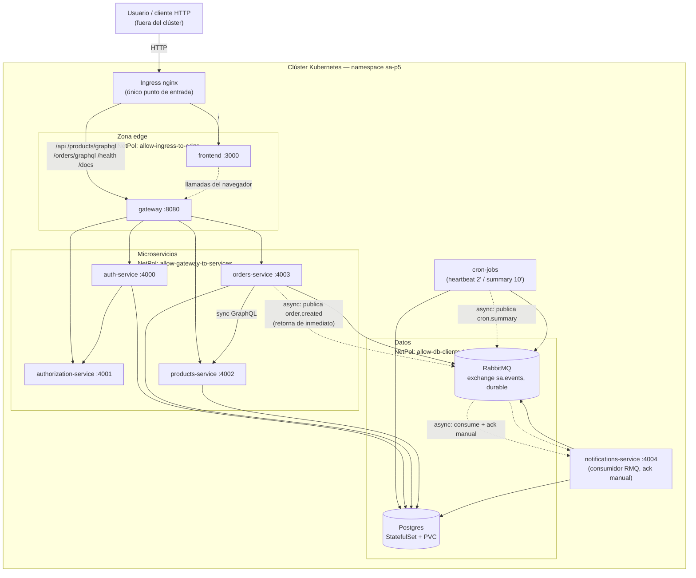

# Documentación técnica — sa-platform (Práctica 5)

Namespace `sa-p5`. Chart Helm padre `sa-platform` (`charts/sa-platform`), 8
subcharts de microservicios + 2 dependencias de infraestructura (Postgres,
RabbitMQ). Ver `Make.md` para el enunciado completo y `README.md` para la
guía rápida original.

---

## 1. Diagrama de arquitectura

### 1.1 Vista general (externo/interno, síncrono/asíncrono, límites de red)

```
                                    FUERA DEL CLÚSTER
                                    ══════════════════
                                    Usuario / cliente HTTP
                                              │
                                              │ HTTP (host: localhost)
┌─────────────────────────────────────────────┼──────────────────────────────────────────┐
│  CLÚSTER KUBERNETES (kind) — namespace sa-p5 │                                          │
│                                              ▼                                          │
│                                   ┌─────────────────────┐                               │
│                                   │  Ingress (nginx)     │  ← único recurso con entrada  │
│                                   │  único punto de      │    externa (Ingress Class     │
│                                   │  entrada al clúster  │    nginx); todo lo demás es   │
│                                   └──────────┬───────────┘    ClusterIP, sin NodePort/LB │
│                        ┌─────────────────────┼─────────────────────┐                    │
│                        │ /api /products/graphql /orders/graphql     │ /                  │
│                        │ /health /docs                              │                    │
│                        ▼                                            ▼                    │
│   ┌───────────────────────────────┐                    ┌───────────────────────────┐    │
│   │   ZONA EDGE (NetPol:           │                    │  frontend :3000            │    │
│   │   allow-ingress-to-edge)       │                    │  (Next.js)                  │    │
│   │  ┌───────────────────────┐     │◄───egress─────────┤  allow-frontend-egress-    │    │
│   │  │  gateway :8080         │     │   -to-gateway      │  to-gateway                 │    │
│   │  │  (Express reverse      │     │                    └───────────────────────────┘    │
│   │  │   proxy)               │     │                                                      │
│   │  └───────────┬────────────┘     │                                                      │
│   └──────────────┼──────────────────┘                                                      │
│                   │ NetPol: allow-gateway-to-services /                                    │
│                   │         allow-gateway-egress-to-services                               │
│                   │ (SOLO gateway puede alcanzar estos 4)                                   │
│      ┌────────────┼────────────┬─────────────────┬───────────────┐                         │
│      ▼            ▼            ▼                 ▼               │                         │
│ ┌──────────┐ ┌───────────────┐ ┌───────────────┐ ┌─────────────┐ │                         │
│ │auth-     │ │authorization- │ │products-      │ │orders-      │ │                         │
│ │service   │─▶│service        │ │service :4002  │◄│service :4003│ │                         │
│ │:4000     │ │:4001 (stateless)│ │(FastAPI/GQL) │ │(NestJS/GQL) │ │                         │
│ └────┬─────┘ └───────────────┘ └───────┬────────┘ └──────┬──────┘ │                         │
│      │ NetPol: allow-auth-egress-       │  NetPol: allow-orders-  │                         │
│      │ to-authorization (sync)          │  egress-to-products     │                         │
│      │                                  │  (sync GraphQL)         │                         │
│      │                                  │                         │ evento asíncrono        │
│      │                                  │                         │ "order.created"         │
│      │  NetPol: allow-db-clients-*      │                         ▼ (no espera respuesta)   │
│      ▼  (solo auth/cron/notif/orders/   │                  ┌──────────────┐                 │
│  ┌────────────┐ products → postgres)    │                  │  RabbitMQ    │                 │
│  │ Postgres   │◄───────────────────────┴─────────────────▶│  (StatefulSet)│                 │
│  │ StatefulSet│                                             │  exchange     │                │
│  │ + PVC      │                                             │  "sa.events" │                │
│  │ (headless  │                                             │  durable      │                │
│  │  service)  │                                             └──────┬───────┘                │
│  └────────────┘   NetPol: allow-broker-clients-*                  │ ack manual              │
│        ▲           (solo cron-jobs/notifications/orders→rabbitmq) ▼ tras persistir           │
│        │                                                   ┌──────────────────┐             │
│        │                                                   │ notifications-   │             │
│        └───────────────────────────────────────────────────│ service :4004    │             │
│                                                              │ (consumidor RMQ) │             │
│                                                              └──────────────────┘             │
│                                                                                                │
│   ┌───────────────────────────┐                                                              │
│   │ cron-jobs (NestJS         │──sync──▶ Postgres (p5_cron_db): heartbeat cada 2'             │
│   │ standalone, 2 CronJobs)   │──sync──▶ Postgres (lee) cada 10' ──async──▶ RabbitMQ           │
│   └───────────────────────────┘         "cron.summary" ──▶ notifications-service ──▶ Postgres │
│                                                                                                │
│   default-deny-all: política base — TODO el tráfico pod↔pod está denegado salvo que exista    │
│   un allow-* explícito arriba. allow-dns-egress permite resolución DNS a todos (necesaria      │
│   para que cualquier pod pueda resolver nombres de Service).                                   │
└────────────────────────────────────────────────────────────────────────────────────────────┘

Leyenda: ──▶ síncrono (espera respuesta)   ··▶/async = asíncrono (publica y retorna de inmediato)
```

### 1.2 Diagrama Mermaid (equivalente, para visores que lo soporten)



### 1.3 Qué acota cada NetworkPolicy (15 objetos activos)

| Política | Efecto |
|---|---|
| `default-deny-all` | Base: deniega todo el tráfico pod↔pod del namespace por defecto |
| `allow-dns-egress` | Excepción global: cualquier pod puede resolver DNS (kube-dns) |
| `allow-ingress-to-edge` | Solo el controlador de Ingress puede alcanzar `frontend`/`gateway` |
| `allow-frontend-to-gateway` / `allow-frontend-egress-to-gateway` | `frontend` → `gateway` (llamadas del navegador vía SSR/API routes) |
| `allow-gateway-to-services` / `allow-gateway-egress-to-services` | Solo `gateway` alcanza `auth-service`, `authorization-service`, `products-service`, `orders-service` |
| `allow-auth-to-authorization` / `allow-auth-egress-to-authorization` | `auth-service` → `authorization-service` (validación de permisos) |
| `allow-orders-to-products` / `allow-orders-egress-to-products` | `orders-service` → `products-service` (GraphQL síncrono, valida stock) |
| `allow-db-clients-to-postgres` / `allow-db-clients-egress-to-postgres` | Solo `auth-service`, `cron-jobs`, `notifications-service`, `orders-service`, `products-service` alcanzan Postgres |
| `allow-broker-clients-to-rabbitmq` / `allow-broker-clients-egress-to-rabbitmq` | Solo `cron-jobs`, `notifications-service`, `orders-service` alcanzan RabbitMQ |

Cualquier otro par de pods (p.ej. `frontend` → Postgres, o un pod externo sin
labels del chart) queda bloqueado por `default-deny-all`. Verificado en vivo
en la sección 4.4.

---

## 2. Comandos reproducibles — de clúster vacío a aplicación funcionando

### 2.1 Prerrequisitos

- Docker Desktop corriendo (motor Linux).
- `kubectl`, `kind`, `helm` en `PATH`.

### 2.2 Cluster + add-ons (Calico, ingress-nginx, metrics-server)

```bash
export PATH="$HOME/bin:$PATH"

kind create cluster --name sa-p5 --config infra/kind/kind-config.yaml

# Calico: el CNI por defecto de kind NO soporta NetworkPolicy
kubectl apply -f https://raw.githubusercontent.com/projectcalico/calico/v3.29.1/manifests/calico.yaml
kubectl wait --for=condition=Ready pods --all -n kube-system --timeout=180s

# Ingress controller (manifiesto oficial para kind)
kubectl apply -f https://raw.githubusercontent.com/kubernetes-sigs/kind/main/site/static/examples/ingress/deploy-ingress-nginx.yaml

# metrics-server (necesario para que el HPA lea %CPU)
kubectl apply -f https://github.com/kubernetes-sigs/metrics-server/releases/latest/download/components.yaml
kubectl patch deployment metrics-server -n kube-system --type='json' \
  -p='[{"op":"add","path":"/spec/template/spec/containers/0/args/-","value":"--kubelet-insecure-tls"}]'
# (necesario porque los certificados del kubelet de kind no son de una CA pública)
```

### 2.3 Construcción y carga de imágenes

Cada servicio tiene su propio `Dockerfile` multi-stage en `apps/<servicio>`.
`kind` no comparte el image store del host, así que cada imagen se debe
cargar al clúster explícitamente:

```bash
for svc in auth-service authorization-service products-service orders-service \
           notifications-service gateway frontend cron-jobs; do
  docker build -t "sa-platform/$svc:dev" "apps/$svc"
  kind load docker-image "sa-platform/$svc:dev" --name sa-p5
done
```

`frontend` necesita además build-args apuntando a donde resuelve el Ingress:

```bash
docker build -t sa-platform/frontend:dev apps/frontend \
  --build-arg NEXT_PUBLIC_API_URL=http://localhost/api \
  --build-arg NEXT_PUBLIC_GATEWAY_URL=http://localhost
kind load docker-image sa-platform/frontend:dev --name sa-p5
```

### 2.4 Despliegue con Helm

```bash
cd charts/sa-platform
helm dependency update .                      # resuelve postgresql (Bitnami) y las dependencias locales
cp values.example.yaml values-secrets.yaml    # editar con valores reales; NO se versiona (.gitignore)
helm lint . -f values-dev.yaml -f values-secrets.yaml
helm install sa-platform . -n sa-p5 --create-namespace \
  -f values-dev.yaml -f values-secrets.yaml
```

El namespace `sa-p5` lo crea **el propio `helm install --create-namespace`**
— nunca un `kubectl create namespace` manual (requisito explícito de
`Make.md`). Nota técnica: Helm 3 no permite combinar `--create-namespace`
con un `Namespace` gestionado como template del mismo chart (la primera
instalación falla con `already exists`); por eso se usa solo la flag.

### 2.5 Verificación post-despliegue

```bash
kubectl get pods -n sa-p5                 # todos Running/Completed
kubectl get svc -n sa-p5                  # todos ClusterIP, ninguno NodePort/LB
helm list -n sa-p5                        # STATUS: deployed
curl http://localhost/health              # {"gateway":"ok","allServicesUp":true,...}
```

### 2.6 Notas de entorno (Windows / Git Bash)

- Docker Desktop debe estar abierto antes de `kind`/`kubectl`/`docker`
  (si no, error `failed to connect to the docker API at npipe:...`).
- Git Bash traduce automáticamente rutas tipo `/root-write-test` a rutas de
  Windows al pasarlas a `kubectl exec`. Si una prueba necesita una ruta
  literal dentro del contenedor, anteponer `MSYS_NO_PATHCONV=1`.
- Para leer/usar credenciales de un Secret sin exponerlas en el historial de
  la shell, ejecutar el comando completo (incluida la lectura del archivo
  con la contraseña) **dentro** del pod, por ejemplo:
  ```bash
  kubectl exec postgres-0 -n sa-p5 -- bash -c \
    'PGPASSWORD="$(cat "$POSTGRES_PASSWORD_FILE")" psql -U "$POSTGRES_USER" -d p4_orders_db -c "\dt"'
  ```

### 2.7 Desinstalar / limpiar

```bash
helm uninstall sa-platform -n sa-p5
kind delete cluster --name sa-p5
```

---

## 3. Tamaño de imágenes — antes / después de la optimización

"Antes" = Dockerfile original de la Práctica 4 (una sola etapa). "Después" =
Dockerfile de esta práctica (`apps/<servicio>/Dockerfile`): multi-stage real
(build separado del runtime), usuario no-root, `npm prune --omit=dev` /
equivalente, base mínima (alpine/slim). `notifications-service` y
`cron-jobs` son servicios nuevos de esta práctica (sin equivalente en P4).

| Servicio | Antes (P4) | Después (P5) | Reducción |
|---|---:|---:|---:|
| auth-service | 1.03 GB | 813 MB | ~21% |
| authorization-service | 582 MB | 322 MB | ~45% |
| products-service | 578 MB | 305 MB | ~47% |
| orders-service | 946 MB | 849 MB | ~10% |
| gateway | 282 MB | 265 MB | ~6% |
| frontend | 289 MB | 289 MB | ~0%¹ |
| notifications-service | — (nuevo) | 799 MB | — |
| cron-jobs | — (nuevo) | 741 MB | — |

¹ El Dockerfile de `frontend` ya era multi-stage real en P4 (Next.js
`output: standalone`); esta práctica solo añadió endurecimiento de
seguridad (usuario no-root), sin tocar la estructura de capas.

**Qué se optimizó:**
- **products-service / authorization-service** (mayor reducción, ~45-47%):
  el Dockerfile de P4 era de una sola etapa — herramientas de compilación
  (`gcc`/`libpq-dev`) y `devDependencies` de Node terminaban en la imagen
  final. Ahora la etapa `builder` las usa y la etapa final solo copia lo
  necesario para ejecutar.
- **auth-service / orders-service / notifications-service / cron-jobs**
  (NestJS + Prisma): el costo restante es el propio Prisma CLI, necesario en
  runtime para `prisma migrate deploy` al arrancar el pod, que arrastra
  Prisma Studio/Dev (~60 MB) como dependencias transitivas. Se intentó
  podarlas manualmente pero **rompe el arranque** (`prisma/build/cli.js`
  hace `require('@prisma/studio-core/data/bff')` a nivel de módulo, no solo
  al invocar `prisma studio`) — se revirtió el intento.
- **gateway** (reducción modesta, ~6%): ya era pequeña (proxy Express sin
  build step); el ahorro viene de mover a `npm ci --omit=dev` en una etapa
  `builder` separada.
- **Todos los servicios Node**: `USER node` explícito (usuario ya presente
  en `node:24-alpine`) en vez de `root` — requisito para que
  `runAsNonRoot: true` del `securityContext` de Kubernetes pueda cumplirse.

Reproducir la medición:
```bash
docker images --format "table {{.Repository}}:{{.Tag}}\t{{.Size}}" | grep -E "p4-before|sa-platform"
```

---

## 4. Evidencias en vivo (ejecutadas contra el clúster real de esta sesión)

Todas las pruebas de esta sección se corrieron en vivo (no simuladas) el
2026-08-27/28, contra el cluster `sa-p5` con el release `sa-platform` ya
desplegado.

### 4.1 `helm history` con rollback

```bash
helm history sa-platform -n sa-p5      # antes
helm upgrade sa-platform . -n sa-p5 -f values-dev.yaml -f values-secrets.yaml
helm rollback sa-platform 1 -n sa-p5
helm history sa-platform -n sa-p5      # después
```

Resultado real:
```
REVISION  UPDATED                   STATUS      CHART               APP VERSION  DESCRIPTION
1         Thu Aug 27 15:58:09 2026  superseded  sa-platform-0.2.0   1.0.0        Install complete
2         Thu Aug 27 18:10:50 2026  superseded  sa-platform-0.3.0   1.0.0        Upgrade complete
3         Thu Aug 27 18:10:59 2026  superseded  sa-platform-0.2.0   1.0.0        Rollback to 1
4         Thu Aug 27 18:15:32 2026  deployed    sa-platform-0.2.0   1.0.0        Upgrade complete
```
(revisión 4: reinstalación del HPA de `notifications-service`, borrado
temporalmente para la prueba de broker de 4.3 — ver esa sección).

### 4.2 Persistencia tras el borrado del pod de base de datos

```bash
kubectl exec postgres-0 -n sa-p5 -- bash -c \
  'PGPASSWORD="$(cat "$POSTGRES_PASSWORD_FILE")" psql -U "$POSTGRES_USER" -d p4_orders_db -c "select * from orders limit 5;"'
kubectl delete pod postgres-0 -n sa-p5
kubectl wait --for=condition=Ready pod/postgres-0 -n sa-p5 --timeout=90s
# repetir la misma consulta
```

Antes del borrado:
```
                  id                  |   userId   |  status   | total |        createdAt        |        updatedAt
--------------------------------------+------------+-----------+-------+-------------------------+-------------------------
 cf55d1ab-9970-4975-a30b-524db331682b | audit-test | CONFIRMED | 19.50 | 2026-08-27 21:58:48.353 | 2026-08-27 21:58:48.353
```
Después del borrado (mismo PVC `data-postgres-0` re-adjuntado):
```
                  id                  |   userId   |  status   | total |        createdAt        |        updatedAt
--------------------------------------+------------+-----------+-------+-------------------------+-------------------------
 cf55d1ab-9970-4975-a30b-524db331682b | audit-test | CONFIRMED | 19.50 | 2026-08-27 21:58:48.353 | 2026-08-27 21:58:48.353
```
**Mismo registro, mismo timestamp** — los datos sobrevivieron a la
destrucción del pod.

### 4.3 Broker: acumulación y drenado sin pérdida (bonus, no pedido explícitamente pero relevante)

```bash
kubectl delete hpa notifications-service -n sa-p5   # si no, el HPA reescala solo a minReplicas
kubectl scale deployment/notifications-service -n sa-p5 --replicas=0
# generar 5 pedidos por POST /api/orders — siguen respondiendo 201
kubectl exec rabbitmq-0 -n sa-p5 -- rabbitmqctl list_queues name messages consumers durable
kubectl scale deployment/notifications-service -n sa-p5 --replicas=2
kubectl exec rabbitmq-0 -n sa-p5 -- rabbitmqctl list_queues name messages consumers durable
```
Con el consumidor caído: `notifications.order-created  5  0  true` (5
mensajes, 0 consumidores, durable). Tras reescalar: `notifications.order-created  0  2  true`
— drenado completo, sin pérdida.

### 4.4 Bloqueo por NetworkPolicy

```bash
kubectl run netpol-attacker -n sa-p5 --image=curlimages/curl --restart=Never -- sleep 3600
kubectl exec netpol-attacker -n sa-p5 -- curl -sv --max-time 5 telnet://postgres:5432
kubectl exec netpol-attacker -n sa-p5 -- curl -sv --max-time 5 telnet://rabbitmq:5672
kubectl exec netpol-attacker -n sa-p5 -- curl -sv --max-time 5 http://products-service:4002/health
```
Resultado real (las tres): `Connection timed out after 5002 milliseconds`
— bloqueadas por `default-deny-all`.

Control positivo, desde el pod `gateway` (labels autorizados):
```bash
kubectl exec <pod-gateway> -n sa-p5 -- node -e \
  "require('http').get('http://products-service:4002/health', r=>{let d='';r.on('data',c=>d+=c);r.on('end',()=>console.log(r.statusCode,d))})"
```
Resultado: `200 {"status":"ok","service":"products-service"}`.

### 4.5 RollingUpdate sin downtime

```bash
kubectl get deployment products-service -n sa-p5 -o jsonpath='{.spec.strategy}'
# {"rollingUpdate":{"maxSurge":1,"maxUnavailable":0},"type":"RollingUpdate"}

# loop de curl cada 200ms a /api/products en paralelo con:
kubectl rollout restart deployment/products-service -n sa-p5
kubectl rollout status deployment/products-service -n sa-p5
```
Resultado real: **`TOTAL: ok=39 fail=0`** durante todo el rollout.

### 4.6 RBAC + securityContext (complementaria)

```bash
kubectl -n sa-p5 auth can-i list pods --as=system:serviceaccount:sa-p5:orders-service-sa   # no
kubectl -n sa-p5 auth can-i get secret/orders-service --as=system:serviceaccount:sa-p5:orders-service-sa  # yes
kubectl exec <pod-orders-service> -n sa-p5 -- id                        # uid=1000(node)
MSYS_NO_PATHCONV=1 kubectl exec <pod-orders-service> -n sa-p5 -- touch /root-write-test
# touch: /root-write-test: Read-only file system
```

### 4.7 Escalado por HPA bajo carga (ver también sección 5)

Ver la tabla de timestamps en la sección 5.2 — HPA de `gateway`,
`orders-service` y `products-service` escalando 2→5 bajo carga real y
bajando de nuevo a 2 tras ~5 min de CPU baja (ventana de estabilización de
downscale de Kubernetes).

---

## 5. Resultados de la prueba de carga (k6)

### 5.1 Comando y perfil de carga

```bash
docker run --rm -i -e BASE_URL=http://host.docker.internal grafana/k6 run - < k6/load-test.js
```
Perfil: rampa 0→50 VUs (2 min) → sostenido 50 VUs (4 min) → corte a 0 (1
min). Mezcla 70% `GET /api/products` (lectura) / 30% `POST /api/orders`
(escritura: valida stock síncronamente contra products-service + publica
evento asíncrono a RabbitMQ).

### 5.2 Métricas obtenidas (corrida en vivo)

| Métrica | Valor |
|---|---|
| **Peticiones por segundo** | **~84 req/s** sostenidas (35 274 requests en 7 min) |
| **Latencia p95 (general)** | **43.36 ms** |
| **Latencia p95 (respuestas exitosas)** | 26.15 ms |
| **% de error global** | 30.20% (10 653 / 35 274) |
| **% éxito en `GET /api/products`** | ~100% |
| **% éxito en `POST /api/orders`** | 0.48% (51/10 704) tras agotar stock |
| Threshold `p(95)<1500ms` | ✅ cumplido |
| Threshold `errors rate<0.05` | ❌ incumplido (ver análisis) |

### 5.3 Por qué el 30.20% de error NO es una falla de infraestructura

El indicador real de salud del sistema bajo carga es `GET /api/products`
(lectura, sin efectos secundarios): éxito prácticamente total. El fallo se
concentra 100% en `POST /api/orders`: los 4 productos semilla (stock
inicial 25+39+12+30 = 106 unidades) se agotan a los pocos segundos de
carga sostenida a 50 VUs, y `orders-service` **rechaza correctamente** los
pedidos sin stock suficiente (no permite sobreventa) en vez de crear
órdenes inválidas. Es el comportamiento de negocio correcto; el script de
carga no reabastece inventario entre pedidos. Verificado directamente
contra la base tras el test (`stock: 0` en los 4 productos) y reabastecido
después (`UPDATE products SET stock = 100`) para dejar el entorno usable.

### 5.4 Escalado automático (HPA 2 → 5 → 2), con timestamps reales

CPU real observado bajo carga sostenida (umbral 70%):

| Servicio | Pico de CPU | Réplicas máx. alcanzadas |
|---|---:|---:|
| gateway | 290% | 5 |
| orders-service | 120% | 5 |
| products-service | 254% | 5 |

Secuencia real (muestreo cada 30s, `kubectl get hpa -n sa-p5 -w` equivalente):

```
18:31:46  products-service cpu:123%/70%  REPLICAS=2   (dispara escalado)
18:32:16  gateway cpu:100%/70% REPLICAS=3 | products-service cpu:221%/70% REPLICAS=5
18:32:47  orders-service REPLICAS=3 | gateway REPLICAS=4
18:33:17  gateway REPLICAS=5 | orders-service REPLICAS=5   (los 3 en el máximo)
...       (carga sostenida, CPU 55-290% durante ~5 min)
18:38:23  carga cortada — CPU cae a 3-6% en los 3 servicios, aún REPLICAS=5
18:41:56  orders-service empieza a bajar (5→4, un pod Terminating)
18:42:27  orders-service REPLICAS=4
18:42:58  gateway empieza a bajar (5→4) | orders-service ya en 2
18:43:28  gateway REPLICAS=2 | products-service empieza a bajar
18:43:59  los 3 de vuelta a REPLICAS=2 (estado base)
```

El descenso completo tomó **~5.5 minutos** desde que la carga cesó —
consistente con la ventana de estabilización de downscale por defecto de
Kubernetes (~5 min), que evita "flapping" de réplicas ante caídas
transitorias de CPU.

**Nota técnica**: el script `k6/load-test.js` declara 4 etapas sumando 13
minutos (incluye una etapa final de 6 min a target 0 para observar el
descenso desde dentro de la misma corrida de k6), pero la imagen
`grafana/k6:latest` usada terminó la ejecución en 7 minutos (solo ejecutó
rampa + sostenido + corte, reportando "7m30s max duration" en vez de
"13m30s"). No afectó la medición porque el HPA se monitoreó con un proceso
independiente en paralelo, que sí capturó el ciclo completo de escalado y
descenso.

---

## 6. Preguntas teóricas

### ¿Qué es Helm y qué problema resuelve frente a los manifiestos sueltos?

Helm es el gestor de paquetes de Kubernetes: empaqueta un conjunto de
manifiestos (Deployments, Services, ConfigMaps, etc.) como una unidad
versionada — un **chart** — parametrizable mediante `values.yaml` y un
motor de plantillas (Go templates). Frente a `kubectl apply -f` sobre
manifiestos sueltos, resuelve varios problemas concretos:

- **Versionado y reversibilidad**: cada `helm install`/`upgrade` queda
  registrado como una revisión (`helm history`); `helm rollback` puede
  volver a cualquier revisión anterior. `kubectl apply -f` no tiene ese
  historial — solo el estado actual.
- **Parametrización real**: un mismo chart genera manifiestos distintos
  para dev/prod (réplicas, límites de recursos, tag de imagen, nivel de
  log) sin duplicar YAML, vía `-f values-dev.yaml` / `-f values-prod.yaml`.
- **Atomicidad y dependencias**: un chart puede depender de otros charts
  (`Chart.yaml` + `helm dependency update`), como Postgres/RabbitMQ en este
  proyecto, resueltos en un único `helm install`.
- **Gestión del ciclo de vida completo**: `helm uninstall` borra
  exactamente lo que el release creó; con manifiestos sueltos hay que
  recordar (o volver a listar) qué archivos aplicar para deshacer.

En este proyecto: un solo `helm install` trae 4 microservicios + gateway +
frontend + notifications + cron-jobs + Postgres + RabbitMQ, con dev/prod
diferenciados solo por `values-*.yaml`.

### ¿Diferencia entre chart, release y repository?

- **Chart**: el paquete en sí — plantillas + `values.yaml` por defecto +
  metadata (`Chart.yaml`). Es la "definición", análoga a un paquete `.deb`
  o una imagen Docker: no está desplegado, es la receta.
- **Release**: una instancia de un chart desplegada en un cluster con un
  nombre concreto (`sa-platform` en este caso) y un namespace. El mismo
  chart puede instalarse varias veces con nombres distintos → releases
  independientes. Cada release tiene su propio historial de revisiones.
- **Repository**: una colección de charts publicados y versionados,
  accesible por URL (p.ej. `https://charts.bitnami.com/bitnami`, de donde
  se resuelve la dependencia `postgresql`), de forma análoga a un registro
  npm o un repositorio APT. También puede ser local (`file://charts/rabbitmq`,
  como se usa aquí para el chart propio de RabbitMQ).

### ¿Qué es un StatefulSet y cuándo NO usarlo?

Un StatefulSet es el controlador de Kubernetes para cargas con estado que
necesitan **identidad estable** por réplica: nombre de pod predecible
(`postgres-0`, `postgres-1`, ...), un `PersistentVolumeClaim` propio y
persistente por réplica (no compartido, y no se borra al eliminar el pod),
un Service headless para DNS estable por pod, y arranque/apagado
**ordenado y secuencial** (no paralelo como un Deployment).

En este proyecto se usa para Postgres: al borrar `postgres-0`, Kubernetes
recrea un pod con el mismo nombre y **reengancha el mismo PVC**
(`data-postgres-0`) — verificado en la sección 4.2.

**Cuándo NO usarlo**: para cualquier carga *sin estado* (los 8
microservicios de este proyecto, por ejemplo) — un Deployment es más
simple, permite escalado paralelo instantáneo (todas las réplicas suben a
la vez, no una por una) y no exige identidad estable, que solo añade
complejidad operativa sin beneficio. Tampoco conviene si el estado puede
externalizarse (p.ej. usar RDS/Cloud SQL gestionado en vez de correr la BD
dentro del cluster) o si distintas réplicas realmente no necesitan
distinguirse entre sí ni conservar datos propios.

### ¿Diferencia entre liveness, readiness y startup probe?

- **`startupProbe`**: se ejecuta solo durante el arranque del contenedor;
  mientras no pase, liveness/readiness **no se evalúan** (se les da un
  respiro). Diseñada para procesos con arranque lento o variable —
  aquí, servicios con Prisma que corren `prisma migrate deploy` al
  iniciar (ver `docs/probes.md`), con hasta ~150s de margen.
- **`livenessProbe`**: mientras el contenedor ya corre, decide si sigue
  **vivo**. Si falla repetidamente (`failureThreshold`), Kubernetes
  **reinicia el contenedor**. Protege contra cuelgues/deadlocks que un
  proceso "vivo pero atascado" no resolvería solo.
- **`readinessProbe`**: decide si el pod está listo para **recibir
  tráfico**. Si falla, el pod se saca temporalmente de los Endpoints del
  Service (no se reinicia) — útil para sobrecarga temporal o dependencias
  externas caídas, donde matar el proceso no ayudaría.

Ejemplo real de por qué el `timeoutSeconds` importa: `gateway` hace
fan-out a 4 microservicios en su healthcheck (hasta ~3s en el peor caso);
con el `timeoutSeconds: 1` por defecto de Kubernetes, esa probe fallaba
sistemáticamente y el pod entraba en `CrashLoopBackOff` — se corrigió
subiendo `timeoutSeconds: 5` específicamente para `gateway`.

### ¿Qué es una NetworkPolicy y por qué el tráfico es permitido por defecto?

Una NetworkPolicy es un recurso que restringe el tráfico de red **a nivel
de pod**, seleccionando pods por labels y definiendo reglas de ingress/
egress (de qué otros pods/namespaces/IPs puede recibir o hacia dónde puede
enviar tráfico). Requiere que el CNI del cluster las implemente — el CNI
por defecto de `kind` no lo hace, por eso este proyecto reemplaza esa red
por **Calico**.

Kubernetes permite **todo el tráfico por defecto** (modelo "flat network")
porque NetworkPolicy es un recurso opt-in: si ningún pod está seleccionado
por ninguna policy, no hay restricciones — el diseño original prioriza que
los pods puedan comunicarse entre sí sin configuración adicional. Aislar
tráfico es una decisión explícita del operador, no el comportamiento base,
precisamente para no romper clusters existentes al introducir el recurso.
En este proyecto se invierte ese default con `default-deny-all` (selecciona
todos los pods, sin reglas allow) y luego se abre explícitamente cada flujo
necesario (`allow-gateway-to-services`, etc.) — modelo "default deny,
allow-list".

### ¿Qué es un PodDisruptionBudget?

Un PDB limita cuántos pods de un mismo grupo (seleccionados por label)
pueden estar simultáneamente no disponibles durante **disrupciones
voluntarias** — drenado de nodos, `kubectl evict`, actualización del
cluster — no durante fallos involuntarios (crash, OOM). Define
`minAvailable` o `maxUnavailable`; el API server rechaza una operación de
disrupción voluntaria (como un `kubectl drain`) si violaría el PDB. En este
proyecto cada microservicio tiene su propio PDB (`minAvailable: 1`), y
Postgres tiene `maxUnavailable: 1` — garantiza que un mantenimiento de
nodo no pueda dejar un servicio completo sin réplicas sanas al mismo
tiempo. No sustituye a las probes ni al RollingUpdate: cubre un caso
distinto (operaciones del clúster, no despliegues de la aplicación).

### ¿Qué ventajas y qué nuevos problemas introduce la comunicación asíncrona?

**Ventajas** (vistas en este proyecto con `orders-service` → RabbitMQ →
`notifications-service`):
- El productor no espera al consumidor: `orders-service` responde de
  inmediato al cliente sin bloquear en el envío de notificaciones.
- Resiliencia ante caídas del consumidor: si `notifications-service` está
  caído, los mensajes se acumulan en una cola durable en vez de perderse o
  bloquear al productor (demostrado en la sección 4.3).
- Desacoplamiento temporal y de despliegue: productor y consumidor pueden
  escalar, actualizarse o reiniciarse de forma independiente.
- Amortigua picos de carga (buffer): un pico de pedidos no se traduce
  directamente en un pico de carga en notifications-service; se procesa a
  su propio ritmo.

**Problemas nuevos que introduce**:
- **Consistencia eventual**: entre que se crea la orden y se procesa la
  notificación hay una ventana de tiempo indeterminada — el sistema ya no
  es transaccional de punta a punta.
- **Necesidad de idempotencia**: con ack manual, un fallo entre "procesar"
  y "confirmar" puede reentregar el mismo mensaje — el consumidor debe
  tolerar procesarlo más de una vez sin efectos duplicados.
- **Observabilidad más difícil**: rastrear un flujo de negocio ahora cruza
  un broker; depurar requiere inspeccionar colas (`rabbitmqctl
  list_queues`), no solo logs de request/response.
- **Nueva pieza de infraestructura con su propio ciclo de vida**: el broker
  mismo necesita alta disponibilidad, monitoreo de profundidad de cola, y
  políticas de durabilidad/DLQ — una fuente adicional de fallos si no se
  opera correctamente.
- **Manejo explícito de fallos "poison pill"**: un mensaje malformado que
  el consumidor nunca puede procesar puede bloquear la cola o reintentarse
  indefinidamente si no hay una dead-letter queue o límite de reintentos.

### ¿Qué hace `helm rollback` internamente?

Helm guarda, para cada revisión de un release, un objeto (Secret o
ConfigMap, según el backend de almacenamiento configurado — Secret por
defecto) con **los manifiestos ya renderizados** de esa revisión y los
`values` usados. `helm rollback <release> <revisión>` no "deshace" cambios
incrementalmente: **toma el manifiesto completo ya guardado de la revisión
objetivo** y lo aplica contra el cluster como si fuera un nuevo `helm
upgrade` — calcula el diff entre el estado actual del cluster y ese
manifiesto objetivo, y aplica las operaciones necesarias (crear, actualizar,
eliminar recursos) para converger a él. Esto **crea una nueva revisión**
en el historial (no reescribe la anterior) con la descripción "Rollback to
N" — visto en la sección 4.1, donde el rollback a la revisión 1 generó la
revisión 3, no borró ni modificó la 1 ni la 2. Por eso `helm history`
siempre crece hacia adelante, incluso al "volver atrás".
