# Arquitectura del flujo de entrega

```mermaid
flowchart LR
    C[Commit o tag vX.Y.Z] --> CI[Build y pruebas]
    CI --> HL[Helm lint + Terraform validate]
    HL --> TV[Trivy: bloquea CRITICAL]
    TV --> SB[SBOM SPDX]
    SB --> SG[Cosign keyless]
    SG --> PR[PR automático: solo image.tag]
    PR --> RV[Revisión y merge]
    RV --> AR[ArgoCD reconcilia]
    AR --> K[Kyverno verifica política y firma]
    K --> W10[Canary 10 %]
    W10 --> A1[AnalysisRun HTTP]
    A1 -->|éxito| W25[Canary 25 %]
    W25 --> A2[AnalysisRun HTTP]
    A2 -->|éxito| W50[Canary 50 %]
    W50 --> A3[AnalysisRun HTTP]
    A3 -->|éxito| W100[Promoción 100 %]
    A1 -->|fallo| RB[Abortar y conservar estable]
    A2 -->|fallo| RB
    A3 -->|fallo| RB
```

El pipeline no conoce el clúster. Terraform se ejecuta desde una estación administrativa para crear únicamente infraestructura base; la aplicación queda bajo reconciliación exclusiva de ArgoCD. Git conserva el estado deseado, ArgoCD detecta drift y `selfHeal` lo corrige.
