# Documentación consolidada — Práctica 8

- **Curso:** Software Avanzado
- **Carnet:** 202203069
- **Tema:** GitOps, entrega progresiva y seguridad de la cadena de suministro
- **Clúster:** `sa-p8`
- **Proyecto GCP:** `softwareavanzado-507703`
- **Aplicación ArgoCD:** `sa-platform-prod`
- **Namespace de trabajo:** `sa-p8-prod`

Este documento concentra la explicación técnica, arquitectura, operación, incidente, evidencias, capturas requeridas y ejecución del verificador oficial. El README de entrega continúa siendo el punto de entrada obligatorio para los enlaces públicos.

## 1. Estado de la entrega

La solución está desplegada en GKE y utiliza dos repositorios públicos:

- Código y pipeline: [Practicas-SA-B-202203069](https://github.com/Carbonell-Castillo/Practicas-SA-B-202203069).
- Fuente de verdad: [Practicas-SA-B-202203069-gitops](https://github.com/Carbonell-Castillo/Practicas-SA-B-202203069-gitops).

Estado verificado:

- GKE `sa-p8`: `RUNNING`.
- ArgoCD `sa-platform-prod`: `Synced` y `Healthy`.
- Siete Rollouts: `Healthy`.
- Gateway estable: `ghcr.io/carbonell-castillo/gateway:1.0.4`.
- Endpoint público: `http://34.42.133.51/health`.
- Verificador oficial: `60/60` en conocimiento.
- GitHub Actions no almacena kubeconfig ni despliega directamente al clúster.

## 2. Tabla de enlaces obligatoria

| Ítem | Enlace o dato requerido |
| --- | --- |
| Repositorio GitOps | [Practicas-SA-B-202203069-gitops](https://github.com/Carbonell-Castillo/Practicas-SA-B-202203069-gitops) |
| Aplicación en ArgoCD | `sa-platform-prod`, namespace de ArgoCD `argocd`, destino `sa-p8-prod` |
| Ejecución exitosa del pipeline | [Release 1.0.4 · Run 35398601069](https://github.com/Carbonell-Castillo/Practicas-SA-B-202203069/actions/runs/35398601069) |
| Reversión automática | [Release defectuosa 1.0.3 · Run 35312427008](https://github.com/Carbonell-Castillo/Practicas-SA-B-202203069/actions/runs/35312427008), [PR GitOps #4](https://github.com/Carbonell-Castillo/Practicas-SA-B-202203069-gitops/pull/4), [AnalysisRun fallido](evidence/analysisrun-failed-1.0.3.yaml) y [Rollout abortado](evidence/gateway-aborted-1.0.3.yaml) |
| Despliegue rechazado por política | [Salida real de Kyverno](evidence/kyverno-rejection.txt) |
| Bloqueo por vulnerabilidad crítica | [Run bloqueado 35292544355](https://github.com/Carbonell-Castillo/Practicas-SA-B-202203069/actions/runs/35292544355) |
| Imagen firmada | `ghcr.io/carbonell-castillo/gateway:1.0.2` y [verificación Cosign](evidence/cosign-verify.txt) |
| Reporte de prueba de carga | [Resumen JSON](evidence/k6-summary.json) y [salida de consola](evidence/k6-console.txt) |
| Verificador oficial | [Reporte 60/60](evidence/reporte_p8_202203069.txt) y [CSV](evidence/resultados_p8.csv) |
| Video demostrativo | [Video en Google Drive](https://drive.google.com/file/d/1FgsHZm2ZFiyrdckXfZQlhW70AdzkExXO/view?usp=sharing) |

> Atención: el enlace de vulnerabilidad demuestra un bloqueo real de Trivy sobre una ejecución de tag. Para cumplir literalmente el texto “Pull Request bloqueado”, debe conservarse además un PR cuya validación de Trivy falle.

## 3. Arquitectura

```mermaid
flowchart LR
    C[Commit o tag vX.Y.Z] --> CI[Build y pruebas]
    CI --> HL[Helm lint y Terraform validate]
    HL --> TV[Trivy bloquea CRITICAL]
    TV --> SB[SBOM SPDX]
    SB --> SG[Cosign keyless por digest]
    SG --> PR[PR automático: solo image.tag]
    PR --> RV[Revisión y merge]
    RV --> AR[ArgoCD reconcilia]
    AR --> KY[Kyverno admite o rechaza]
    KY --> W10[Canary 10 %]
    W10 --> A1[AnalysisRun HTTP]
    A1 -->|éxito| W25[Canary 25 %]
    W25 --> A2[AnalysisRun HTTP]
    A2 -->|éxito| W50[Canary 50 %]
    W50 --> A3[AnalysisRun HTTP]
    A3 -->|éxito| W100[Promoción 100 %]
    A1 -->|fallo| RB[Abortar y conservar versión estable]
    A2 -->|fallo| RB
    A3 -->|fallo| RB
```

Terraform crea la infraestructura base desde una estación administrativa. El pipeline no conoce el clúster: construye, analiza, firma y propone un cambio mediante PR. Después del merge, ArgoCD es el único componente que reconcilia aplicaciones. Kyverno controla la admisión y Argo Rollouts administra la promoción progresiva.

## 4. Flujo GitOps

1. Se crea un tag semántico `vMAJOR.MINOR.PATCH` o se inicia el workflow con una versión válida.
2. GitHub Actions valida Terraform, charts Helm, scripts y pruebas unitarias.
3. Se construyen ocho imágenes y se publican con una etiqueta inmutable; nunca se utiliza `latest`.
4. Trivy bloquea CVE corregibles de severidad `CRITICAL`.
5. Se genera un SBOM en formato SPDX JSON.
6. Cosign firma cada imagen por digest mediante identidad OIDC de GitHub Actions.
7. El pipeline abre un PR en el repositorio GitOps y modifica solamente `image.tag`.
8. Después de revisar y fusionar el PR, ArgoCD detecta el cambio y lo aplica.
9. Kyverno verifica políticas y firma antes de admitir los recursos.
10. Argo Rollouts promueve 10 % → 25 % → 50 % → 100 %, ejecutando un AnalysisRun en cada escalón.
11. Si el análisis falla, la revisión candidata se aborta y la versión estable continúa atendiendo tráfico.

Los workflows no contienen `kubectl apply`, `kubectl set image`, `helm upgrade`, kubeconfig ni credenciales del clúster.

## 5. Infraestructura como código

Terraform define:

- VPC y subred con rangos secundarios para pods y servicios.
- Clúster GKE Standard y node pool.
- Namespace `sa-p8-prod`.
- `ResourceQuota` y `LimitRange`.
- ServiceAccount, Role y RoleBinding para ArgoCD.

Evidencia disponible:

- [Plan de creación](evidence/terraform-create-plan.txt): `17 to add, 0 to change, 0 to destroy`.
- [Estado aplicado](evidence/terraform-applied-state.txt).
- [Outputs](evidence/terraform-outputs.txt).

Terraform no instala los microservicios ni sustituye a ArgoCD.

## 6. Helm

El repositorio GitOps contiene nueve charts: ocho workloads y `platform-infra` para PostgreSQL y RabbitMQ. Cada chart tiene:

- `values.yaml` con valores base.
- `values-dev.yaml` para desarrollo.
- `values-prod.yaml` para producción.
- Plantillas parametrizadas.

El pipeline ejecuta `helm lint` para `dev` y `prod`, además de `helm template` para verificar el render final.

## 7. ArgoCD y fuente de verdad

La aplicación `sa-platform-prod` utiliza sincronización automática, `prune` y `selfHeal`. El repositorio independiente contiene:

```text
argocd/             AppProject y Application
charts/             charts de workloads e infraestructura
manifests/prod/     NetworkPolicy y Sealed Secrets
policies/           políticas Kyverno
```

Si alguien modifica manualmente un recurso administrado, ArgoCD detecta el drift y restaura el estado declarado. Los cambios de versión ingresan por PR, por lo que queda un historial auditable.

## 8. Entrega progresiva y reversión

Los servicios HTTP utilizan `Rollout` con estrategia canary:

- Peso 10 % y AnalysisRun.
- Peso 25 % y AnalysisRun.
- Peso 50 % y AnalysisRun.
- Peso 100 % y AnalysisRun final.

Cada AnalysisTemplate crea jobs HTTP contra el servicio canary. Cada métrica realiza tres intentos y falla cuando supera `failureLimit: 1`.

La versión defectuosa `gateway:1.0.3` respondió HTTP 503. El AnalysisRun `gateway-68b7cb79c4-8-1` registró dos fallos, Argo Rollouts abortó la revisión 8 y conservó estable la revisión anterior.

## 9. Validación automatizada

- `P8/tests/smoke.sh`: exige HTTP 200 y confirma la salud de gateway y dependencias.
- `P8/tests/integration.sh`: valida gateway, catálogo y contrato JSON.
- `P8/tests/k6-load.js`: 10 usuarios virtuales durante 60 segundos.
- AnalysisTemplates: pruebas HTTP automáticas contra cada revisión canary.

Umbrales de k6:

- Errores HTTP menores a 1 %.
- p95 menor a 500 ms.
- Más de 99 % de checks exitosos.

Resultado registrado: 553 solicitudes, 0 % de errores, p95 de 95.37 ms y 100 % de checks exitosos.

> El reporte de k6 demuestra la prueba de carga. Para convertirla en puerta completamente automática, debe ejecutarse desde el pipeline o desde un AnalysisTemplate; actualmente el canary utiliza pruebas HTTP de humo.

## 10. Seguridad de la cadena de suministro

### Trivy

Analiza cada imagen con severidad `CRITICAL`, `ignore-unfixed: true` y `exit-code: 1`. Un hallazgo bloqueante impide llegar a firma y PR GitOps.

### SBOM

Se genera un archivo SPDX JSON por imagen mediante `anchore/sbom-action`. Los artifacts están disponibles en las ejecuciones de GitHub Actions.

### Cosign

Las imágenes se firman por digest con keyless signing. La identidad esperada pertenece al workflow del repositorio y el emisor es `https://token.actions.githubusercontent.com`.

### Kyverno

Políticas en modo Enforce:

1. Prohibir la etiqueta `latest`.
2. Exigir requests y limits de CPU/memoria.
3. Exigir ejecución sin root y sin escalamiento de privilegios.
4. Verificar firmas de imágenes GHCR.

### Secretos

Sealed Secrets cifra los valores antes de almacenarlos en Git. El repositorio contiene `encryptedData`, nunca credenciales en texto plano.

## 11. Informe de incidente

**Qué falló:** se publicó deliberadamente `gateway:1.0.3` con `P8_INDUCED_FAILURE=true`. El proceso siguió activo, pero `/health` respondió HTTP 503.

**Cómo se detectó:** `gateway-health` ejecutó la prueba HTTP contra `gateway-canary`. Dos de tres ejecuciones fallaron y se superó `failureLimit: 1`.

**Cómo se contuvo:** Argo Rollouts abortó automáticamente la revisión candidata durante el primer escalón. La versión defectuosa no avanzó a 25 %, 50 % ni 100 %, y la revisión estable continuó atendiendo tráfico.

**Tiempo de recuperación:** el AnalysisRun terminó en `Failed` a las 05:56:13 UTC y el PR declarativo de recuperación se fusionó a las 05:57:29 UTC: 76 segundos. El endpoint público permaneció disponible.

**Cómo prevenirlo:** ejecutar una prueba de contrato de `/health` sobre la imagen antes de firmarla evitaría abrir el PR GitOps. El canary se conserva como defensa en profundidad.

## 12. Evidencias existentes

| Evidencia | Archivo o enlace |
| --- | --- |
| Verificador oficial | [reporte_p8_202203069.txt](evidence/reporte_p8_202203069.txt) |
| Resultado CSV | [resultados_p8.csv](evidence/resultados_p8.csv) |
| Terraform plan | [terraform-create-plan.txt](evidence/terraform-create-plan.txt) |
| Terraform state | [terraform-applied-state.txt](evidence/terraform-applied-state.txt) |
| Terraform outputs | [terraform-outputs.txt](evidence/terraform-outputs.txt) |
| AnalysisRun fallido | [analysisrun-failed-1.0.3.yaml](evidence/analysisrun-failed-1.0.3.yaml) |
| Rollout abortado | [gateway-aborted-1.0.3.yaml](evidence/gateway-aborted-1.0.3.yaml) |
| Salud durante rollback | [public-health-during-rollback.json](evidence/public-health-during-rollback.json) |
| Rechazo Kyverno | [kyverno-rejection.txt](evidence/kyverno-rejection.txt) |
| Verificación Cosign | [cosign-verify.txt](evidence/cosign-verify.txt) |
| k6 | [k6-console.txt](evidence/k6-console.txt) y [k6-summary.json](evidence/k6-summary.json) |

## 13. Espacios para capturas

Guardar las imágenes dentro de `P8/evidence/capturas/` con los nombres sugeridos. Después descomentar o agregar cada referencia Markdown.

### Captura 01 — Terraform plan

Debe verse `Plan: 17 to add, 0 to change, 0 to destroy`.

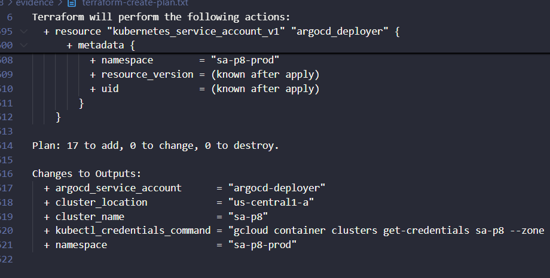

### Captura 02 — Clúster GKE

En GCP: **Kubernetes Engine → Clusters → sa-p8**. Deben verse nombre, zona `us-central1-a` y estado `RUNNING`.

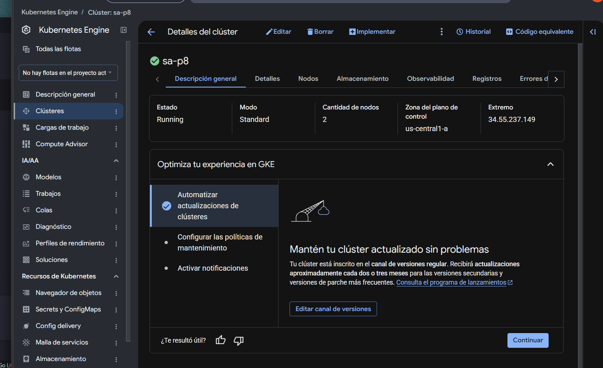

### Captura 03 — Pipeline exitoso

Abrir el [run 35398601069](https://github.com/Carbonell-Castillo/Practicas-SA-B-202203069/actions/runs/35398601069). Debe verse el grafo completo en verde.

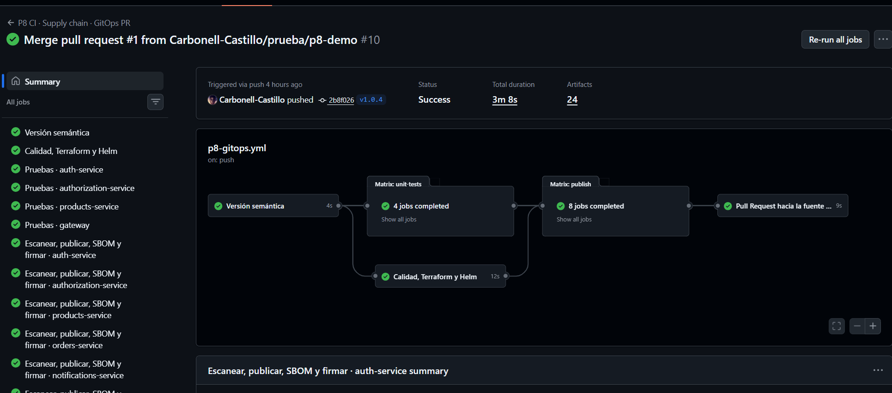

### Captura 04 — Terraform y Helm en CI

Dentro del run, abrir `Calidad, Terraform y Helm`. Deben verse `terraform validate`, `helm lint` y `helm template` exitosos.
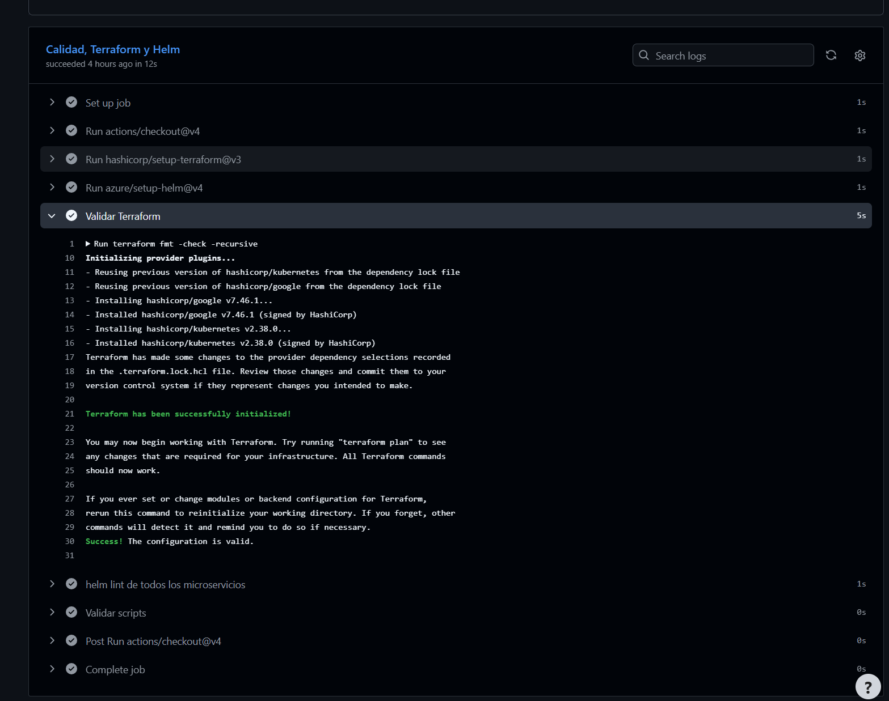

### Captura 05 — Trivy, SBOM y Cosign

Abrir un job `Escanear, publicar, SBOM y firmar`. Deben verse en verde Trivy, generación de SBOM y firma keyless.

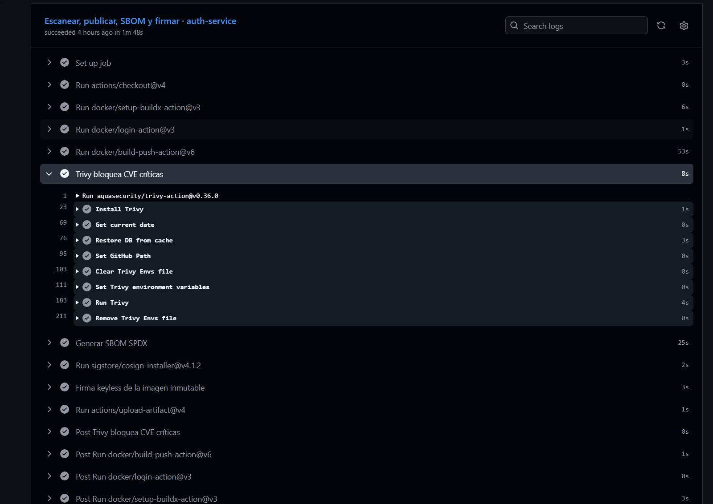

### Captura 06 — PR GitOps

Abrir [PR GitOps #6](https://github.com/Carbonell-Castillo/Practicas-SA-B-202203069-gitops/pull/6/files). Debe verse `Merged` y que el cambio se limita a tags declarativos.

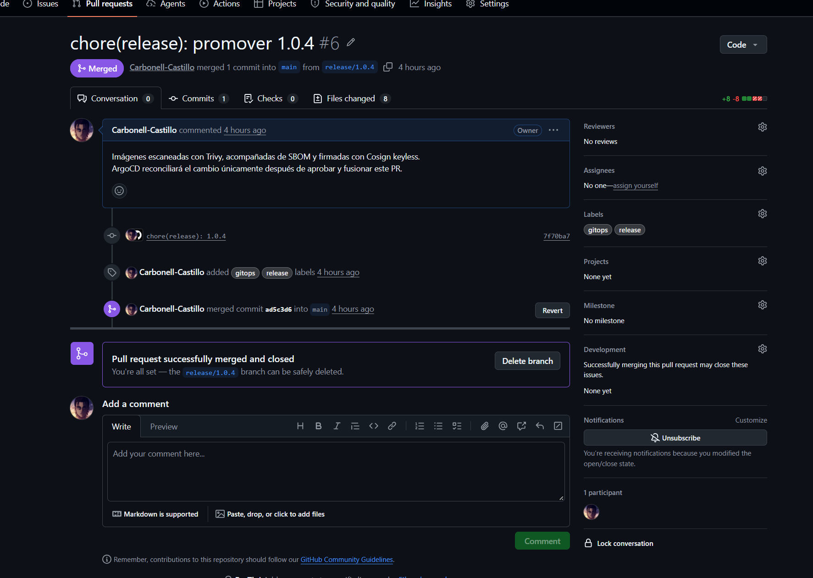

### Captura 07 — ArgoCD Synced y Healthy

Abrir `sa-platform-prod` en ArgoCD. Deben verse `Synced`, `Healthy`, la rama/revisión y el namespace `sa-p8-prod`.

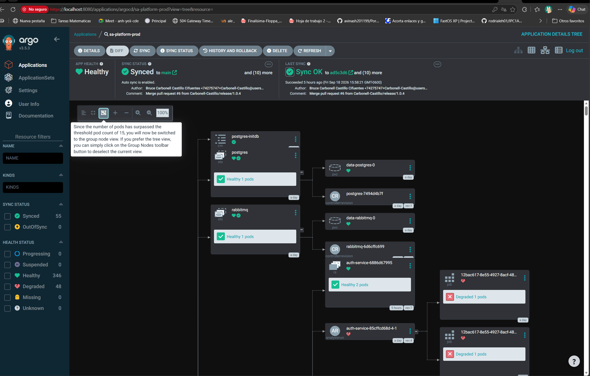

### Captura 08 — Historial de ArgoCD

En la aplicación, abrir **History and Rollback** y mostrar las sincronizaciones registradas.

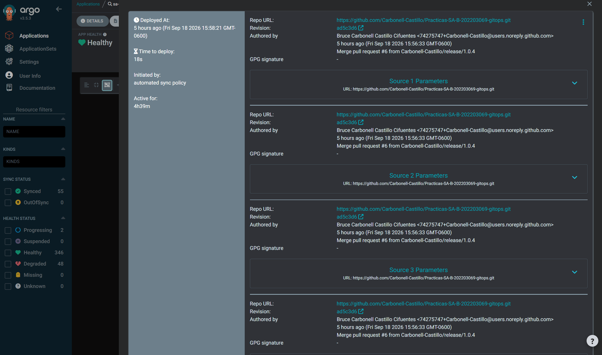

### Captura 09 — Promoción canary exitosa

En Rollouts Dashboard o CLI, mostrar gateway `Healthy`, `Step 11/11`, `SetWeight 100`, imagen `1.0.4` y AnalysisRuns exitosos.

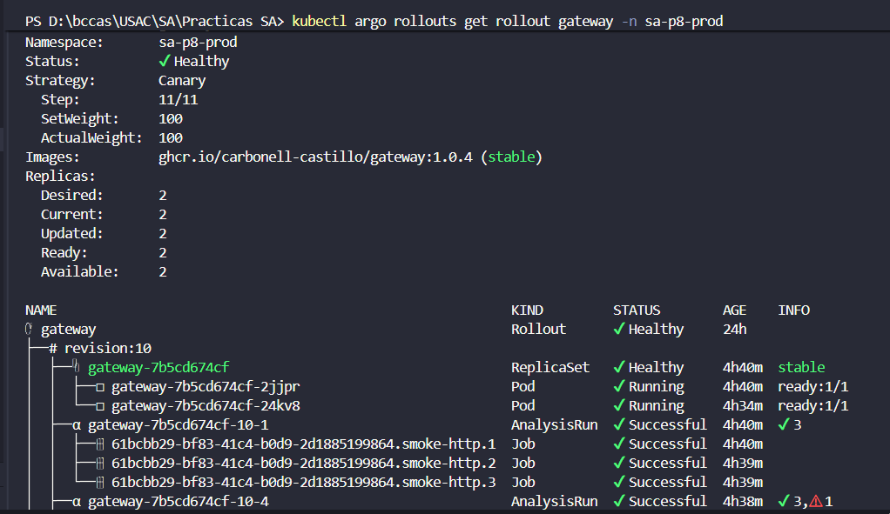

### Captura 10 — Reversión automática

Mostrar la revisión 8 de gateway, `gateway-68b7cb79c4-8-1` en `Failed` y el ReplicaSet defectuoso escalado.

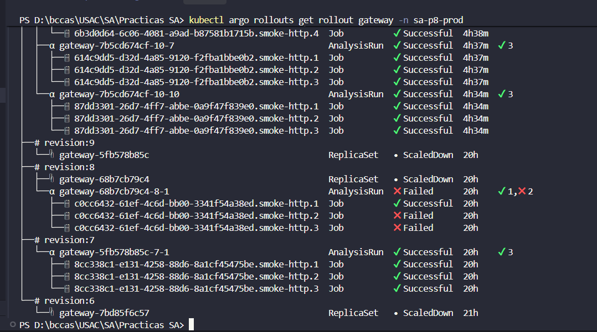

### Captura 11 — Políticas Kyverno y rechazo

Mostrar las cuatro ClusterPolicies y la salida de rechazo para `busybox:latest`.

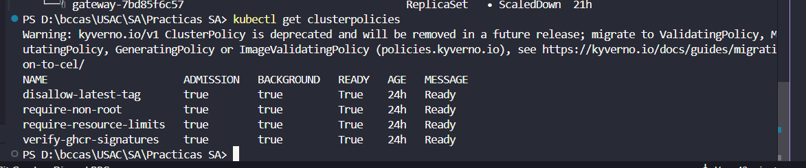


### Captura 12 — Sealed Secrets

Mostrar el recurso sincronizado en ArgoCD o el manifiesto con `encryptedData`. No mostrar secretos decodificados.

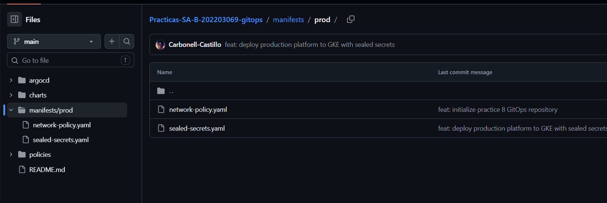

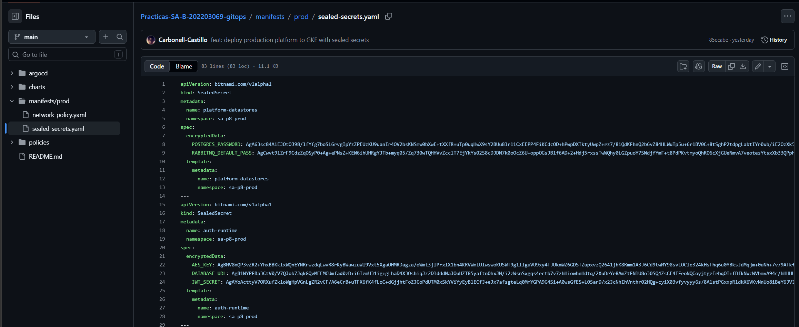

### Captura 13 — Prueba k6

Mostrar los tres thresholds exitosos, 0 % de errores, p95 y checks al 100 %.

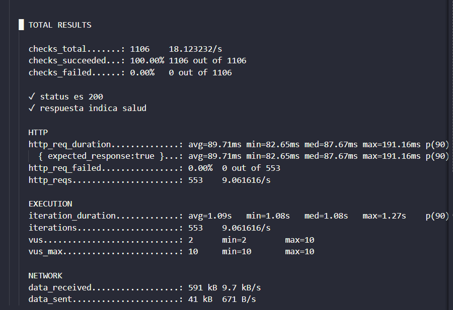

### Captura 14 — Endpoint saludable

Abrir `http://34.42.133.51/health`. Debe verse `allServicesUp: true` y los servicios saludables.

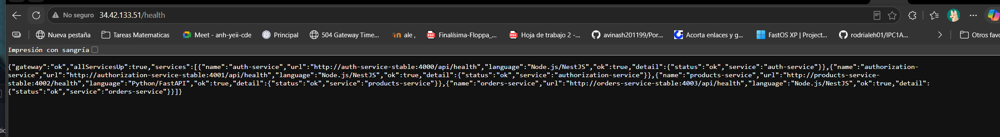

### Captura 15 — Verificador 60/60

Ejecutar el script oficial siguiendo la sección 15. Debe verse el resumen completo, `CONOCIMIENTO 60/60` y “Requisitos eliminatorios: todos cumplidos”.

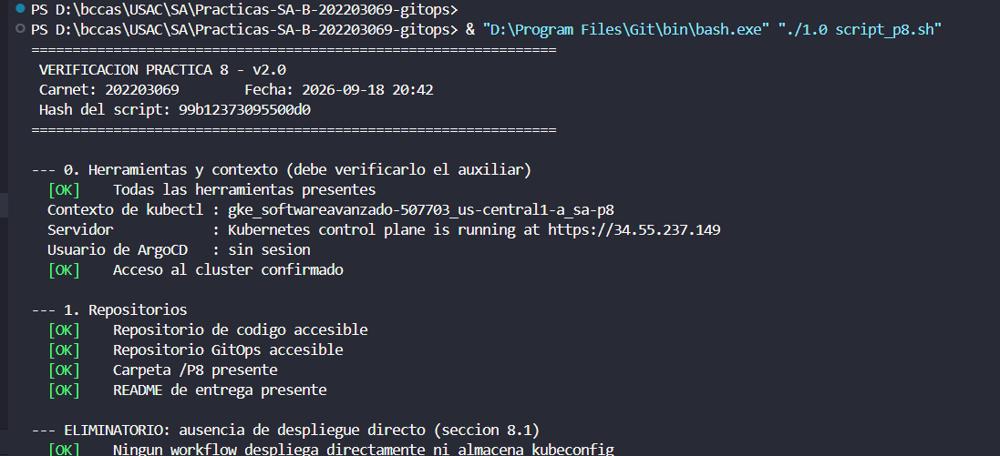

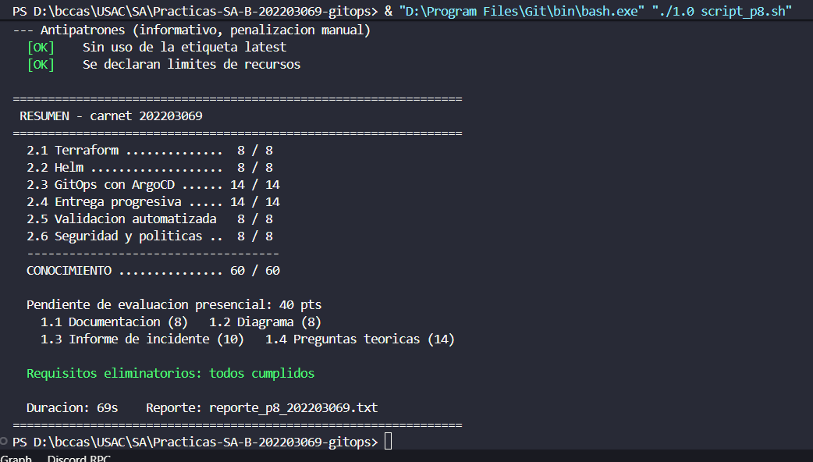

## 14. Acceso a ArgoCD y Argo Rollouts

### ArgoCD

```powershell
kubectl port-forward svc/argocd-server -n argocd 8080:443
```

Abrir `https://localhost:8080`. No incluir contraseñas ni tokens en capturas.

### Argo Rollouts Dashboard

```powershell
kubectl argo rollouts dashboard -n sa-p8-prod --port 3100
```

Abrir `http://localhost:3100/rollouts`.

### Evidencia por CLI

```powershell
kubectl get application sa-platform-prod -n argocd
kubectl get rollouts -n sa-p8-prod
kubectl argo rollouts get rollout gateway -n sa-p8-prod
kubectl get clusterpolicies
curl.exe http://34.42.133.51/health
```

No se recomienda usar un `kubectl get pods` sin filtros para la captura final, porque el namespace conserva jobs históricos de AnalysisRuns y CronJobs. La evidencia principal debe centrarse en `Application`, `Rollout`, AnalysisRuns y workloads actuales.

## 15. Ejecución del verificador oficial

### 15.1 Iniciar sesión y configurar GCP

Ejecutar en **PowerShell**:

```powershell
gcloud auth login

gcloud config set project softwareavanzado-507703

gcloud container clusters get-credentials sa-p8 `
  --zone us-central1-a `
  --project softwareavanzado-507703

kubectl config use-context gke_softwareavanzado-507703_us-central1-a_sa-p8

kubectl get nodes
kubectl get application sa-platform-prod -n argocd
```

Antes de continuar debe cumplirse:

- `kubectl get nodes` muestra nodos `Ready`.
- La aplicación muestra `Synced` y `Healthy`.
- El contexto actual corresponde a `gke_softwareavanzado-507703_us-central1-a_sa-p8`.

Puede comprobarse con:

```powershell
kubectl config current-context
```

### 15.2 Entrar al repositorio GitOps

```powershell
cd "D:\bccas\USAC\SA\Practicas-SA-B-202203069-gitops"
```

En esa carpeta deben existir:

- `1.0 script_p8.sh`.
- `p8.conf`.
- Los directorios `argocd`, `charts`, `manifests` y `policies`.

### 15.3 Preparar herramientas y ejecutar

```powershell
$env:PATH = "C:\Users\bccas\bin;" + $env:PATH
$env:NSUB = "0"

& "D:\Program Files\Git\bin\bash.exe" "./1.0 script_p8.sh"
```

`C:\Users\bccas\bin` contiene herramientas auxiliares instaladas para la evaluación. `NSUB=0` inicializa el contador usado por esta versión del script y evita un error causado por `set -u`.

El archivo `p8.conf` debe contener, como mínimo:

```bash
CARNET="202203069"
REPO_CODE="https://github.com/Carbonell-Castillo/Practicas-SA-B-202203069"
REPO_GITOPS="https://github.com/Carbonell-Castillo/Practicas-SA-B-202203069-gitops"
APP="sa-platform-prod"
NS="sa-p8-prod"
IMAGE="ghcr.io/carbonell-castillo/gateway:1.0.2"
COSIGN_IDENTITY_REGEXP="https://github.com/Carbonell-Castillo/Practicas-SA-B-202203069/.*"
COSIGN_ISSUER="https://token.actions.githubusercontent.com"
```

El script comprueba `git`, `jq`, `kubectl`, `helm`, `terraform`, `trivy`, `cosign`, `argocd` y el plugin `kubectl argo rollouts`. También consulta directamente el clúster, por lo que no debe ejecutarse sin haber configurado antes el contexto correcto.

### 15.4 Resultado esperado

La consola debe finalizar aproximadamente así:

```text
2.1 Terraform ..............  8 / 8
2.2 Helm ...................  8 / 8
2.3 GitOps con ArgoCD ...... 14 / 14
2.4 Entrega progresiva ..... 14 / 14
2.5 Validacion automatizada   8 / 8
2.6 Seguridad y politicas ..  8 / 8
------------------------------------
CONOCIMIENTO ............... 60 / 60
Requisitos eliminatorios: todos cumplidos
```

El script genera en el repositorio GitOps:

- `reporte_p8_202203069.txt`: salida detallada.
- `resultados_p8.csv`: resumen de puntuación.

Para confirmar los archivos:

```powershell
Get-Content ".\reporte_p8_202203069.txt"
Get-Content ".\resultados_p8.csv"
```

## 16. Video demostrativo

[Abrir video demostrativo en Google Drive](https://drive.google.com/file/d/1FgsHZm2ZFiyrdckXfZQlhW70AdzkExXO/view?usp=sharing)

## 17. Lista final de entrega

- [x] Carpeta `/P8` con workflow, Terraform, charts, pruebas y documentación.
- [x] Repositorio GitOps público e independiente.
- [x] Terraform con plan y estado aplicado.
- [x] Charts con valores `dev` y `prod`.
- [x] ArgoCD como reconciliador exclusivo.
- [x] Argo Rollouts con cuatro pesos y análisis.
- [x] Evidencia de reversión automática.
- [x] Trivy, SBOM, Cosign, Kyverno y Sealed Secrets.
- [x] Pruebas de humo, integración y carga con reporte.
- [x] Informe de incidente con cinco campos.
- [x] Diagrama del flujo GitOps.
- [x] Verificador oficial 60/60.
- [x] Capturas de evidencia.
- [x] URL del video de 5 a 8 minutos.
- [ ] Conservar evidencia de un PR bloqueado por Trivy para cumplimiento literal.
- [ ] Versionar una copia permanente del SBOM y reporte Trivy recomendado.
